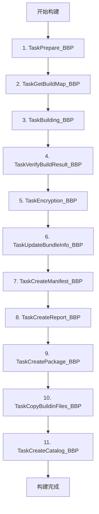
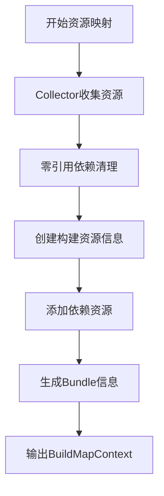
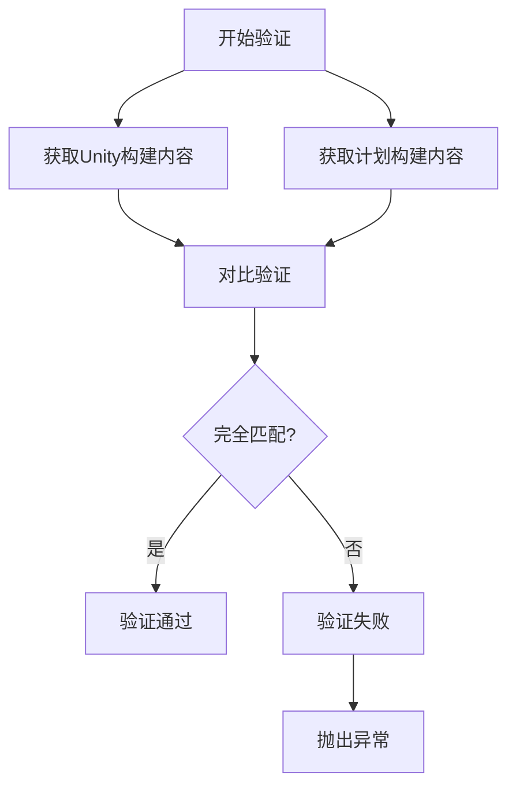
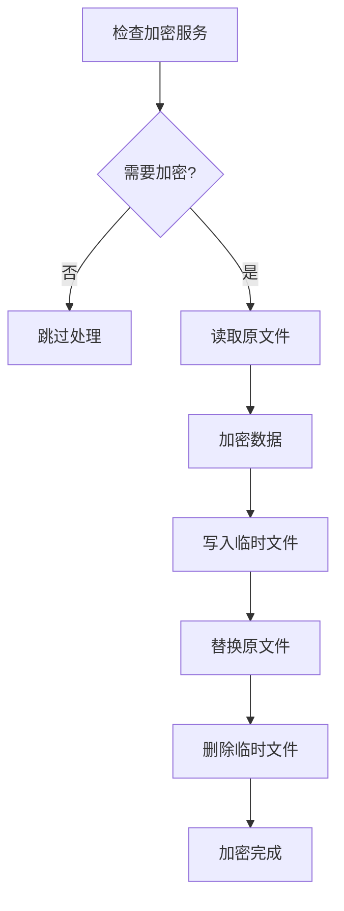
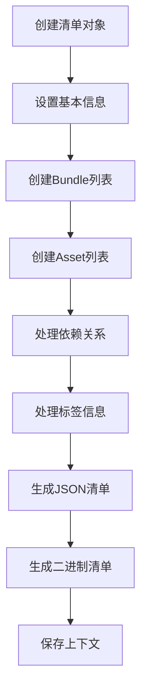
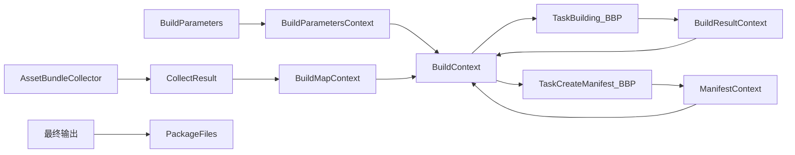

# Builtin Build Pipeline 流程详解

**YooAsset Builtin Build Pipeline 完整技术解析**

---

## 📋 目录

- [1. BBP 概述](#1-bbp-概述)
- [2. 构建流程总览](#2-构建流程总览)
- [3. 11个Task详细解析](#3-11个task详细解析)
- [4. 数据流转机制](#4-数据流转机制)
- [5. BBP vs SBP 对比](#5-bbp-vs-sbp-对比)
- [6. 使用建议](#6-使用建议)

---

## 1. BBP 概述

### 什么是 Builtin Build Pipeline？

Builtin Build Pipeline（BBP）是 YooAsset 的传统资源打包方式，基于 Unity 的 `BuildPipeline.BuildAssetBundles()` API。

### 核心特点

| 特性 | 描述 |
|------|------|
| ✅ **兼容性** | 支持所有 Unity 版本 |
| ✅ **稳定性** | Unity 官方 API，经过长期验证 |
| ✅ **简单性** | 配置参数少，易于上手 |
| ⚠️ **性能** | 构建速度中等，不如 SBP |
| ⚠️ **功能** | 缺少高级优化功能 |

### 适用场景

- ✅ 小型项目（资源量 < 500MB）
- ✅ Unity 旧版本（< 2018.4）
- ✅ 快速原型验证
- ✅ 学习 AssetBundle 基础概念

---

## 2. 构建流程总览

### 11个Task执行顺序



### 流程概览表

| 步骤 | Task名称 | 主要功能 | 输出结果 |
|------|----------|----------|----------|
| 1 | Prepare_BBP | 构建准备 | 环境就绪 |
| 2 | GetBuildMap_BBP | 资源映射 | BuildMapContext |
| 3 | Building_BBP | Unity构建 | AssetBundle文件 |
| 4 | VerifyBuildResult_BBP | 结果验证 | 验证通过 |
| 5 | Encryption_BBP | 文件加密 | 加密文件 |
| 6 | UpdateBundleInfo_BBP | 信息更新 | Bundle元数据 |
| 7 | CreateManifest_BBP | 清单创建 | YooAsset清单 |
| 8 | CreateReport_BBP | 报告生成 | 构建报告 |
| 9 | CreatePackage_BBP | 补丁包创建 | 最终包文件 |
| 10 | CopyBuildinFiles_BBP | 内置文件复制 | StreamingAssets |
| 11 | CreateCatalog_BBP | 目录创建 | 资源目录文件 |

---

## 3. 11个Task详细解析

### 3.1 TaskPrepare_BBP - 准备阶段

**目的**: 构建前的环境准备工作

**核心功能**:
```csharp
void IBuildTask.Run(BuildContext context)
{
    // 1. 验证构建参数
    buildParametersContext.CheckBuildParameters();

    // 2. 检查场景保存状态
    if (EditorTools.HasDirtyScenes())
        throw new Exception("Found unsaved scene !");

    // 3. 清理构建缓存（可选）
    if (buildParameters.ClearBuildCacheFiles)
        EditorTools.DeleteDirectory(packageRootDirectory);

    // 4. 创建输出目录
    EditorTools.CreateDirectory(pipelineOutputDirectory);

    // 5. Unity版本检查
#if UNITY_2021_3_OR_NEWER
    BuildLogger.Warning("Recommend use script build pipeline (SBP) !");
#endif
}
```

**输出结果**:
- ✅ 构建参数验证完成
- ✅ 输出目录创建完成
- ✅ 构建环境准备就绪

---

### 3.2 TaskGetBuildMap_BBP - 资源映射

**目的**: 生成完整的资源构建映射关系

**核心流程**:


**关键逻辑**:
```csharp
public BuildMapContext CreateBuildMap(bool simulateBuild, BuildParameters buildParameters)
{
    // 1. 收集所有资源
    var collectResult = AssetBundleCollectorSettingData.Setting.BeginCollect(
        packageName, simulateBuild, useAssetDependencyDB);

    // 2. 清理零引用依赖
    RemoveZeroReferenceAssets(context, allCollectAssets);

    // 3. 创建主资源信息
    foreach (var collectAssetInfo in allCollectAssets)
    {
        // 清除非MainAssetCollector的标签
        if (collectAssetInfo.CollectorType != ECollectorType.MainAssetCollector)
            collectAssetInfo.AssetTags.Clear();

        // 创建BuildAssetInfo
        var buildAssetInfo = new BuildAssetInfo(
            collectAssetInfo.CollectorType,
            collectAssetInfo.BundleName,
            collectAssetInfo.Address,
            collectAssetInfo.AssetInfo);
    }

    // 4. 添加依赖资源
    foreach (var collectAssetInfo in allCollectAssets)
    {
        foreach (var dependAsset in collectAssetInfo.DependAssets)
        {
            // 添加未被包含的依赖资源
            if (!allBuildAssetInfos.ContainsKey(dependAsset.AssetPath))
            {
                var buildAssetInfo = new BuildAssetInfo(
                    ECollectorType.DependAssetCollector,
                    string.Empty, string.Empty, dependAsset);
                allBuildAssetInfos.Add(dependAsset.AssetPath, buildAssetInfo);
            }
        }
    }

    return buildMapContext;
}
```

**输出结果**:
- ✅ `BuildMapContext` 对象
- ✅ 完整的资源映射关系
- ✅ 所有 Bundle 的构建信息

---

### 3.3 TaskBuilding_BBP - Unity构建

**目的**: 调用 Unity 原生 API 进行 AssetBundle 构建

**核心实现**:
```csharp
void IBuildTask.Run(BuildContext context)
{
    var buildMapContext = context.GetContextObject<BuildMapContext>();
    var builtinBuildParameters = buildParametersContext.Parameters as BuiltinBuildParameters;

    // 1. 准备构建参数
    string pipelineOutputDirectory = buildParametersContext.GetPipelineOutputDirectory();
    BuildAssetBundleOptions buildOptions = builtinBuildParameters.GetBundleBuildOptions();

    // 2. 调用Unity构建API
    AssetBundleManifest unityManifest = BuildPipeline.BuildAssetBundles(
        pipelineOutputDirectory,
        buildMapContext.GetPipelineBuilds(),
        buildOptions,
        buildParametersContext.Parameters.BuildTarget);

    // 3. 验证构建结果
    if (unityManifest == null)
        throw new Exception("UnityEngine build failed !");

    // 4. 保存构建结果
    BuildResultContext buildResultContext = new BuildResultContext();
    buildResultContext.UnityManifest = unityManifest;
    context.SetContextObject(buildResultContext);
}
```

**构建选项配置**:
```csharp
public BuildAssetBundleOptions GetBundleBuildOptions()
{
    BuildAssetBundleOptions options = BuildAssetBundleOptions.None;

    // 压缩选项
    switch (CompressionOption)
    {
        case ECompressOption.Uncompressed:
            options |= BuildAssetBundleOptions.UncompressedAssetBundle;
            break;
        case ECompressOption.LZMA:
            options |= BuildAssetBundleOptions.ChunkBasedCompression;
            break;
    }

    // 强制重建
    if (BuildMode == EBuildMode.ForceRebuild)
        options |= BuildAssetBundleOptions.ForceRebuildAssetBundle;

    return options;
}
```

**输出结果**:
- ✅ 所有 AssetBundle 文件
- ✅ Unity 的 .manifest 文件
- ✅ Unity 的 AssetBundle 文件
- ✅ `BuildResultContext` 对象

---

### 3.4 TaskVerifyBuildResult_BBP - 构建验证

**目的**: 验证构建结果的完整性和正确性

**验证逻辑**:


**实现代码**:
```csharp
private void VerifyingBuildingResult(BuildContext context, AssetBundleManifest unityManifest)
{
    var buildMapContext = context.GetContextObject<BuildMapContext>();

    // 1. 获取实际构建内容
    string[] unityBuildContent = unityManifest.GetAllAssetBundles();

    // 2. 获取计划构建内容
    string[] planningContent = buildMapContext.Collection
        .Select(t => t.BundleName).ToArray();

    // 3. 验证差异：Unity构建了但计划中没有的
    var unexpectedBundles = unityBuildContent.Except(planningContent).ToList();
    if (unexpectedBundles.Count > 0)
    {
        foreach (var bundle in unexpectedBundles)
            BuildLogger.Warning($"Found unintended build bundle : {bundle}");
        throw new Exception("Unintended build detected !");
    }

    // 4. 验证差异：计划中有但Unity没有构建的
    var missingBundles = planningContent.Except(unityBuildContent).ToList();
    if (missingBundles.Count > 0)
    {
        foreach (var bundle in missingBundles)
            BuildLogger.Warning($"Missing planned bundle : {bundle}");
        throw new Exception("Build result incomplete !");
    }

    BuildLogger.Log("Build results verify success !");
}
```

**输出结果**:
- ✅ 构建结果验证通过
- ❌ 验证失败则抛出异常

---

### 3.5 TaskEncryption_BBP - 资源加密

**目的**: 对生成的 Bundle 文件进行加密处理

**加密流程**:


**实现代码**:
```csharp
protected void EncryptingBundleFiles(BuildParametersContext buildParametersContext, BuildMapContext buildMapContext)
{
    var encryptionServices = buildParametersContext.Parameters.EncryptionServices;
    if (encryptionServices == null)
        return;

    foreach (var bundleInfo in buildMapContext.Collection)
    {
        if (bundleInfo.Encrypted == false)
            continue;

        // 1. 读取原文件
        byte[] originalData = File.ReadAllBytes(bundleInfo.PackageSourceFilePath);

        // 2. 加密数据
        byte[] encryptedData = encryptionServices.EncryptBundle(originalData, bundleInfo.BundleName);

        // 3. 写入并替换
        string tempPath = bundleInfo.PackageSourceTempFilePath;
        File.WriteAllBytes(tempPath, encryptedData);
        EditorTools.ReplaceFile(tempPath, bundleInfo.PackageSourceFilePath);
        File.Delete(tempPath);

        BuildLogger.Log($"Encrypt bundle file: {bundleInfo.BundleName}");
    }
}
```

**输出结果**:
- ✅ 加密的 Bundle 文件
- ✅ 未加密的 Bundle 保持原样

---

### 3.6 TaskUpdateBundleInfo_BBP - 更新Bundle信息

**目的**: 更新 Bundle 的哈希、CRC、大小等元数据信息

**信息更新项**:
```csharp
protected virtual void UpdateBundleInfo(BuildContext context)
{
    foreach (var bundleInfo in buildMapContext.Collection)
    {
        // 1. Unity哈希值（来自Unity Manifest）
        bundleInfo.UnityHash = GetUnityHash(bundleInfo, context);

        // 2. Unity CRC值（Unity计算）
        bundleInfo.UnityCRC = GetUnityCRC(bundleInfo, context);

        // 3. 文件哈希值（YooAsset计算）
        bundleInfo.FileHash = HashUtility.FileMD5(bundleInfo.PackageSourceFilePath);

        // 4. 文件CRC值（YooAsset计算）
        bundleInfo.FileCRC = HashUtility.FileCRC32Value(bundleInfo.PackageSourceFilePath);

        // 5. 文件大小
        bundleInfo.FileSize = FileUtility.GetFileSize(bundleInfo.PackageSourceFilePath);

        // 6. 哈希名称
        bundleInfo.HashName = GetBundleHashName(bundleInfo);
    }
}
```

**BBP特有的信息获取**:
```csharp
// 获取Unity哈希
protected override string GetUnityHash(BuildBundleInfo bundleInfo, BuildContext context)
{
    var buildResult = context.GetContextObject<TaskBuilding_BBP.BuildResultContext>();
    var hash = buildResult.UnityManifest.GetAssetBundleHash(bundleInfo.BundleName);
    return hash.isValid ? hash.ToString() : throw new Exception("Hash not found");
}

// 获取Unity CRC
protected override uint GetUnityCRC(BuildBundleInfo bundleInfo, BuildContext context)
{
    return BuildPipeline.GetCRCForAssetBundle(bundleInfo.BuildOutputFilePath, out uint crc)
        ? crc
        : throw new Exception("CRC not found");
}
```

**输出结果**:
- ✅ 所有 Bundle 的完整元数据信息
- ✅ Unity 和 YooAsset 两套校验数据

---

### 3.7 TaskCreateManifest_BBP - 创建清单

**目的**: 生成 YooAsset 的资源清单文件

**清单创建流程**:


**核心实现**:
```csharp
protected void CreateManifestFile(bool processBundleDepends, bool processBundleTags, BuildContext context)
{
    var buildParametersContext = context.GetContextObject<BuildParametersContext>();
    var buildMapContext = context.GetContextObject<BuildMapContext>();

    // 1. 创建清单对象
    PackageManifest manifest = new PackageManifest();
    manifest.PackageName = buildParametersContext.Parameters.PackageName;
    manifest.PackageVersion = buildParametersContext.Parameters.PackageVersion;
    manifest.BuildPipeline = buildParametersContext.Parameters.BuildPipeline;

    // 2. 创建资源包列表
    manifest.BundleList = CreatePackageBundleList(buildMapContext);

    // 3. 创建资源对象列表（只包含MainAssetCollector）
    manifest.AssetList = CreatePackageAssetList(buildMapContext);

    // 4. 处理依赖关系（BBP特有）
    if (processBundleDepends)
        ProcessBundleDepends(context, manifest);

    // 5. 生成文件
    CreateManifestFiles(manifest, buildParametersContext);

    // 6. 保存上下文
    context.SetContextObject(new ManifestContext { Manifest = manifest });
}
```

**BBP特有的依赖处理**:
```csharp
protected override string[] GetBundleDepends(BuildContext context, string bundleName)
{
    var buildResultContext = context.GetContextObject<TaskBuilding_BBP.BuildResultContext>();
    return buildResultContext.UnityManifest.GetAllDependencies(bundleName);
}
```

**输出结果**:
- ✅ JSON 格式的清单文件
- ✅ 二进制格式的清单文件
- ✅ `ManifestContext` 对象

---

### 3.8 TaskCreateReport_BBP - 创建报告

**目的**: 生成详细的构建报告，用于分析和调试

**报告内容结构**:
```json
{
  "Summary": {
    "PackageName": "DefaultPackage",
    "PackageVersion": "1.0.0",
    "BuildPipeline": "BuiltinBuildPipeline",
    "BuildTarget": "StandaloneWindows64",
    "BuildTime": "2024-01-15 10:30:00",
    "TotalBundleCount": 45,
    "TotalBundleSize": 256000000,
    "MainAssetCount": 30,
    "EncryptedBundleCount": 20
  },
  "BundleDetails": [
    {
      "BundleName": "ui_mainpanel_abc123",
      "FileName": "ui_mainpanel_abc123.bundle",
      "FileSize": 1024000,
      "UnityHash": "abc123...",
      "FileHash": "def456...",
      "Encrypted": true,
      "Tags": ["UI", "Panel"],
      "DependBundles": ["shared_assets_xyz789"],
      "MainAssets": [
        {
          "Address": "UI/MainPanel",
          "AssetPath": "Assets/GameRes/UI/MainPanel.prefab",
          "AssetType": "GameObject"
        }
      ]
    }
  ]
}
```

**统计信息计算**:
```csharp
// 计算Bundle总数
int totalBundleCount = manifest.BundleList.Count;

// 计算总大小
long totalBundleSize = manifest.BundleList.Sum(b => b.FileSize);

// 计算主资源数量
int mainAssetCount = manifest.AssetList.Count;

// 计算加密Bundle数量
int encryptedBundleCount = manifest.BundleList.Count(b => b.Encrypted);
```

**输出结果**:
- ✅ 详细的 JSON 格式构建报告
- ✅ Bundle 信息统计和分析
- ✅ 构建过程总结

---

### 3.9 TaskCreatePackage_BBP - 创建补丁包

**目的**: 将构建文件组织成最终的补丁包结构

**补丁包结构**:
```
PackageOutputDirectory/
└── DefaultPackage/
    ├── DefaultPackage.manifest    # YooAsset清单文件
    ├── DefaultPackage.json        # JSON清单文件
    ├── Bundle_abc123.bundle       # 资源Bundle文件
    ├── Bundle_def456.bundle       # 资源Bundle文件
    └── ...                        # 更多Bundle文件
```

**文件复制流程**:
```csharp
private void CreatePackagePatch(BuildParametersContext buildParametersContext, BuildMapContext buildMapContext)
{
    string pipelineOutputDirectory = buildParametersContext.GetPipelineOutputDirectory();
    string packageOutputDirectory = buildParametersContext.GetPackageOutputDirectory();

    // 1. 复制Unity Manifest文件
    CopyUnityManifestFiles(pipelineOutputDirectory, packageOutputDirectory);

    // 2. 复制所有Bundle文件
    CopyBundleFiles(buildMapContext);

    // 3. 显示进度条
    DisplayCopyProgress(buildMapContext.Collection.Count);
}

private void CopyUnityManifestFiles(string sourceDir, string destDir)
{
    // 复制序列化文件
    CopyFile($"{sourceDir}/OutputCache", $"{destDir}/OutputCache");

    // 复制文本文件
    CopyFile($"{sourceDir}/OutputCache.manifest", $"{destDir}/OutputCache.manifest");
}
```

**输出结果**:
- ✅ 完整的补丁包目录结构
- ✅ Unity 的 manifest 文件
- ✅ 所有 Bundle 文件组织完成

---

### 3.10 TaskCopyBuildinFiles_BBP - 复制内置文件

**目的**: 将构建文件复制到 StreamingAssets 目录，用于内置文件分发

**内置文件选项**:
```csharp
public enum EBuildinFileCopyOption
{
    None,           // 不复制内置文件
    ClearAndCopy,   // 清理并复制
    OnlyCopy,        // 仅复制
    ClearAll        // 清理所有内置文件
}
```

**复制逻辑**:
```csharp
internal void CopyBuildinFilesToStreaming(BuildParametersContext buildParametersContext, PackageManifest manifest)
{
    string streamingAssetsPath = buildParametersContext.GetStreamingAssetsDirectory();

    switch (buildParametersContext.Parameters.BuildinFileCopyOption)
    {
        case EBuildinFileCopyOption.ClearAndCopy:
            // 清理并复制
            ClearDirectory(streamingAssetsPath);
            CopyPackageFiles(streamingAssetsPath);
            break;

        case EBuildinFileCopyOption.OnlyCopy:
            // 仅复制
            CopyPackageFiles(streamingAssetsPath);
            break;

        case EBuildinFileCopyOption.ClearAll:
            // 清理所有
            ClearDirectory(streamingAssetsPath);
            break;
    }
}
```

**StreamingAssets结构**:
```
StreamingAssets/
└── YooAsset/
    └── DefaultPackage/
        ├── DefaultPackage.manifest
        ├── DefaultPackage.json
        ├── Bundle_abc123.bundle
        └── ...
```

**输出结果**:
- ✅ StreamingAssets 目录中的内置文件
- ✅ 包含清单和 Bundle 文件

---

### 3.11 TaskCreateCatalog_BBP - 创建目录

**目的**: 创建资源目录文件，提供快速查找功能

**目录文件作用**:
- 🔍 快速资源查找
- 📊 资源统计分析
- 🎯 Bundle 和 Asset 的映射关系

**目录文件结构**:
```json
{
  "PackageName": "DefaultPackage",
  "PackageVersion": "1.0.0",
  "BundleCount": 45,
  "BundleList": [
    {
      "BundleName": "ui_mainpanel_abc123",
      "FileName": "ui_mainpanel_abc123.bundle",
      "FileHash": "def456...",
      "FileSize": 1024000,
      "Tags": ["UI", "Panel"],
      "AssetCount": 5,
      "AssetList": [
        {
          "Address": "UI/MainPanel",
          "AssetPath": "Assets/GameRes/UI/MainPanel.prefab",
          "AssetGUID": "789abc...",
          "AssetType": "GameObject"
        }
      ]
    }
  ]
}
```

**创建逻辑**:
```csharp
protected void CreateCatalogFile(BuildContext context)
{
    var buildMapContext = context.GetContextObject<BuildMapContext>();

    // 1. 创建目录对象
    PackageCatalog catalog = new PackageCatalog();
    catalog.PackageName = buildParametersContext.Parameters.PackageName;
    catalog.PackageVersion = buildParametersContext.Parameters.PackageVersion;

    // 2. 填充Bundle信息
    foreach (var bundleInfo in buildMapContext.Collection)
    {
        var bundleCatalog = new PackageBundleCatalog();
        bundleCatalog.BundleName = bundleInfo.BundleName;
        bundleCatalog.FileName = bundleInfo.FileName;
        bundleCatalog.FileHash = bundleInfo.FileHash;
        bundleCatalog.FileSize = bundleInfo.FileSize;
        bundleCatalog.Tags = bundleInfo.Tags.ToList();

        // 3. 填充Asset信息
        var assetInfos = bundleInfo.GetAllManifestAssetInfos();
        foreach (var assetInfo in assetInfos)
        {
            var assetCatalog = new PackageAssetCatalog();
            assetCatalog.Address = assetInfo.Address;
            assetCatalog.AssetPath = assetInfo.AssetInfo.AssetPath;
            assetCatalog.AssetGUID = assetInfo.AssetInfo.AssetGUID;
            bundleCatalog.AssetList.Add(assetCatalog);
        }

        catalog.BundleList.Add(bundleCatalog);
    }

    // 4. 保存目录文件
    SaveCatalogFile(catalog, buildParametersContext);
}
```

**输出结果**:
- ✅ JSON 格式的目录文件
- ✅ Bundle 和 Asset 的快速索引

---

## 4. 数据流转机制

### 上下文系统架构



### 关键上下文对象

| 上下文对象 | 作用 | 生命周期 |
|------------|------|----------|
| `BuildParametersContext` | 存储构建参数 | 整个构建过程 |
| `BuildMapContext` | 存储资源映射信息 | Task2 后 |
| `BuildResultContext` | 存储 Unity 构建结果 | Task3 后 |
| `ManifestContext` | 存储 YooAsset 清单 | Task7 后 |

---

## 5. BBP vs SBP 对比

### 详细对比表

| 特性 | Builtin Build Pipeline | Scriptable Build Pipeline |
|------|----------------------|------------------------|
| **Unity API** | `BuildPipeline.BuildAssetBundles()` | `ContentPipeline.BuildAssetBundles()` |
| **构建速度** | ⭐⭐⭐ 中等 | ⭐⭐⭐⭐⭐ 最快 |
| **增量构建** | ⚠️ 基础支持 | ✅ 完整支持 |
| **依赖分析** | ⚠️ Unity 自动分析 | ✅ 精确依赖分析 |
| **内存使用** | ⭐⭐⭐ 较高 | ⭐⭐⭐⭐ 优化 |
| **错误处理** | ⭐⭐⭐⭐ 完善 | ⭐⭐⭐⭐⭐ 详细 |
| **自定义程度** | ⭐⭐ 有限 | ⭐⭐⭐⭐⭐ 高度可定制 |
| **适用版本** | 所有 Unity 版本 | Unity 2018.4+ |
| **配置复杂度** | ⭐⭐ 简单 | ⭐⭐⭐⭐ 中等 |
| **学习成本** | ⭐⭐ 低 | ⭐⭐⭐ 中等 |

### 核心差异

#### 1. 构建 API
```csharp
// BBP - 传统方式
AssetBundleManifest manifest = BuildPipeline.BuildAssetBundles(
    outputDirectory, builds, options, target);

// SBP - 可编程方式
ReturnCode result = ContentPipeline.BuildAssetBundles(
    parameters, content, out results, tasks);
```

#### 2. 依赖处理
```csharp
// BBP - 依赖 Unity 自动分析
string[] dependencies = unityManifest.GetAllDependencies(bundleName);

// SBP - 支持自定义依赖处理
// 可以精确控制依赖关系的计算和处理逻辑
```

#### 3. 性能优化
```csharp
// BBP - 每次全量构建
// 适合小型项目，构建时间可接受

// SBP - 增量构建支持
// 只有修改的资源重新构建，大幅提升效率
```

---

## 6. 使用建议

### 选择 BBP 的情况

✅ **推荐使用**:
- Unity 版本低于 2018.4
- 项目资源量小于 500MB
- 团队对构建时间要求不高
- 需要快速上手，配置简单
- 学习 AssetBundle 基础概念

### 迁移到 SBP 的建议

⚠️ **建议迁移**:
- Unity 2021.3+ 版本强烈推荐使用 SBP
- 项目资源量超过 1GB
- 需要频繁构建的大型项目
- 对构建性能有高要求的项目

### 迁移步骤

1. **评估当前项目**
   ```csharp
   // 检查 Unity 版本
   #if UNITY_2021_3_OR_NEWER
   Debug.Log("建议迁移到 Scriptable Build Pipeline");
   #endif
   ```

2. **备份 BBP 配置**
   - 保存当前构建参数
   - 记录构建配置细节

3. **逐步测试 SBP**
   - 在测试环境试用 SBP
   - 对比构建结果和性能

4. **正式迁移**
   - 更新构建脚本
   - 培训团队使用 SBP

---

## 🎯 总结

Builtin Build Pipeline 作为 YooAsset 的传统构建管线，具有以下特点：

### 🏗️ 架构优势

- ✅ **稳定可靠**：基于 Unity 官方 API，经过长期验证
- ✅ **兼容性强**：支持所有 Unity 版本
- ✅ **流程清晰**：11 个任务步骤明确，易于理解和调试
- ✅ **简单易用**：配置简单，上手容易

### 🔧 技术特色

- ✅ **完整流程**：从准备到打包的完整构建流程
- ✅ **数据验证**：多层次的构建结果验证机制
- ✅ **文件管理**：完善的文件组织和复制机制
- ✅ **报告生成**：详细的构建报告和目录文件

### 💡 最佳实践

- 🎯 **小型项目首选**：适合简单项目快速开发
- 🎯 **学习入门推荐**：理解 AssetBundle 基础概念
- 🎯 **版本兼容备选**：旧版本 Unity 的解决方案
- 🎯 **逐步迁移建议**：大型项目考虑迁移到 SBP

BBP 为 YooAsset 提供了稳定可靠的构建基础，是学习和使用 YooAsset 的重要起点！虽然功能相对简单，但其清晰的架构和完善的流程为理解高级构建管线奠定了坚实基础。

---

## 📚 相关文档

- [YooAsset打包系统完整解析](YooAsset打包系统完整解析.md)
- [Scriptable Build Pipeline详解](ScriptableBuildPipeline详解.md)
- [YooAsset学习路线图](YooAsset学习路线图.md)
- [DependAssetCollector机制深度解析](DependAssetCollector机制深度解析.md)