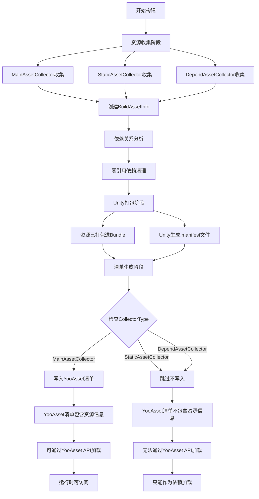

# DependAssetCollector机制深度解析：参与打包但不写入清单

通过深入分析YooAsset源码，详细解释DependAssetCollector是如何实现"参与打包但不写入清单"这个特殊机制的。

### 🎯 核心原理：**打包与清单的分离机制**

YooAsset将资源处理分为两个独立阶段：
1. **打包阶段**：将资源打包进AssetBundle
2. **清单阶段**：生成资源清单文件

DependAssetCollector通过在这两个阶段采用不同策略来实现特殊机制。

---

## 🔧 实现机制详细分析

### 1. **打包阶段：正常参与打包**

#### 📋 资源收集阶段
```csharp
// TaskGetBuildMap.cs:48-50
var buildAssetInfo = new BuildAssetInfo(collectAssetInfo.CollectorType,
                                      collectAssetInfo.BundleName,
                                      collectAssetInfo.Address,
                                      collectAssetInfo.AssetInfo);
allBuildAssetInfos.Add(collectAssetInfo.AssetInfo.AssetPath, buildAssetInfo);
```

**关键点**：
- **所有Collector类型都会被处理**，包括DependAssetCollector
- **创建BuildAssetInfo对象**，记录资源信息
- **添加到allBuildAssetInfos**中，参与后续的打包流程

#### 📋 依赖资源验证和清理
```csharp
// TaskGetBuildMap.cs:151-195
// 1. 获取所有主资源的依赖资源集合
HashSet<string> allDependAsset = new HashSet<string>();
foreach (var collectAsset in allCollectAssets)
{
    var collectorType = collectAsset.CollectorType;
    if (collectorType == ECollectorType.MainAssetCollector || collectorType == ECollectorType.StaticAssetCollector)
    {
        foreach (var dependAsset in collectAsset.DependAssets)
        {
            allDependAsset.Add(dependAsset.AssetPath);
        }
    }
}

// 2. 移除零引用的依赖资源
foreach (var collectAssetInfo in allCollectAssets)
{
    var collectorType = collectAssetInfo.CollectorType;
    if (collectorType == ECollectorType.DependAssetCollector)
    {
        if (allDependAsset.Contains(collectAssetInfo.AssetInfo.AssetPath) == false)
            removeList.Add(collectAssetInfo); // 移除未被引用的依赖资源
    }
}
```

**关键作用**：确保只有被主资源引用的依赖资源才会参与打包。

### 2. **清单阶段：选择性过滤**

#### 📋 资源清单生成
```csharp
// TaskCreateManifest.cs:137-158
private List<PackageAsset> CreatePackageAssetList(BuildMapContext buildMapContext)
{
    List<PackageAsset> result = new List<PackageAsset>(1000);
    foreach (var bundleInfo in buildMapContext.Collection)
    {
        // 🎯 关键：只获取写入清单的资源信息
        var assetInfos = bundleInfo.GetAllManifestAssetInfos();
        foreach (var assetInfo in assetInfos)
        {
            PackageAsset packageAsset = new PackageAsset();
            packageAsset.Address = assetInfo.Address;
            packageAsset.AssetPath = assetInfo.AssetInfo.AssetPath;
            packageAsset.AssetTags = assetInfo.AssetTags.ToArray();
            packageAsset.TempDataInEditor = assetInfo;
            result.Add(packageAsset);
        }
    }
    return result;
}
```

#### 📋 关键过滤方法
```csharp
// BuildBundleInfo.cs:169-171
public BuildAssetInfo[] GetAllManifestAssetInfos()
{
    return AllPackAssets.Where(t => t.CollectorType == ECollectorType.MainAssetCollector).ToArray();
}
```

**🎯 核心机制**：
- **只有`MainAssetCollector`的资源才会被加入清单**
- **StaticAssetCollector和DependAssetCollector被过滤掉**
- 资源已经打包进Bundle，但清单中找不到记录

---

## 🔍 双层Manifest机制

### 1. **Unity原生AssetBundle Manifest**
```csharp
// Unity打包时自动生成的文件
SceneBundle.unity.manifest:
ManifestFileVersion: 0
CRC: 1234567890
Hashes:
  AssetFileHash:
    serializedVersion: 2
    Hash: abc123...
  TypeTreeHash:
    serializedVersion: 2
    Hash: def456...
HashAppended: 0
ClassTypes: []
Assets:
  Assets/GameRes/Scenes/MainMenu.unity: 1
  Assets/GameRes/Materials/MainMenu_Mat.mat: 2  // ✅ 有记录
  Assets/GameRes/Textures/Wood_Texture.jpg: 3  // ✅ 有记录
Dependencies: {}
```

### 2. **YooAsset自定义Manifest**
```csharp
// YooAsset生成的清单文件
PackageManifest.json:
{
  "AssetList": [
    {
      "Address": "MainMenu",
      "AssetPath": "Assets/GameRes/Scenes/MainMenu.unity",
      "BundleName": "scene_mainmenu"
    }
    // ❌ MainMenu_Mat.mat和Wood_Texture.jpg不在记录中！
  ]
}
```

### 3. **运行时加载路径构造**
```csharp
// YooAsset运行时的加载流程
public OperationHandle LoadAssetAsync<T>(string address)
{
    // 1. 从YooAsset清单查找资源
    PackageAsset packageAsset = Manifest.GetAsset(address);
    if (packageAsset == null)
    {
        Debug.LogError($"Asset not found in manifest: {address}");
        return null; // ❌ DependAsset在这里找不到
    }

    // 2. 构造Bundle名称
    string bundleName = packageAsset.BundleName;

    // 3. 加载AssetBundle
    var bundleHandle = LoadBundleAsync(bundleName);

    // 4. 从Bundle中加载资源
    return bundleHandle.LoadAssetAsync<T>(packageAsset.AssetPath);
}
```

---

## 🔄 完整流程图



---

## 💡 实际验证这个机制

### 测试代码
```csharp
// 假设有以下资源配置：
// MainAssetCollector: MainMenu.unity
// DependAssetCollector: MainMenu_Mat.mat

// 测试1：通过YooAsset加载主资源 ✅
var sceneHandle = YooAssets.LoadSceneAsync("MainMenu");
yield return sceneHandle;
// 场景加载成功，材质也会自动加载（Unity依赖系统）

// 测试2：通过YooAsset加载依赖资源 ❌
var matHandle = YooAssets.LoadAssetAsync<Material>("MainMenu_Mat.mat");
yield return matHandle;
// 返回错误：Asset not found in manifest

// 测试3：绕过YooAsset直接加载Bundle ✅
var mainBundle = AssetBundle.LoadFromFile("StreamingAssets/scene_mainmenu");
var material = mainBundle.LoadAsset<Material>("MainMenu_Mat.mat");
// 可以成功加载！因为Unity的.manifest中有记录
```

### Unity原生加载 vs YooAsset加载
```csharp
// ✅ Unity原生方式：可以找到（因为有.manifest记录）
AssetBundle mainBundle = AssetBundle.LoadFromFile("SceneBundle.unity");
var material = mainBundle.LoadAsset<Material>("Assets/GameRes/Materials/MainMenu_Mat.mat");

// ❌ YooAsset方式：找不到（因为自定义清单中没有记录）
var handle = YooAssets.LoadAssetAsync<Material>("Assets/GameRes/Materials/MainMenu_Mat.mat");
// Manifest.GetAsset() 返回 null，因为YooAsset清单中没这个记录
```

---

## 🎯 实际效果演示

### 打包结果
```csharp
// AssetBundle内容
SceneBundle.unity:
├── MainMenu.unity (MainAsset)
├── MainMenu_Mat.mat (DependAsset)
└── Wood_Texture.jpg (DependAsset)

// Unity Manifest文件 (.manifest)
UnityManifest:
{
  "Assets": {
    "Assets/GameRes/Scenes/MainMenu.unity": 1,
    "Assets/GameRes/Materials/MainMenu_Mat.mat": 2,  // ✅ Unity有记录
    "Assets/GameRes/Textures/Wood_Texture.jpg": 3   // ✅ Unity有记录
  }
}

// YooAsset清单文件 (Manifest.json)
YooAssetManifest:
{
  "AssetList": [
    {
      "Address": "MainMenu",
      "AssetPath": "Assets/GameRes/Scenes/MainMenu.unity"
    }
    // ❌ MainMenu_Mat.mat和Wood_Texture.jpg不在清单中！
  ]
}
```

### 运行时行为
```csharp
// ✅ 可以加载：MainAssetCollector的资源
var sceneHandle = YooAssets.LoadSceneAsync("MainMenu"); // 成功

// ❌ 无法加载：DependAssetCollector的资源
var texHandle = YooAssets.LoadAssetAsync<Texture>("Wood_Texture"); // 失败，清单中没有记录

// ✅ 间接加载：作为依赖被自动加载
// 加载MainMenu场景时，Wood_Texture.jpg会自动加载到内存
```

---

## 🎯 核心技术原理

### 1. **双阶段处理架构**
```csharp
// 阶段1：打包处理（所有资源）
allBuildAssetInfos.Add(assetInfo); // 所有类型都添加

// 阶段2：清单处理（选择性）
.Where(t => t.CollectorType == ECollectorType.MainAssetCollector) // 只过滤MainAsset
```

### 2. **Bundle与清单分离**
```csharp
// Bundle文件：包含所有资源（物理层面）
AssetBundle: [MainAsset1, MainAsset2, DependAsset1, DependAsset2]

// 清单文件：只包含主资源信息（逻辑层面）
Manifest: [{Address: "MainAsset1"}, {Address: "MainAsset2"}]
```

### 3. **隐式依赖加载**
```csharp
// Unity的AssetBundle机制：
// 1. 加载MainAsset时，自动分析依赖关系
// 2. 自动加载依赖的Bundle
// 3. 不需要清单记录就能工作
```

### 4. **构建时的处理**
```csharp
// TaskGetBuildMap.cs - 打包阶段
var buildAssetInfo = new BuildAssetInfo(collectAssetInfo.CollectorType,
                                      collectAssetInfo.BundleName,
                                      collectAssetInfo.Address,
                                      collectAssetInfo.AssetInfo);

// 所有类型都参与Unity打包，Unity会记录在.manifest中
allBuildAssetInfos.Add(collectAssetInfo.AssetInfo.AssetPath, buildAssetInfo);

// TaskCreateManifest.cs - 清单阶段
var assetInfos = bundleInfo.GetAllManifestAssetInfos();

// 🎯 关键过滤！只有MainAssetCollector写入YooAsset清单
public BuildAssetInfo[] GetAllManifestAssetInfos()
{
    return AllPackAssets.Where(t => t.CollectorType == ECollectorType.MainAssetCollector).ToArray();
}
```

---

## ⚙️ 优势和应用场景

### ✅ 优势
1. **减少清单大小**：避免清单文件过大
2. **简化资源管理**：共享资源不需要单独管理
3. **自动依赖解析**：Unity自动处理依赖加载
4. **优化内存使用**：共享资源只加载一次

### 💡 典型场景
```csharp
// 场景：多个角色共享相同的材质和纹理
Character1.prefab (MainAssetCollector)
├── Body.mat (DependAssetCollector)
└── Common_Texture.jpg (DependAssetCollector)

Character2.prefab (MainAssetCollector)
├── Body.mat (DependAssetCollector)  // 共享材质
└── Common_Texture.jpg (DependAssetCollector)  // 共享纹理

// 效果：
// 1. 只能直接加载Character1和Character2
// 2. 加载时自动加载共享的材质和纹理
// 3. 材质和纹理在内存中只有一份
```

### 🎯 资源清单的精简性
```csharp
// 如果所有资源都写入清单，清单会很大
Manifest.json (假设包含所有资源):
{
  "AssetList": [
    { "Address": "MainMenu", "AssetPath": "MainMenu.unity" },
    { "Address": "MainMenu_Mat", "AssetPath": "MainMenu_Mat.mat" },  // 冗余
    { "Address": "Wood_Tex", "AssetPath": "Wood_Texture.jpg" },    // 冗余
    // ... 成千上万的资源记录
  ]
}

// YooAsset方式：只记录主资源
{
  "AssetList": [
    { "Address": "MainMenu", "AssetPath": "MainMenu.unity" }
    // 清单简洁，加载快速
  ]
}
```

### 🔍 依赖关系的透明化
```csharp
// YooAsset让开发者不需要关心底层依赖
// 开发者只需要知道主资源，依赖资源自动处理

// 而Unity原生方式需要手动管理：
AssetBundle mainBundle = AssetBundle.LoadFromFile("SceneBundle.unity");
var scene = mainBundle.LoadAsset<Scene>("MainMenu");
// 还需要手动处理材质、纹理等依赖...
```

---

## ⚠️ 常见问题说明

### 1. 为什么依赖资源无法直接加载？
```csharp
// 因为YooAsset的加载API依赖于清单文件
public OperationHandle LoadAssetAsync<T>(string address)
{
    // 步骤1：从清单查找资源信息
    PackageAsset assetInfo = Manifest.GetAsset(address); // DependAsset返回null
    if (assetInfo == null)
    {
        Debug.LogError("Asset not found in manifest");
        return null;
    }
    // 步骤2：基于清单信息加载资源
}
```

### 2. 依赖资源是如何被加载的？
```csharp
// 通过Unity的依赖系统自动加载
// 当加载主资源时，Unity会：
// 1. 分析主资源的依赖关系
// 2. 加载依赖的资源Bundle
// 3. 将依赖资源加载到内存
// 这个过程对开发者是透明的
```

### 3. 如何验证依赖资源确实在Bundle中？
```csharp
// 可以通过Unity原生API验证
AssetBundle bundle = AssetBundle.LoadFromFile("path/to/bundle");
var allAssets = bundle.LoadAllAssets(); // 加载Bundle中所有资源
// 会看到依赖资源也在其中
```

---

## 🎉 总结

DependAssetCollector的"参与打包但不写入清单"机制是通过以下关键技术实现的：

### 🔧 核心机制
1. **统一打包**：所有资源都参与AssetBundle打包
2. **选择性清单**：只有MainAssetCollector写入清单
3. **自动依赖**：Unity自动处理依赖资源加载
4. **零引用清理**：自动移除未使用的依赖资源

### 🎯 实现效果
- **物理存在**：依赖资源确实在Bundle中，Unity.manifest有记录
- **逻辑隐藏**：YooAsset清单中找不到记录
- **自动加载**：作为主资源的依赖自动加载
- **无法直接访问**：不能通过YooAsset API单独加载

### 💡 设计精妙之处
- **隐藏复杂性**：开发者不需要管理成千上万的依赖资源
- **保证完整性**：依赖资源确实在Bundle中，不会丢失
- **简化API**：只暴露主资源的加载接口
- **自动化管理**：利用Unity的依赖系统自动处理加载和卸载

### 🔍 技术本质
1. **物理层面**：依赖资源确实在AssetBundle中，Unity.manifest有记录
2. **逻辑层面**：YooAsset清单故意忽略这些记录
3. **访问层面**：YooAsset框架无法构造加载路径，但Unity底层可以访问
4. **依赖层面**：作为主资源的依赖被Unity自动加载

这种设计既保证了功能的完整性，又保持了API的简洁性，是一个非常精妙的架构设计！它充分利用了Unity的依赖管理系统，同时为开发者提供了简单易用的资源管理接口。