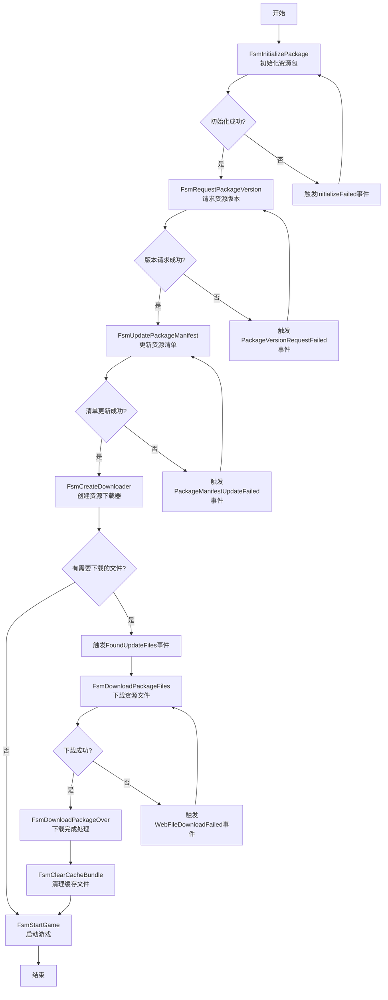

# YooAsset热更新状态机流程详解

## 概述

YooAsset使用状态机模式管理游戏启动时的资源初始化和更新过程。这种设计使得复杂的资源更新流程变得清晰可控，每个状态负责特定的任务，完成后自动切换到下一个状态。

## 状态机节点详解

### 1. FsmInitializePackage - 初始化资源包

**功能：**
- 根据指定的运行模式(EPlayMode)创建并初始化资源包
- 支持编辑器模拟模式、单机模式、联机模式和WebGL模式
- 设置远程服务器地址和文件系统参数

**切换关系：**
- 初始化成功 → FsmRequestPackageVersion
- 初始化失败 → 触发InitializeFailed事件，等待用户处理

### 2. FsmRequestPackageVersion - 请求资源版本

**功能：**
- 向服务器请求最新的资源包版本信息
- 将获取到的版本号存储在状态机的黑板中
- 用于后续比较本地和远程资源差异

**切换关系：**
- 版本请求成功 → FsmUpdatePackageManifest
- 版本请求失败 → 触发PackageVersionRequestFailed事件，等待用户处理

### 3. FsmUpdatePackageManifest - 更新资源清单

**功能：**
- 使用获取到的版本号更新本地资源清单
- 清单包含所有资源文件的哈希值、大小等信息
- 为后续文件差异比较做准备

**切换关系：**
- 清单更新成功 → FsmCreateDownloader
- 清单更新失败 → 触发PackageManifestUpdateFailed事件，等待用户处理

### 4. FsmCreateDownloader - 创建资源下载器

**功能：**
- 比较本地清单与服务器清单，创建需要下载的文件列表
- 设置下载参数（最大下载数、重试次数等）
- 计算总下载文件数和总下载大小

**切换关系：**
- 没有需要下载的文件 → FsmStartGame
- 有需要下载的文件 → 触发FoundUpdateFiles事件，暂停流程等待用户确认

### 5. FsmDownloadPackageFiles - 下载资源文件

**功能：**
- 执行实际的文件下载操作
- 提供下载进度回调和错误处理
- 支持断点续传和并发下载

**切换关系：**
- 下载成功 → FsmDownloadPackageOver
- 下载失败 → 触发WebFileDownloadFailed事件，等待用户处理

### 6. FsmDownloadPackageOver - 下载完成处理

**功能：**
- 一个简单的过渡状态，通知用户资源下载完成
- 执行下载后的清理工作

**切换关系：**
- 状态进入后 → FsmClearCacheBundle

### 7. FsmClearCacheBundle - 清理缓存文件

**功能：**
- 清理不再使用的缓存资源文件，释放存储空间
- 保持缓存目录整洁，提高后续加载效率

**切换关系：**
- 清理完成 → FsmStartGame

### 8. FsmStartGame - 启动游戏

**功能：**
- 最后一个状态，调用SetFinish()方法完成整个资源更新流程
- 触发PatchStepsChange事件，通知UI显示"开始游戏！"

**切换关系：**
- 状态进入后 → 结束整个流程

## 状态机流程图

## 事件驱动交互

状态机通过事件系统与UI交互，主要包括：

1. **PatchStepsChange** - 通知UI当前步骤变化
2. **InitializeFailed** - 初始化失败事件
3. **PackageVersionRequestFailed** - 版本请求失败事件
4. **PackageManifestUpdateFailed** - 清单更新失败事件
5. **FoundUpdateFiles** - 发现更新文件事件
6. **WebFileDownloadFailed** - 文件下载失败事件
7. **DownloadUpdate** - 下载进度更新事件

## 黑板数据共享

状态机使用黑板(Blackboard)存储共享数据：

- **PackageName** - 资源包名称
- **PlayMode** - 运行模式
- **PackageVersion** - 资源包版本
- **Downloader** - 资源下载器实例

## 关键设计特点

1. **状态机模式**：将复杂的资源更新流程分解为多个独立状态，每个状态负责特定任务
2. **黑板模式**：使用状态机的黑板存储共享数据，实现状态间数据传递
3. **事件驱动**：通过事件系统与UI交互，实现松耦合设计
4. **异步操作**：所有耗时操作都是异步执行，避免阻塞主线程
5. **错误处理**：每个状态都有相应的错误处理逻辑，提高系统健壮性
6. **可扩展性**：开发者可以根据需要添加新的状态或修改现有状态的逻辑

## 总结

YooAsset的状态机设计使得资源热更新流程既清晰又灵活，通过状态转换和事件驱动的方式，实现了从资源包初始化到游戏启动的完整流程。这种设计不仅便于维护和扩展，也为开发者提供了良好的自定义空间。
