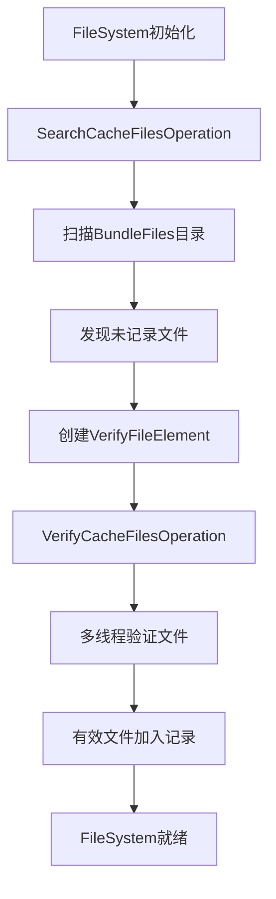
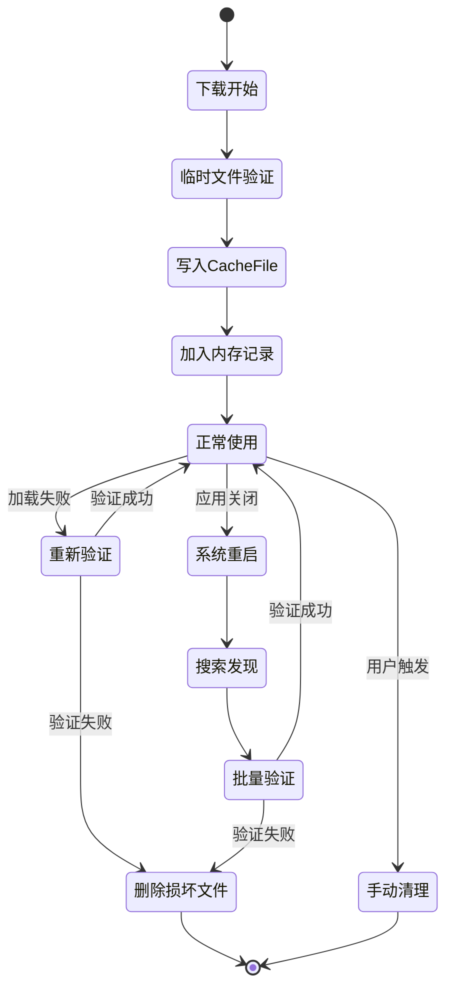

# YooAsset CacheFile搜索与验证机制深度解析

## 目录
1. [SearchCacheFile机制概述](#1-searchcachefile机制概述)
2. [CacheFile结构与组成](#2-cachefile结构与组成)
3. [三级验证机制详解](#3-三级验证机制详解)
4. [CacheFile生命周期管理](#4-cachefile生命周期管理)
5. [关键代码实现分析](#5-关键代码实现分析)
6. [性能优化与容错机制](#6-性能优化与容错机制)
7. [实际应用示例](#7-实际应用示例)
8. [总结](#8-总结)

---

## 1. SearchCacheFile机制概述

### 1.1 核心目的
SearchCacheFile机制的主要目的是在系统初始化时**发现并验证所有已存在的缓存文件**，确保它们能够被正确使用。

### 1.2 触发时机
SearchCacheFile在以下情况下被触发：
- **系统初始化时**：当DefaultCacheFileSystem首次初始化
- **重新初始化时**：当清理旧的FileSystem后重新创建
- **缓存恢复时**：当需要重新建立缓存文件索引

### 1.3 核心实现

```csharp
// SearchCacheFilesOperation.cs - 核心扫描逻辑
private bool SearchFiles()
{
    // 1. 获取缓存根目录
    DirectoryInfo rootDirectory = new DirectoryInfo(_fileSystem.GetCacheBundleFilesRoot());
    var childDirectories = rootDirectory.EnumerateDirectories();

    foreach (var childDirectory in childDirectories)
    {
        string bundleGUID = childDirectory.Name;

        // 2. 检查是否已记录在内存中
        if (_fileSystem.IsRecordBundleFile(bundleGUID))
            continue; // 已记录，跳过处理

        // 3. 为未记录的文件创建验证元素
        var element = new VerifyFileElement(bundleGUID,
                                          GetBundleInfoFilePath(bundleGUID),
                                          GetBundleDataFilePath(bundleGUID));
        Result.Add(element);
    }

    return true;
}
```

### 1.4 执行流程



---

## 2. CacheFile结构与组成

### 2.1 双文件结构设计

CacheFile采用**双文件结构**来存储每个Bundle，确保数据完整性和快速访问：

```
PackageRoot/
├── BundleFiles/                    # 缓存资源文件根目录
│   ├── 2a/                        # 按FileHash前两位分目录（性能优化）
│   │   └── abc123def456/           # Bundle GUID目录
│   │       ├── __data              # 数据文件（实际的AssetBundle内容）
│   │       └── __info              # 信息文件（元数据：CRC + 文件大小）
│   ├── 7f/
│   │   └── ...
│   └── ...
├── ManifestFiles/                  # 清单文件目录
│   ├── package.json
│   └── ...
└── TempFiles/                      # 临时文件目录
    └── download_temp_*.tmp
```

### 2.2 RecordFileElement数据结构

```csharp
// RecordFileElement.cs - 缓存文件记录元素
public class RecordFileElement
{
    /// <summary>
    /// 信息文件路径（存储元数据）
    /// </summary>
    public string InfoFilePath { get; }

    /// <summary>
    /// 数据文件路径（存储实际内容）
    /// </summary>
    public string DataFilePath { get; }

    /// <summary>
    /// 数据文件的CRC32校验值
    /// </summary>
    public uint DataFileCRC { get; }

    /// <summary>
    /// 数据文件大小
    /// </summary>
    public long DataFileSize { get; }

    public RecordFileElement(string infoFilePath, string dataFilePath,
                           uint dataFileCRC, long dataFileSize)
    {
        InfoFilePath = infoFilePath;
        DataFilePath = dataFilePath;
        DataFileCRC = dataFileCRC;
        DataFileSize = dataFileSize;
    }
}
```

### 2.3 __info文件的二进制格式

```csharp
// DefaultCacheFileSystem.WriteBundleInfoFile()
public void WriteBundleInfoFile(string filePath, uint dataFileCRC, long dataFileSize)
{
    using (FileStream fs = new FileStream(filePath, FileMode.Create, FileAccess.Write, FileShare.Read))
    {
        _sharedBuffer.Clear();
        _sharedBuffer.WriteUInt32(dataFileCRC);    // 4字节：CRC32校验值
        _sharedBuffer.WriteInt64(dataFileSize);     // 8字节：文件大小
        _sharedBuffer.WriteToStream(fs);
        fs.Flush();
    }
}

// DefaultCacheFileSystem.ReadBundleInfoFile()
public void ReadBundleInfoFile(string filePath, out uint dataFileCRC, out long dataFileSize)
{
    using (FileStream fs = new FileStream(filePath, FileMode.Open, FileAccess.Read, FileShare.Read))
    {
        byte[] bytes = FileUtility.ReadAllBytes(filePath);
        using (ByteBuffer buffer = new ByteBuffer(bytes))
        {
            dataFileCRC = buffer.ReadUInt32();    // 读取CRC32
            dataFileSize = buffer.ReadInt64();     // 读取文件大小
        }
    }
}
```

### 2.4 文件路径生成规则

```csharp
// DefaultCacheFileSystem.cs:427-440 - 路径生成逻辑
public string GetBundleDataFilePath(PackageBundle bundle)
{
    if (_bundleDataFilePathMapping.TryGetValue(bundle.BundleGUID, out string filePath) == false)
    {
        // 关键：使用FileHash的前两位作为目录名
        string folderName = bundle.FileHash.Substring(0, 2);
        // 示例：{cacheRoot}/BundleFiles/2a/abc123def456/__data[.ext]
        filePath = PathUtility.Combine(_cacheBundleFilesRoot, folderName, bundle.BundleGUID, DefaultCacheFileSystemDefine.BundleDataFileName);
        if (AppendFileExtension)
            filePath += bundle.FileExtension;
        _bundleDataFilePathMapping.Add(bundle.BundleGUID, filePath);
    }
    return filePath;
}

public string GetBundleInfoFilePath(PackageBundle bundle)
{
    if (_bundleInfoFilePathMapping.TryGetValue(bundle.BundleGUID, out string filePath) == false)
    {
        // 同样使用FileHash的前两位作为目录名
        string folderName = bundle.FileHash.Substring(0, 2);
        // 示例：{cacheRoot}/BundleFiles/2a/abc123def456/__info
        filePath = PathUtility.Combine(_cacheBundleFilesRoot, folderName, bundle.BundleGUID, DefaultCacheFileSystemDefine.BundleInfoFileName);
        _bundleInfoFilePathMapping.Add(bundle.BundleGUID, filePath);
    }
    return filePath;
}
```

---

## 3. 三级验证机制详解

### 3.1 验证级别定义

YooAsset提供了三个级别的文件验证，平衡了性能和安全性：

```csharp
// EFileVerifyLevel.cs
public enum EFileVerifyLevel
{
    Low = 1,     // 只验证文件存在性
    Middle = 2,  // 验证文件存在性 + 文件大小
    High = 3,    // 验证文件存在性 + 文件大小 + CRC32校验
}
```

### 3.2 验证结果类型

```csharp
// EFileVerifyResult.cs
public enum EFileVerifyResult
{
    Succeed,               // 验证成功
    DataFileNotExisted,    // 数据文件不存在
    InfoFileNotExisted,    // 信息文件不存在
    FileNotComplete,       // 文件不完整（大小不足）
    FileOverflow,          // 文件溢出（大小超限）
    FileCrcError,          // CRC32校验错误
    Exception              // 验证过程发生异常
}
```

### 3.3 核心验证逻辑

```csharp
// FileVerifyHelper.FileVerify() - 核心验证方法
public static EFileVerifyResult FileVerify(string filePath, long fileSize, uint fileCRC, EFileVerifyLevel verifyLevel)
{
    // 1. 验证文件存在性
    if (File.Exists(filePath) == false)
        return EFileVerifyResult.DataFileNotExisted;

    // 2. 验证文件大小
    long actualSize = FileUtility.GetFileSize(filePath);
    if (actualSize < fileSize)
        return EFileVerifyResult.FileNotComplete;
    if (actualSize > fileSize)
        return EFileVerifyResult.FileOverflow;

    // 3. 验证CRC32（仅High级别执行）
    if (verifyLevel == EFileVerifyLevel.High)
    {
        uint actualCRC = HashUtility.FileCRC32Value(filePath);
        if (actualCRC == fileCRC)
            return EFileVerifyResult.Succeed;
        else
            return EFileVerifyResult.FileCrcError;
    }

    return EFileVerifyResult.Succeed;
}
```

### 3.4 缓存文件验证流程

```csharp
// VerifyCacheFilesOperation.cs - 缓存文件验证实现
private EFileVerifyResult VerifyingCacheFile(VerifyFileElement element, EFileVerifyLevel verifyLevel)
{
    try
    {
        // Low级别：只检查文件存在
        if (verifyLevel == EFileVerifyLevel.Low)
        {
            if (File.Exists(element.InfoFilePath) == false)
                return EFileVerifyResult.InfoFileNotExisted;
            if (File.Exists(element.DataFilePath) == false)
                return EFileVerifyResult.DataFileNotExisted;
            return EFileVerifyResult.Succeed;
        }

        // Middle/High级别：读取信息文件并验证
        _fileSystem.ReadBundleInfoFile(element.InfoFilePath,
                                     out element.DataFileCRC,
                                     out element.DataFileSize);
    }
    catch (Exception)
    {
        return EFileVerifyResult.Exception;
    }

    // 执行实际验证
    return FileVerifyHelper.FileVerify(element.DataFilePath,
                                     element.DataFileSize,
                                     element.DataFileCRC,
                                     verifyLevel);
}
```

### 3.5 验证级别选择建议

| 场景 | 推荐级别 | 原因 |
|------|----------|------|
| 开发调试 | Low | 快速启动，允许部分文件不完整 |
| 正式发布 | Middle | 平衡性能和安全性 |
| 金融/安全应用 | High | 最高安全性要求 |

---

## 4. CacheFile生命周期管理

### 4.1 完整生命周期



### 4.2 下载完成后创建CacheFile

```csharp
// DefaultCacheFileSystem.WriteCacheBundleFile()
public bool WriteCacheBundleFile(PackageBundle bundle, string copyPath)
{
    string infoFilePath = GetBundleInfoFilePath(bundle);
    string dataFilePath = GetBundleDataFilePath(bundle);

    // 1. 删除旧文件（如果存在）
    if (File.Exists(infoFilePath)) File.Delete(infoFilePath);
    if (File.Exists(dataFilePath)) File.Delete(dataFilePath);

    // 2. 创建目录并拷贝数据文件
    FileUtility.CreateFileDirectory(dataFilePath);
    FileInfo fileInfo = new FileInfo(copyPath);
    fileInfo.CopyTo(dataFilePath);

    // 3. 写入信息文件
    WriteBundleInfoFile(infoFilePath, bundle.FileCRC, bundle.FileSize);

    // 4. 创建记录并加入内存缓存
    var recordFileElement = new RecordFileElement(infoFilePath, dataFilePath,
                                                bundle.FileCRC, bundle.FileSize);
    return RecordBundleFile(bundle.BundleGUID, recordFileElement);
}
```

### 4.3 加载时验证机制

```csharp
// DCFSLoadBundleOperation.cs - 加载时的验证逻辑
protected override void InternalUpdate()
{
    if (_steps == ESteps.VerifyFile)
    {
        // 1. 检查缓存文件记录
        if (_fileSystem.IsRecordBundleFile(_bundle.BundleGUID))
        {
            // 2. 获取文件路径
            string filePath = _fileSystem.GetCacheBundleFileLoadPath(_bundle);

            // 3. 加载AssetBundle
            if (_bundle.Encrypted)
            {
                var decryptResult = _fileSystem.LoadEncryptedAssetBundle(_bundle);
                _assetBundle = decryptResult.Result;
            }
            else
            {
                _assetBundle = AssetBundle.LoadFromFile(filePath);
            }

            // 4. 加载失败时的重新验证
            if (_assetBundle == null)
            {
                EFileVerifyResult verifyResult = _fileSystem.VerifyCacheFile(_bundle);
                if (verifyResult != EFileVerifyResult.Succeed)
                {
                    // 5. 验证失败，删除损坏文件
                    _fileSystem.DeleteCacheBundleFile(_bundle.BundleGUID);
                }
            }
        }
        _steps = ESteps.Done;
    }
}
```

### 4.4 内存记录管理

```csharp
// DefaultCacheFileSystem.cs - 内存记录管理
protected readonly Dictionary<string, RecordFileElement> _records = new Dictionary<string, RecordFileElement>(10000);

public bool RecordBundleFile(string bundleGUID, RecordFileElement element)
{
    if (_records.ContainsKey(bundleGUID))
        return false;

    _records.Add(bundleGUID, element);
    return true;
}

public bool IsRecordBundleFile(string bundleGUID)
{
    return _records.ContainsKey(bundleGUID);
}

public bool DeleteCacheBundleFile(string bundleGUID)
{
    if (_records.TryGetValue(bundleGUID, out RecordFileElement element))
    {
        // 删除物理文件
        if (File.Exists(element.InfoFilePath)) File.Delete(element.InfoFilePath);
        if (File.Exists(element.DataFilePath)) File.Delete(element.DataFilePath);

        // 删除内存记录
        return _records.Remove(bundleGUID);
    }
    return false;
}
```

---

## 5. 关键代码实现分析

### 5.1 SearchCacheFilesOperation

```csharp
// SearchCacheFilesOperation.cs - 搜索未记录的缓存文件
internal sealed class SearchCacheFilesOperation : AsyncOperationBase
{
    private enum ESteps
    {
        None,
        SearchCacheFiles,
        Done,
    }

    private readonly DefaultCacheFileSystem _fileSystem;
    private readonly List<VerifyFileElement> _result = new List<VerifyFileElement>(5000);

    internal override void InternalUpdate()
    {
        if (_steps == ESteps.SearchCacheFiles)
        {
            // 执行搜索
            SearchFiles();
            _steps = ESteps.Done;
        }
    }

    private bool SearchFiles()
    {
        try
        {
            string bundleFilesRoot = _fileSystem.GetCacheBundleFilesRoot();
            if (Directory.Exists(bundleFilesRoot) == false)
                return true;

            DirectoryInfo rootDirectory = new DirectoryInfo(bundleFilesRoot);
            var childDirectories = rootDirectory.EnumerateDirectories();

            foreach (var childDirectory in childDirectories)
            {
                string bundleGUID = childDirectory.Name;

                // 检查是否已记录在内存中
                if (_fileSystem.IsRecordBundleFile(bundleGUID))
                    continue;

                // 创建验证元素
                var element = new VerifyFileElement(bundleGUID,
                                                  _fileSystem.GetBundleInfoFilePath(bundleGUID),
                                                  _fileSystem.GetBundleDataFilePath(bundleGUID));
                _result.Add(element);
            }
            return true;
        }
        catch (Exception e)
        {
            YooLogger.Error(e.Message);
            return false;
        }
    }

    public List<VerifyFileElement> GetResult()
    {
        return _result;
    }
}
```

### 5.2 VerifyCacheFilesOperation

```csharp
// VerifyCacheFilesOperation.cs - 批量验证缓存文件
internal sealed class VerifyCacheFilesOperation : AsyncOperationBase
{
    private enum ESteps
    {
        None,
        VerifyCacheFiles,
        Done,
    }

    private readonly DefaultCacheFileSystem _fileSystem;
    private readonly List<VerifyFileElement> _verifyFileElements;
    private readonly EFileVerifyLevel _verifyLevel;
    private readonly ConcurrentQueue<VerifyFileElement> _successElements = new ConcurrentQueue<VerifyFileElement>();
    private int _totalProcessCount;
    private int _successCount;

    internal override void InternalUpdate()
    {
        if (_steps == ESteps.VerifyCacheFiles)
        {
            // 多线程验证处理
            Parallel.ForEach(_verifyFileElements, element =>
            {
                EFileVerifyResult result = VerifyingCacheFile(element, _verifyLevel);
                if (result == EFileVerifyResult.Succeed)
                {
                    _successElements.Enqueue(element);
                }
                else
                {
                    YooLogger.Warning($"Cache file verify failed: {element.DataFilePath} - {result}");
                }

                System.Threading.Interlocked.Increment(ref _totalProcessCount);
            });

            // 将验证成功的文件加入记录
            while (_successElements.TryDequeue(out VerifyFileElement element))
            {
                var recordElement = new RecordFileElement(
                    element.InfoFilePath, element.DataFilePath,
                    element.DataFileCRC, element.DataFileSize);
                _fileSystem.RecordBundleFile(element.BundleGUID, recordElement);
                _successCount++;
            }

            YooLogger.Log($"Cache file verify completed: {_successCount}/{_totalProcessCount}");
            _steps = ESteps.Done;
        }
    }
}
```

### 5.3 文件验证辅助方法

```csharp
// FileVerifyHelper.cs - 文件验证工具类
public static class FileVerifyHelper
{
    /// <summary>
    /// 验证文件完整性
    /// </summary>
    public static EFileVerifyResult FileVerify(string filePath, long fileSize, uint fileCRC, EFileVerifyLevel verifyLevel)
    {
        try
        {
            // 1. 检查文件存在性
            if (File.Exists(filePath) == false)
                return EFileVerifyResult.DataFileNotExisted;

            // 2. 检查文件大小
            long actualSize = FileUtility.GetFileSize(filePath);
            if (actualSize < fileSize)
                return EFileVerifyResult.FileNotComplete;
            if (actualSize > fileSize)
                return EFileVerifyResult.FileOverflow;

            // 3. 检查CRC（仅High级别）
            if (verifyLevel == EFileVerifyLevel.High)
            {
                uint actualCRC = HashUtility.FileCRC32Value(filePath);
                if (actualCRC != fileCRC)
                    return EFileVerifyResult.FileCrcError;
            }

            return EFileVerifyResult.Succeed;
        }
        catch (Exception)
        {
            return EFileVerifyResult.Exception;
        }
    }

    /// <summary>
    /// 验证临时下载文件
    /// </summary>
    public static EFileVerifyResult VerifyTempFile(string filePath, string tempFilePath, long fileSize, uint fileCRC, EFileVerifyLevel verifyLevel)
    {
        // 先验证临时文件，成功后重命名为正式文件
        EFileVerifyResult result = FileVerify(tempFilePath, fileSize, fileCRC, verifyLevel);
        if (result == EFileVerifyResult.Succeed)
        {
            // 重命名临时文件为正式文件
            if (File.Exists(filePath))
                File.Delete(filePath);
            File.Move(tempFilePath, filePath);
        }
        return result;
    }
}
```

### 5.4 缓存文件路径管理

```csharp
// DefaultCacheFileSystem.cs - 路径管理相关方法
public class DefaultCacheFileSystem : IFileSystem
{
    // 获取缓存数据文件路径
    public string GetCacheBundleFileLoadPath(PackageBundle bundle)
    {
        return GetBundleDataFilePath(bundle);
    }

    // 获取Bundle数据文件路径
    private string GetBundleDataFilePath(PackageBundle bundle)
    {
        string fileExtension = AppendFileExtension ? bundle.FileExtension : string.Empty;
        return PathUtility.Combine(GetCacheBundleFilesRoot(), bundle.BundleGUID, "__data" + fileExtension);
    }

    // 获取Bundle信息文件路径
    private string GetBundleInfoFilePath(PackageBundle bundle)
    {
        return PathUtility.Combine(GetCacheBundleFilesRoot(), bundle.BundleGUID, "__info");
    }

    // 获取缓存文件根目录
    private string GetCacheBundleFilesRoot()
    {
        return PathUtility.Combine(_packageRoot, DefaultCacheFileSystemDefine.SaveBundleFilesFolderName);
    }
}
```

---

## 6. 性能优化与容错机制

### 6.1 性能优化策略

#### 6.1.1 哈希分目录存储
```csharp
// 按FileHash的前两位字符分目录，避免单目录文件过多
// 示例：FileHash="2a8b9c..." -> BundleFiles/2a/{BundleGUID}/
string folderName = bundle.FileHash.Substring(0, 2);  // DefaultCacheFileSystem.cs:427
```

#### 6.1.2 内存缓存机制
```csharp
// 使用Dictionary缓存已验证的文件信息，避免重复IO操作
protected readonly Dictionary<string, RecordFileElement> _records = new Dictionary<string, RecordFileElement>(10000);

public bool IsRecordBundleFile(string bundleGUID)
{
    return _records.ContainsKey(bundleGUID); // O(1)时间复杂度
}
```

#### 6.1.3 并发验证
```csharp
// 使用Parallel.ForEach进行多线程验证
Parallel.ForEach(_verifyFileElements, element =>
{
    EFileVerifyResult result = VerifyingCacheFile(element, _verifyLevel);
    // 处理验证结果...
});
```

#### 6.1.4 缓冲区复用
```csharp
// 使用共享的ByteBuffer避免频繁内存分配
private static readonly ByteBuffer _sharedBuffer = new ByteBuffer(1024);

public void WriteBundleInfoFile(string filePath, uint dataFileCRC, long dataFileSize)
{
    using (FileStream fs = new FileStream(filePath, FileMode.Create))
    {
        _sharedBuffer.Clear();
        _sharedBuffer.WriteUInt32(dataFileCRC);
        _sharedBuffer.WriteInt64(dataFileSize);
        _sharedBuffer.WriteToStream(fs);
    }
}
```

### 6.2 容错机制

#### 6.2.1 加载失败时的自动修复
```csharp
// DCFSLoadBundleOperation.cs
if (_assetBundle == null)
{
    // 1. 重新验证缓存文件
    EFileVerifyResult verifyResult = _fileSystem.VerifyCacheFile(_bundle);
    if (verifyResult == EFileVerifyResult.Succeed)
    {
        // 2. 验证成功，尝试从内存加载
        byte[] fileData = FileUtility.ReadAllBytes(filePath);
        _assetBundle = AssetBundle.LoadFromMemory(fileData);
    }

    // 3. 仍然失败则删除损坏文件
    if (_assetBundle == null)
    {
        YooLogger.Warning($"Failed to load bundle: {_bundle.BundleName}, deleting corrupted cache file.");
        _fileSystem.DeleteCacheBundleFile(_bundle.BundleGUID);
    }
}
```

#### 6.2.2 异常处理和恢复
```csharp
// VerifyCacheFilesOperation.cs
private EFileVerifyResult VerifyingCacheFile(VerifyFileElement element, EFileVerifyLevel verifyLevel)
{
    try
    {
        // 验证逻辑
        return FileVerifyHelper.FileVerify(element.DataFilePath,
                                         element.DataFileSize,
                                         element.DataFileCRC,
                                         verifyLevel);
    }
    catch (Exception e)
    {
        YooLogger.Error($"Exception during cache file verification: {e.Message}");
        return EFileVerifyResult.Exception;
    }
}
```

#### 6.2.3 文件锁处理
```csharp
// 使用FileShare.Read避免文件访问冲突
public void ReadBundleInfoFile(string filePath, out uint dataFileCRC, out long dataFileSize)
{
    using (FileStream fs = new FileStream(filePath, FileMode.Open, FileAccess.Read, FileShare.Read))
    {
        // 读取文件内容
        byte[] bytes = FileUtility.ReadAllBytes(filePath);
        using (ByteBuffer buffer = new ByteBuffer(bytes))
        {
            dataFileCRC = buffer.ReadUInt32();
            dataFileSize = buffer.ReadInt64();
        }
    }
}
```

### 6.3 监控和调试

#### 6.3.1 统计信息收集
```csharp
// 验证完成后的统计报告
YooLogger.Log($"Cache file verification report:");
YooLogger.Log($"  Total files scanned: {_totalProcessCount}");
YooLogger.Log($"  Successfully verified: {_successCount}");
YooLogger.Log($"  Failed verification: {_totalProcessCount - _successCount}");
YooLogger.Log($"  Verification level: {_verifyLevel}");
```

#### 6.3.2 详细错误报告
```csharp
// 为不同验证结果提供具体的错误信息
switch (result)
{
    case EFileVerifyResult.DataFileNotExisted:
        YooLogger.Warning($"Data file not found: {element.DataFilePath}");
        break;
    case EFileVerifyResult.InfoFileNotExisted:
        YooLogger.Warning($"Info file not found: {element.InfoFilePath}");
        break;
    case EFileVerifyResult.FileCrcError:
        YooLogger.Warning($"CRC mismatch: expected={element.DataFileCRC:X8}, actual={actualCRC:X8}");
        break;
    case EFileVerifyResult.FileNotComplete:
        YooLogger.Warning($"File incomplete: expected={element.DataFileSize}, actual={actualSize}");
        break;
}
```

---

## 7. 实际应用示例

### 7.1 基本使用示例

```csharp
public class YooAssetCacheExample : MonoBehaviour
{
    private void Start()
    {
        StartCoroutine(InitializeYooAsset());
    }

    private IEnumerator InitializeYooAsset()
    {
        // 1. 创建远程服务和加密服务
        var remoteServices = new DefaultRemoteServices("https://cdn.example.com");
        var decryptionServices = new GameDecryptionServices();

        // 2. 创建缓存文件系统参数
        var cacheParams = FileSystemParameters.CreateDefaultCacheFileSystemParameters(
            remoteServices,
            decryptionServices,
            Application.persistentDataPath + "/Cache");

        // 3. 设置验证级别
        cacheParams.AddParameter(FileSystemParametersDefine.FILE_VERIFY_LEVEL, EFileVerifyLevel.Middle);

        // 4. 初始化资源包（内部会触发SearchCacheFile）
        var package = YooAssets.CreatePackage("DefaultPackage");
        var initOperation = package.InitializeAsync(new HostPlayModeParameters
        {
            CacheFileSystemParameters = cacheParams
        });

        yield return initOperation;

        if (initOperation.Status == EOperationStatus.Succeed)
        {
            Debug.Log("YooAsset initialized with cache verification completed!");
        }
        else
        {
            Debug.LogError($"YooAsset initialization failed: {initOperation.Error}");
        }
    }
}
```

### 7.2 缓存验证工具类

```csharp
/// <summary>
/// YooAsset缓存验证工具类
/// </summary>
public static class YooAssetCacheValidator
{
    /// <summary>
    /// 手动触发缓存文件验证
    /// </summary>
    public static void ValidateCacheFiles(string packageName, EFileVerifyLevel verifyLevel = EFileVerifyLevel.Middle)
    {
        var package = YooAssets.GetPackage(packageName);
        var playMode = package.GetFileSystem() as DefaultCacheFileSystem;

        if (playMode != null)
        {
            Debug.Log($"Starting manual cache validation at level: {verifyLevel}");

            // 创建验证操作
            var verifyOperation = new VerifyCacheFilesOperation(playMode, new List<VerifyFileElement>(), verifyLevel);
            verifyOperation.StartOperation();

            // 等待验证完成
            while (!verifyOperation.IsDone)
            {
                System.Threading.Thread.Sleep(100);
            }

            Debug.Log("Cache validation completed.");
        }
    }

    /// <summary>
    /// 获取缓存统计信息
    /// </summary>
    public static void PrintCacheStatistics(string packageName)
    {
        var package = YooAssets.GetPackage(packageName);
        var playMode = package.GetFileSystem() as DefaultCacheFileSystem;

        if (playMode != null)
        {
            Debug.Log($"Cache Statistics:");
            Debug.Log($"  Package: {packageName}");
            Debug.Log($"  Root: {playMode.FileRoot}");
            Debug.Log($"  File Count: {playMode.FileCount}");
            Debug.Log($"  Cache Bundle Root: {playMode.GetCacheBundleFilesRoot()}");
        }
    }

    /// <summary>
    /// 清理损坏的缓存文件
    /// </summary>
    public static void CleanupCorruptedCacheFiles(string packageName)
    {
        var package = YooAssets.GetPackage(packageName);
        var playMode = package.GetFileSystem() as DefaultCacheFileSystem;

        if (playMode != null)
        {
            // 创建搜索操作发现所有文件
            var searchOperation = new SearchCacheFilesOperation(playMode);
            searchOperation.StartOperation();

            while (!searchOperation.IsDone)
            {
                System.Threading.Thread.Sleep(100);
            }

            // 验证发现的文件
            var verifyElements = searchOperation.GetResult();
            var verifyOperation = new VerifyCacheFilesOperation(playMode, verifyElements, EFileVerifyLevel.High);
            verifyOperation.StartOperation();

            while (!verifyOperation.IsDone)
            {
                System.Threading.Thread.Sleep(100);
            }

            Debug.Log($"Cleaned up corrupted cache files for package: {packageName}");
        }
    }
}
```

### 7.3 自定义缓存验证级别

```csharp
/// <summary>
/// 根据不同环境设置不同的验证级别
/// </summary>
public static class CacheVerifyLevelSelector
{
    public static EFileVerifyLevel GetVerifyLevel()
    {
#if DEVELOPMENT_BUILD
        // 开发版本：使用Middle级别，平衡性能和安全性
        return EFileVerifyLevel.Middle;
#elif RELEASE
        // 发布版本：使用Middle级别，保证基本安全性
        return EFileVerifyLevel.Middle;
#else
        // 调试版本：使用Low级别，快速启动
        return EFileVerifyLevel.Low;
#endif
    }

    public static FileSystemParameters CreateCacheFileSystemParameters(IRemoteServices remoteServices)
    {
        var verifyLevel = GetVerifyLevel();

        var cacheParams = FileSystemParameters.CreateDefaultCacheFileSystemParameters(
            remoteServices,
            null, // decryptionServices
            Application.persistentDataPath + "/YooAssetCache");

        cacheParams.AddParameter(FileSystemParametersDefine.FILE_VERIFY_LEVEL, verifyLevel);
        cacheParams.AddParameter(FileSystemParametersDefine.DOWNLOAD_MAX_CONCURRENCY, 3);

        Debug.Log($"Created cache file system with verify level: {verifyLevel}");
        return cacheParams;
    }
}
```

### 7.4 缓存文件监控工具

```csharp
/// <summary>
/// 缓存文件变化监控工具
/// </summary>
public class CacheFileMonitor : MonoBehaviour
{
    [SerializeField] private string packageName = "DefaultPackage";
    [SerializeField] private float checkInterval = 30f;

    private DefaultCacheFileSystem _cacheFileSystem;
    private int _lastFileCount = -1;
    private float _lastCheckTime;

    private void Start()
    {
        var package = YooAssets.GetPackage(packageName);
        _cacheFileSystem = package.GetFileSystem() as DefaultCacheFileSystem;
        _lastCheckTime = Time.time;
    }

    private void Update()
    {
        if (Time.time - _lastCheckTime >= checkInterval)
        {
            CheckCacheChanges();
            _lastCheckTime = Time.time;
        }
    }

    private void CheckCacheChanges()
    {
        if (_cacheFileSystem != null)
        {
            int currentFileCount = _cacheFileSystem.FileCount;
            if (currentFileCount != _lastFileCount)
            {
                Debug.Log($"Cache file count changed: {_lastFileCount} -> {currentFileCount}");
                _lastFileCount = currentFileCount;

                // 可以在这里触发重新验证
                if (currentFileCount > _lastFileCount)
                {
                    Debug.Log("New cache files detected, triggering verification...");
                }
            }
        }
    }

    private void OnGUI()
    {
        if (_cacheFileSystem != null)
        {
            GUILayout.BeginArea(new Rect(10, 10, 300, 100));
            GUILayout.Label($"Package: {packageName}");
            GUILayout.Label($"Cache Files: {_cacheFileSystem.FileCount}");
            GUILayout.Label($"Cache Root: {_cacheFileSystem.FileRoot}");

            if (GUILayout.Button("Validate Cache"))
            {
                YooAssetCacheValidator.ValidateCacheFiles(packageName);
            }

            if (GUILayout.Button("Print Statistics"))
            {
                YooAssetCacheValidator.PrintCacheStatistics(packageName);
            }

            GUILayout.EndArea();
        }
    }
}
```

---

## 8. 总结

YooAsset的SearchCacheFile机制是一个精心设计的缓存管理系统，具有以下核心特点：

### 8.1 设计优势

1. **数据完整性保障**
   - 双文件结构（__data + __info）确保数据可靠性
   - CRC32校验保证文件完整性
   - 三级验证机制平衡性能和安全性

2. **性能优化**
   - 哈希分目录存储避免单目录文件过多
   - 内存缓存机制减少重复IO操作
   - 并发验证提高初始化速度
   - 缓冲区复用减少内存分配

3. **容错能力**
   - 自动检测和修复损坏文件
   - 多级异常处理机制
   - 优雅的降级策略

4. **易用性**
   - 自动化的缓存管理
   - 可配置的验证级别
   - 丰富的调试和监控工具

### 8.2 适用场景

- **移动游戏**：保证离线资源的可靠性
- **大型项目**：管理海量的资源缓存
- **热更新系统**：确保更新后的资源完整性
- **多人游戏**：处理资源的并发访问和验证

### 8.3 最佳实践建议

1. **验证级别选择**：
   - 开发阶段使用Low级别，加快启动速度
   - 发布版本使用Middle级别，平衡性能和安全性
   - 安全敏感应用使用High级别，确保最高安全性

2. **性能优化**：
   - 合理设置下载并发数
   - 定期清理无用缓存文件
   - 监控缓存大小和数量

3. **错误处理**：
   - 监控缓存验证失败的情况
   - 实现自动恢复机制
   - 提供用户友好的错误提示

这套缓存管理机制为YooAsset提供了可靠的资源管理基础，确保了在各种复杂场景下的稳定运行。通过深入理解和合理配置这套机制，可以大大提升游戏的性能和用户体验。