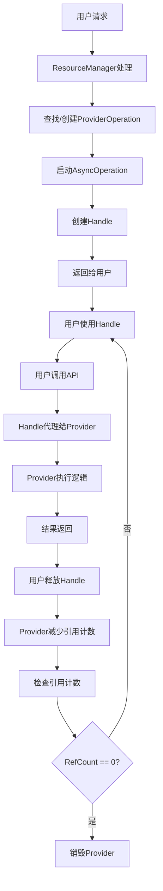

# YooAsset Handle系统与AsyncOperation深度解析

## 一、系统概述与设计理念

### 1.1 整体架构设计

YooAsset的Handle系统采用了**三层分离架构**，实现了用户接口层、资源管理层和异步执行层的清晰分离：

```
┌─────────────────────────────────────────────────────────┐
│                    用户接口层                              │
│              (Handle系统 - 用户API)                       │
├─────────────────────────────────────────────────────────┤
│                   资源管理层                              │
│            (ProviderOperation - 资源管理)                  │
├─────────────────────────────────────────────────────────┤
│                  异步执行层                              │
│          (AsyncOperation - 调度执行)                      │
└─────────────────────────────────────────────────────────┘
```

### 1.2 核心设计理念

#### **责任分离原则 (Separation of Concerns)**
- **Handle层**：专注于提供用户友好的API接口
- **Provider层**：专注于资源加载逻辑和状态管理
- **Operation层**：专注于异步操作调度和执行

#### **轻量级代理模式 (Lightweight Proxy)**
- Handle本身不包含复杂的加载状态，仅作为Provider的轻量级代理
- 通过代理模式实现接口统一和功能解耦

#### **资源共享机制 (Resource Sharing)**
- 同一资源的多个请求通过Provider的引用计数机制复用同一个加载实例
- 避免重复加载，提高资源利用效率

### 1.3 系统组件关系图

```
用户请求
    ↓
ResourceManager (统一入口)
    ↓
┌─────────────┬─────────────┬─────────────┬─────────────┐
│ AssetHandle │ SceneHandle │ SubAssetsHandle │ RawFileHandle │
└─────────────┴─────────────┴─────────────┴─────────────┘
    ↓             ↓             ↓             ↓
┌─────────────┬─────────────┬─────────────┬─────────────┐
│AssetProvider│SceneProvider│SubAssetsProvider│RawFileProvider│
└─────────────┴─────────────┴─────────────┴─────────────┘
    ↓             ↓             ↓             ↓
ProviderOperation (资源管理基类)
    ↓
AsyncOperationBase (异步操作基类)
    ↓
OperationSystem (调度系统)
```

## 二、HandleBase基类的核心设计

### 2.1 HandleBase架构分析

```csharp
public abstract class HandleBase : IEnumerator, IDisposable
{
    // 核心属性
    private readonly AssetInfo _assetInfo;
    internal ProviderOperation Provider { private set; get; }

    // 构造函数
    internal HandleBase(ProviderOperation provider)
    {
        Provider = provider;
        _assetInfo = provider.MainAssetInfo;
    }
}
```

### 2.2 核心机制实现

#### **Provider代理模式**
Handle通过`Provider`属性持有对ProviderOperation的引用，所有操作都通过代理模式委托给Provider执行：

```csharp
// 状态代理
public EOperationStatus Status
{
    get
    {
        if (IsValidWithWarning == false)
            return EOperationStatus.None;
        return Provider.Status;
    }
}

// 进度代理
public float Progress
{
    get
    {
        if (IsValidWithWarning == false)
            return 0f;
        return Provider.Progress;
    }
}

// 错误信息代理
public string Error
{
    get
    {
        if (IsValidWithWarning == false)
            return string.Empty;
        return Provider.Error;
    }
}
```

#### **有效性检查机制**
通过`IsValidWithWarning`属性提供智能的状态检查和警告机制：

```csharp
internal bool IsValidWithWarning
{
    get
    {
        if (Provider != null && Provider.IsDestroyed == false)
        {
            return true;
        }
        else
        {
            if (Provider == null)
                YooLogger.Warning($"Operation handle is released : {_assetInfo.AssetPath}");
            else if (Provider.IsDestroyed)
                YooLogger.Warning($"Provider is destroyed : {_assetInfo.AssetPath}");
            return false;
        }
    }
}
```

#### **异步编程支持**
Handle实现了多种异步编程模式，提供灵活的使用方式：

```csharp
// 协程支持 - 实现IEnumerator接口
bool IEnumerator.MoveNext() => !IsDone;
object IEnumerator.Current => null;
void IEnumerator.Reset() { }

// Task支持 - 提供Task属性
public virtual Task Task => Provider.Task;

// 事件回调支持
public abstract void InvokeCallback(); // 抽象方法，由子类实现
```

### 2.3 资源信息管理

```csharp
// 获取资源信息
public AssetInfo GetAssetInfo() => _assetInfo;

// 获取下载状态
public virtual DownloadStatus GetDownloadStatus() => Provider.GetDownloadStatus();

// 调试信息
public DebugHandleInfo GetDebugHandleInfo()
{
    DebugHandleInfo handleInfo = new DebugHandleInfo();
    handleInfo.AssetInfo = _assetInfo;
    handleInfo.HandleType = this.GetType().Name;
    handleInfo.LoadingStatus = Status.ToString();
    handleInfo.LoadingProgress = Progress;
    handleInfo.RefCount = Provider.RefCount;
    handleInfo.IsValid = Provider != null && !Provider.IsDestroyed;
    handleInfo.Error = Error;
    return handleInfo;
}
```

## 三、具体Handle类型的实现分析

### 3.1 AssetHandle - 资源加载句柄

#### **核心功能设计**
```csharp
public sealed class AssetHandle : HandleBase
{
    private System.Action<AssetHandle> _callback;

    internal AssetHandle(ProviderOperation provider) : base(provider)
    {
    }

    // 资源对象获取
    public UnityEngine.Object AssetObject
    {
        get
        {
            if (IsValidWithWarning == false)
                return null;
            return Provider.AssetObject;
        }
    }
}
```

#### **类型安全访问**
```csharp
// 泛型类型安全访问
public TAsset GetAssetObject<TAsset>() where TAsset : UnityEngine.Object
{
    if (IsValidWithWarning == false)
        return null;
    return Provider.AssetObject as TAsset;
}

// 检查资源类型
public bool CheckAssetType<TAsset>() where TAsset : UnityEngine.Object
{
    if (IsValidWithWarning == false)
        return false;
    return Provider.AssetObject is TAsset;
}
```

#### **实例化功能**
```csharp
// 同步实例化
public GameObject InstantiateSync(Transform parent = null, bool worldPositionStays = true)
{
    if (IsValidWithWarning == false)
        throw new System.Exception($"Asset handle is invalid : {GetAssetInfo().AssetPath}");

    if (Status == EOperationStatus.Failed)
        throw new System.Exception($"Asset load failed ! Error : {Error}");

    var gameObject = GetAssetObject<GameObject>();
    if (gameObject == null)
        throw new System.Exception($"Asset is not GameObject : {GetAssetInfo().AssetPath}");

    return UnityEngine.Object.Instantiate(gameObject, parent, worldPositionStays);
}

// 异步实例化
public InstantiateOperation InstantiateAsync(Transform parent = null, bool worldPositionStays = true)
{
    if (IsValidWithWarning == false)
        throw new System.Exception($"Asset handle is invalid : {GetAssetInfo().AssetPath}");

    if (Status == EOperationStatus.Failed)
        throw new System.Exception($"Asset load failed ! Error : {Error}");

    var gameObject = GetAssetObject<GameObject>();
    if (gameObject == null)
        throw new System.Exception($"Asset is not GameObject : {GetAssetInfo().AssetPath}");

    return InstantiateOperation.InstantiateAsync(gameObject, this, parent, worldPositionStays);
}
```

#### **事件回调机制**
```csharp
public event System.Action<AssetHandle> Completed
{
    add
    {
        if (IsValidWithWarning == false)
            throw new System.Exception($"Asset handle is invalid : {GetAssetInfo().AssetPath}");

        if (Provider.IsDone)
            value.Invoke(this);
        else
            _callback += value;
    }
    remove
    {
        if (IsValidWithWarning == false)
            throw new System.Exception($"Asset handle is invalid : {GetAssetInfo().AssetPath}");

        _callback -= value;
    }
}

internal override void InvokeCallback()
{
    _callback?.Invoke(this);
}
```

### 3.2 SceneHandle - 场景加载句柄

#### **场景特有的属性管理**
```csharp
public class SceneHandle : HandleBase
{
    internal string PackageName { set; get; }

    // 场景名称获取
    public string SceneName
    {
        get
        {
            return GetAssetInfo().AssetPath;
        }
    }

    // 场景对象获取
    public UnityEngine.SceneManagement.Scene SceneObject { get; internal set; }
}
```

#### **场景激活功能**
```csharp
public bool ActivateScene()
{
    if (IsValidWithWarning == false)
        return false;

    // 获取BundleResult中的场景对象
    var bundleResult = Provider.BundleResultObject;
    if (bundleResult != null && bundleResult.SceneObject.IsValid() && bundleResult.SceneObject.isLoaded)
    {
        SceneObject = bundleResult.SceneObject;
        return UnityEngine.SceneManagement.SceneManager.SetActiveScene(bundleResult.SceneObject);
    }
    return false;
}
```

#### **场景卸载功能**
```csharp
public UnloadSceneOperation UnloadAsync()
{
    if (IsValidWithWarning == false)
        throw new System.Exception($"Scene handle is invalid : {GetAssetInfo().AssetPath}");

    if (Status == EOperationStatus.Failed)
        throw new System.Exception($"Scene load failed ! Error : {Error}");

    // 注意：场景卸载成功后，会自动释放该handle的引用计数！
    var operation = new UnloadSceneOperation(Provider);
    OperationSystem.StartOperation(PackageName, operation);
    return operation;
}
```

### 3.3 SubAssetsHandle - 子资源句柄

#### **子资源集合管理**
```csharp
public sealed class SubAssetsHandle : HandleBase
{
    private System.Action<SubAssetsHandle> _callback;

    // 获取所有子资源
    public IReadOnlyList<UnityEngine.Object> SubAssetObjects
    {
        get
        {
            if (IsValidWithWarning == false)
                return null;
            return Provider.SubAssetObjects;
        }
    }
}
```

#### **子资源查询功能**
```csharp
// 按名称获取子资源
public TObject GetSubAssetObject<TObject>(string assetName) where TObject : UnityEngine.Object
{
    if (IsValidWithWarning == false)
        return null;

    if (Provider.SubAssetObjects == null)
        return null;

    foreach (var assetObject in Provider.SubAssetObjects)
    {
        if (assetObject.name == assetName && assetObject is TObject)
            return assetObject as TObject;
    }
    return null;
}

// 按类型获取子资源
public TObject[] GetSubAssetObjects<TObject>() where TObject : UnityEngine.Object
{
    if (IsValidWithWarning == false)
        return null;

    if (Provider.SubAssetObjects == null)
        return null;

    var result = new List<TObject>();
    foreach (var assetObject in Provider.SubAssetObjects)
    {
        if (assetObject is TObject typedObject)
            result.Add(typedObject);
    }
    return result.ToArray();
}

// 获取子资源名称列表
public string[] GetSubAssetNames()
{
    if (IsValidWithWarning == false)
        return null;

    if (Provider.SubAssetObjects == null)
        return null;

    var names = new List<string>();
    foreach (var assetObject in Provider.SubAssetObjects)
    {
        names.Add(assetObject.name);
    }
    return names.ToArray();
}
```

### 3.4 RawFileHandle - 原生文件句柄

#### **文件数据访问**
```csharp
public class RawFileHandle : HandleBase
{
    private System.Action<RawFileHandle> _callback;

    // 获取二进制数据
    public byte[] GetRawFileData()
    {
        if (IsValidWithWarning == false)
            return null;
        return Provider.BundleResultObject.ReadBundleFileData();
    }

    // 获取文本数据
    public string GetRawFileText()
    {
        if (IsValidWithWarning == false)
            return null;
        return Provider.BundleResultObject.ReadBundleFileText();
    }

    // 获取文件路径
    public string GetRawFilePath()
    {
        if (IsValidWithWarning == false)
            return null;
        return Provider.BundleResultObject.FileLoadPath;
    }
}
```

#### **文件大小查询**
```csharp
public long GetRawFileSize()
{
    if (IsValidWithWarning == false)
        return 0;
    return Provider.BundleResultObject.FileSize;
}
```

## 四、Handle与AsyncOperation的协作机制

### 4.1 ProviderOperation的核心角色

ProviderOperation是连接Handle和AsyncOperation的关键桥梁：

```csharp
internal abstract class ProviderOperation : AsyncOperationBase
{
    // 引用计数管理
    public int RefCount { private set; get; } = 0;
    public bool IsDestroyed { private set; get; } = false;

    // Handle集合管理
    private readonly HashSet<HandleBase> _handles = new HashSet<HandleBase>();
    private readonly LinkedList<WeakReference<HandleBase>> _weakReferences =
        new LinkedList<WeakReference<HandleBase>>();

    // 资源对象
    public UnityEngine.Object AssetObject { protected set; get; }
    public UnityEngine.Object[] SubAssetObjects { protected set; get; }

    // Bundle结果
    public BundleResult BundleResultObject { protected set; get; }
}
```

### 4.2 Handle创建流程

```csharp
// ResourceManager中的Handle创建
public AssetHandle LoadAssetAsync(AssetInfo assetInfo, uint priority)
{
    // 1. 生成Provider唯一标识
    string providerGUID = nameof(LoadAssetAsync) + assetInfo.GUID;

    // 2. 尝试获取已存在的Provider
    ProviderOperation provider = TryGetAssetProvider(providerGUID);

    // 3. 创建新的Provider（如果不存在）
    if (provider == null)
    {
        provider = new AssetProvider(this, providerGUID, assetInfo);
        provider.InitProviderDebugInfo();
        ProviderDic.Add(providerGUID, provider);
        OperationSystem.StartOperation(PackageName, provider); // 启动AsyncOperation
    }

    // 4. 设置优先级
    provider.Priority = priority;

    // 5. 创建Handle并返回
    return provider.CreateHandle<AssetHandle>();
}
```

### 4.3 ProviderOperation中的Handle管理

```csharp
// 创建Handle的核心逻辑
public T CreateHandle<T>() where T : HandleBase
{
    if (IsDestroyed)
        throw new System.Exception($"Provider has been destroyed !");

    RefCount++; // 引用计数增加

    // 通过工厂创建Handle
    HandleBase handle = HandleFactory.CreateHandle(this, typeof(T));

    // 根据配置选择引用模式
    if (_resManager.UseWeakReferenceHandle)
    {
        // 弱引用模式 - 允许GC回收
        var weakRef = new WeakReference<HandleBase>(handle);
        _weakReferences.AddLast(weakRef);
    }
    else
    {
        // 强引用模式 - 防止GC回收
        _handles.Add(handle);
    }

    return handle as T;
}

// 释放Handle的逻辑
public void ReleaseHandle(HandleBase handle)
{
    if (RefCount <= 0)
        throw new System.Exception("Should never get here !");

    RefCount--; // 引用计数减少

    if (_resManager.UseWeakReferenceHandle)
    {
        RemoveWeakReference(handle);
    }
    else
    {
        _handles.Remove(handle);
    }

    // 检查是否可以销毁Provider
    if (CanDestroyProvider())
    {
        OnDestroyProvider();
    }
}
```

### 4.4 数据流和控制流分析

#### **数据流向图**
```
用户请求 → ResourceManager → ProviderOperation → Handle
    ↓                           ↓                  ↓
操作启动 ←─── OperationSystem ←─── AsyncOperation ←─── 用户调用
    ↓                           ↓                  ↓
状态更新 ←───── 状态变更 ←─────── 异步执行 ←──────────── 底层IO
    ↓                           ↓                  ↓
结果返回 ←───── 完成回调 ←─────── 操作完成 ←──────────── 资源加载
```

#### **控制流向图**
```
1. 用户调用Handle API
    ↓
2. Handle检查有效性并代理给Provider
    ↓
3. Provider执行具体逻辑
    ↓
4. Provider调用AsyncOperation基类方法
    ↓
5. AsyncOperation通过OperationSystem调度
    ↓
6. 底层系统执行实际操作
    ↓
7. 结果逐层返回到Handle
```

### 4.5 生命周期协作机制

```csharp
// ProviderOperation的生命周期管理
public bool CanDestroyProvider()
{
    // 正在加载中的任务不可以销毁
    if (IsLoading)
        return false;

    // 引用计数为0时可以销毁
    return RefCount <= 0;
}

protected virtual void OnDestroyProvider()
{
    IsDestroyed = true;

    // 清理Bundle引用
    if (BundleResultObject != null)
    {
        BundleResultObject.ReleaseBundleFile();
        BundleResultObject = null;
    }

    // 清理资源引用
    AssetObject = null;
    SubAssetObjects = null;

    // 通知ResourceManager销毁Provider
    _resManager.DestroyAssetProvider(this);
}
```

## 五、HandleFactory工厂模式实现

### 5.1 工厂架构设计

```csharp
internal static class HandleFactory
{
    private static readonly Dictionary<Type, Func<ProviderOperation, HandleBase>> _handleFactory =
        new Dictionary<Type, Func<ProviderOperation, HandleBase>>()
    {
        // 预注册Handle类型
        { typeof(AssetHandle), operation => new AssetHandle(operation) },
        { typeof(SceneHandle), operation => new SceneHandle(operation) },
        { typeof(SubAssetsHandle), operation => new SubAssetsHandle(operation) },
        { typeof(AllAssetsHandle), operation => new AllAssetsHandle(operation) },
        { typeof(RawFileHandle), operation => new RawFileHandle(operation) }
    };

    public static HandleBase CreateHandle(ProviderOperation operation, Type type)
    {
        if (_handleFactory.TryGetValue(type, out var factory))
        {
            return factory(operation);
        }

        throw new NotImplementedException($"Handle type {type.FullName} is not supported.");
    }
}
```

### 5.2 类型安全保证

```csharp
// 泛型创建方法（扩展实现）
public static T CreateHandle<T>(ProviderOperation operation) where T : HandleBase
{
    var handle = CreateHandle(operation, typeof(T));
    return (T)handle;
}

// 运行时类型检查
public static bool IsHandleTypeSupported(Type type)
{
    return _handleFactory.ContainsKey(type);
}

// 获取支持的Handle类型
public static Type[] GetSupportedHandleTypes()
{
    return _handleFactory.Keys.ToArray();
}
```

### 5.3 扩展机制

```csharp
// 动态注册新的Handle类型（扩展功能）
public static void RegisterHandleType<T>(Func<ProviderOperation, T> factory)
    where T : HandleBase
{
    var type = typeof(T);
    if (_handleFactory.ContainsKey(type))
    {
        throw new InvalidOperationException($"Handle type {type.FullName} is already registered.");
    }

    _handleFactory[type] = operation => factory(operation);
}
```

## 六、引用计数和资源管理机制

### 6.1 引用计数原理

```csharp
// ProviderOperation中的引用计数实现
public int RefCount { private set; get; } = 0;

public T CreateHandle<T>() where T : HandleBase
{
    RefCount++; // 创建时增加
    // Handle创建逻辑...
    return handle as T;
}

public void ReleaseHandle(HandleBase handle)
{
    RefCount--; // 释放时减少
    // Handle释放逻辑...
}

public bool IsAlive => RefCount > 0;
public bool CanDestroy => !IsLoading && RefCount <= 0;
```

### 6.2 弱引用机制详解

```csharp
// 配置选项
public bool UseWeakReferenceHandle { private set; get; }

// 弱引用Handle的创建
if (_resManager.UseWeakReferenceHandle)
{
    var weakRef = new WeakReference<HandleBase>(handle);
    _weakReferences.AddLast(weakRef);
}

// 弱引用的定期清理
private void TryCleanupWeakReference()
{
    if (_resManager.UseWeakReferenceHandle == false)
        return;

    var currentNode = _weakReferences.First;
    while (currentNode != null)
    {
        var nextNode = currentNode.Next;

        // 检查弱引用是否仍然有效
        if (currentNode.Value.TryGetTarget(out HandleBase target) == false)
        {
            // 引用已失效，移除并减少计数
            _weakReferences.Remove(currentNode);
            RefCount--;
        }

        currentNode = nextNode;
    }
}
```

### 6.3 资源管理策略

#### **强引用模式（默认）**
- Handle被Provider强引用，防止被GC回收
- 适用于短期使用的资源
- 内存占用相对较高，但更安全

#### **弱引用模式（可选）**
- 使用WeakReference，允许GC回收未使用的Handle
- 适用于大量短期Handle的场景
- 需要定期检查和清理失效的引用

#### **自动清理机制**
```csharp
// 定期清理机制示例
public void AutoCleanup()
{
    // 清理失效的弱引用
    TryCleanupWeakReference();

    // 检查是否可以销毁Provider
    if (CanDestroyProvider())
    {
        OnDestroyProvider();
    }
}
```

## 七、Handle的生命周期管理

### 7.1 完整生命周期流程



### 7.2 创建阶段详解

```csharp
// 完整的创建流程
public T LoadResourceAsync<T>(string location, uint priority) where T : HandleBase
{
    try
    {
        // 1. 参数验证
        if (string.IsNullOrEmpty(location))
            throw new ArgumentNullException(nameof(location));

        // 2. 获取资源信息
        AssetInfo assetInfo = ConvertLocationToAssetInfo(location);
        if (assetInfo.IsInvalid())
            throw new Exception($"Asset location is invalid : {location}");

        // 3. 检查锁定状态
        if (LockLoadOperation)
        {
            return CreateErrorHandle<T>(assetInfo, "The load operation locked !");
        }

        // 4. 查找或创建Provider
        string providerGUID = $"{typeof(T).Name}_{assetInfo.GUID}";
        ProviderOperation provider = TryGetAssetProvider(providerGUID);

        if (provider == null)
        {
            // 创建新的Provider
            provider = CreateProviderByHandleType(typeof(T), providerGUID, assetInfo);
            provider.InitProviderDebugInfo();
            ProviderDic.Add(providerGUID, provider);

            // 启动AsyncOperation
            OperationSystem.StartOperation(PackageName, provider);
        }

        // 5. 设置优先级并创建Handle
        provider.Priority = priority;
        return provider.CreateHandle<T>();
    }
    catch (Exception e)
    {
        YooLogger.Error(e.Message);
        throw;
    }
}
```

### 7.3 使用阶段详解

```csharp
// Handle使用的最佳实践示例
public class ResourceManager : MonoBehaviour
{
    private readonly Dictionary<string, HandleBase> _activeHandles =
        new Dictionary<string, HandleBase>();

    public async void LoadUI()
    {
        try
        {
            // 1. 异步加载Handle
            var handle = await YooAssets.LoadAssetAsync<GameObject>("UI/MainMenu");
            _activeHandles["MainMenuUI"] = handle;

            // 2. 验证加载状态
            if (handle.Status == EOperationStatus.Succeed)
            {
                // 3. 使用资源
                GameObject uiInstance = handle.InstantiateSync();
                uiInstance.transform.SetParent(transform);

                // 4. 注册UI生命周期
                var uiManager = uiInstance.GetComponent<UIManager>();
                uiManager.OnDestroy += () => {
                    handle.Release(); // 确保资源释放
                    _activeHandles.Remove("MainMenuUI");
                };
            }
            else
            {
                Debug.LogError($"UI加载失败: {handle.Error}");
            }
        }
        catch (Exception e)
        {
            Debug.LogError($"UI加载异常: {e}");
        }
    }

    private void OnDestroy()
    {
        // 清理所有活跃的Handle
        foreach (var kvp in _activeHandles)
        {
            kvp.Value?.Release();
        }
        _activeHandles.Clear();
    }
}
```

### 7.4 销毁阶段详解

```csharp
// Handle的销毁流程
public void Release()
{
    if (IsValidWithWarning == false)
        return;

    try
    {
        // 1. 通知Provider减少引用计数
        Provider.ReleaseHandle(this);

        // 2. 清理引用
        Provider = null;

        // 3. 触发自定义清理逻辑（如果有）
        OnHandleDestroyed();
    }
    catch (Exception e)
    {
        YooLogger.Error($"Handle release failed: {e.Message}");
    }
}

// Provider中的销毁检查
public void ReleaseHandle(HandleBase handle)
{
    if (RefCount <= 0)
    {
        YooLogger.Error($"Provider ref count underflow!");
        return;
    }

    // 从集合中移除Handle
    RemoveHandle(handle);
    RefCount--;

    // 检查是否可以销毁Provider
    if (CanDestroyProvider())
    {
        OnDestroyProvider();
    }
}
```

## 八、Handle系统的设计模式分析

### 8.1 代理模式 (Proxy Pattern)

#### **实现结构**
```csharp
// 抽象主题
public abstract class HandleBase : IEnumerator, IDisposable
{
    // 定义统一的接口
    public abstract EOperationStatus Status { get; }
    public abstract float Progress { get; }
    // ...
}

// 真实主题
internal abstract class ProviderOperation : AsyncOperationBase
{
    // 实际的业务逻辑实现
    public EOperationStatus Status { get; protected set; }
    public float Progress { get; protected set; }
    // ...
}

// 代理主题
public sealed class AssetHandle : HandleBase
{
    private ProviderOperation _provider;

    // 代理所有调用到真实主题
    public override EOperationStatus Status => _provider.Status;
    public override float Progress => _provider.Progress;
    // ...
}
```

#### **优势分析**
- **接口统一**：Handle提供统一的用户接口
- **职责分离**：Handle专注接口，Provider专注实现
- **生命周期管理**：Handle和Provider可以独立管理生命周期

### 8.2 工厂模式 (Factory Pattern)

#### **实现结构**
```csharp
// 抽象工厂
public abstract class HandleFactory
{
    public static HandleBase CreateHandle(ProviderOperation operation, Type type)
    {
        // 工厂方法实现
    }
}

// 具体工厂实现
internal static class HandleFactory
{
    private static readonly Dictionary<Type, Func<ProviderOperation, HandleBase>> _factories;

    // 注册具体的工厂方法
    static HandleFactory()
    {
        _factories = new Dictionary<Type, Func<ProviderOperation, HandleBase>>();
        _factories[typeof(AssetHandle)] = op => new AssetHandle(op);
        _factories[typeof(SceneHandle)] = op => new SceneHandle(op);
        // ...
    }
}
```

#### **优势分析**
- **类型安全**：编译时类型检查
- **扩展性强**：新增Handle类型只需注册工厂方法
- **解耦合**：创建逻辑与使用逻辑分离

### 8.3 观察者模式 (Observer Pattern)

#### **实现结构**
```csharp
public abstract class HandleBase
{
    // 主题接口
    public abstract event System.Action Completed;

    // 通知观察者
    internal abstract void InvokeCallback();
}

public sealed class AssetHandle : HandleBase
{
    private System.Action<AssetHandle> _callback;

    public event System.Action<AssetHandle> Completed
    {
        add
        {
            if (IsDone)
                value.Invoke(this); // 立即通知
            else
                _callback += value; // 延迟通知
        }
        remove { _callback -= value; }
    }

    internal override void InvokeCallback()
    {
        _callback?.Invoke(this); // 通知所有观察者
    }
}
```

### 8.4 建造者模式 (Builder Pattern)

#### **实现结构**
```csharp
// Handle建造者
public class HandleBuilder
{
    private AssetInfo _assetInfo;
    private uint _priority = 0;
    private System.Action<HandleBase> _callback;

    public HandleBuilder SetAssetInfo(AssetInfo assetInfo)
    {
        _assetInfo = assetInfo;
        return this;
    }

    public HandleBuilder SetPriority(uint priority)
    {
        _priority = priority;
        return this;
    }

    public HandleBuilder SetCallback(System.Action<HandleBase> callback)
    {
        _callback = callback;
        return this;
    }

    public T Build<T>() where T : HandleBase
    {
        var handle = CreateHandleInternal<T>(_assetInfo);
        handle.Priority = _priority;

        if (_callback != null && !handle.IsDone)
        {
            handle.Completed += _callback;
        }

        return handle;
    }
}
```

### 8.5 命令模式 (Command Pattern)

#### **实现结构**
```csharp
// 命令接口
public interface IResourceCommand
{
    HandleBase Execute();
}

// 具体命令实现
public class LoadAssetCommand : IResourceCommand
{
    private readonly string _location;
    private readonly uint _priority;

    public LoadAssetCommand(string location, uint priority = 0)
    {
        _location = location;
        _priority = priority;
    }

    public HandleBase Execute()
    {
        return YooAssets.LoadAssetAsync(_location, _priority);
    }
}

// 命令调用者
public class CommandQueue
{
    private readonly Queue<IResourceCommand> _commands = new Queue<IResourceCommand>();

    public void EnqueueCommand(IResourceCommand command)
    {
        _commands.Enqueue(command);
    }

    public void ExecuteCommands()
    {
        while (_commands.Count > 0)
        {
            var command = _commands.Dequeue();
            var handle = command.Execute();
            // 处理Handle...
        }
    }
}
```

## 九、数据流和控制流的深度分析

### 9.1 详细数据流分析

#### **请求阶段数据流**
```csharp
// 1. 用户请求数据
var handle = YooAssets.LoadAssetAsync<GameObject>("Prefabs/Player");

// 2. 数据转换流程
string location → AssetInfo → ProviderGUID → ProviderOperation → Handle

// 3. 关键数据节点
string location = "Prefabs/Player"                    // 用户输入
AssetInfo assetInfo = {                            // 资源信息
    AssetPath = "Prefabs/Player",
    GUID = "12345678-1234-1234-1234-123456789abc",
    AssetTags = ["Player", "Character"]
}
string providerGUID = "LoadAssetAsync12345678..."   // Provider唯一标识
ProviderOperation provider = {...}                 // 资源加载实例
Handle handle = {...}                              // 用户接口
```

#### **执行阶段数据流**
```csharp
// 1. 状态数据流
ProviderOperation.Status → Handle.Status
ProviderOperation.Progress → Handle.Progress
ProviderOperation.Error → Handle.Error

// 2. 资源数据流
BundleFile → ProviderOperation.AssetObject → Handle.AssetObject

// 3. 事件数据流
ProviderOperation.Completed → Handle.Completed
```

### 9.2 详细控制流分析

#### **同步操作控制流**
```csharp
// 同步等待的控制流
handle.WaitForAsyncComplete();
    ↓
handle.Provider.WaitForAsyncComplete();
    ↓
handle.Provider.InternalWaitForAsyncComplete();
    ↓
// 阻塞当前线程直到操作完成
```

#### **异步操作控制流**
```csharp
// 异步回调的控制流
handle.Completed += (h) => { /* 处理完成 */ };
    ↓
handle._callback += handler;
    ↓
ProviderOperation.InvokeCompletion();
    ↓
foreach (var handle in ProviderOperation.Handles)
    handle.InvokeCallback();
    ↓
handle._callback?.Invoke(handle);
```

#### **协程操作控制流**
```csharp
// 协程模式的控制流
yield return handle;
    ↓
handle.MoveNext() → !handle.IsDone → !handle.Provider.IsDone
    ↓
while (!handle.Provider.IsDone)
{
    yield return null; // 等待下一帧
}
```

### 9.3 异常处理控制流

```csharp
// 异常处理流程
try
{
    var handle = YooAssets.LoadAssetAsync<GameObject>("InvalidPath");
    var asset = handle.AssetObject; // 可能触发异常
}
catch (Exception e)
{
    // 异常来源：
    // 1. 参数验证异常
    // 2. Provider创建异常
    // 3. 异步操作异常
    // 4. 资源加载异常
    // 5. Handle状态异常
}

// Handle内部的异常处理
public UnityEngine.Object AssetObject
{
    get
    {
        if (IsValidWithWarning == false)
            return null; // 静默处理无效状态

        if (Status == EOperationStatus.Failed)
        {
            YooLogger.Warning($"Asset load failed: {Error}");
            return null; // 返回null而不是抛出异常
        }

        return Provider.AssetObject;
    }
}
```

## 十、Handle系统的扩展机制

### 10.1 自定义Handle的完整实现

#### **步骤1：定义Handle类**
```csharp
public sealed class CustomAssetHandle : HandleBase
{
    private System.Action<CustomAssetHandle> _callback;
    private CustomAssetData _customData;

    internal CustomAssetHandle(ProviderOperation provider) : base(provider)
    {
        // 初始化自定义数据
        _customData = new CustomAssetData();
    }

    // 自定义资源数据
    public CustomAssetData CustomData
    {
        get
        {
            if (IsValidWithWarning == false)
                return null;
            return _customData;
        }
    }

    // 自定义API
    public T GetCustomComponent<T>() where T : class
    {
        if (IsValidWithWarning == false)
            return null;

        return _customData.GetComponent<T>();
    }

    // 完成事件
    public event System.Action<CustomAssetHandle> Completed
    {
        add
        {
            if (IsValidWithWarning == false)
                throw new System.Exception($"{nameof(CustomAssetHandle)} is invalid");

            if (Provider.IsDone)
                value.Invoke(this);
            else
                _callback += value;
        }
        remove
        {
            if (IsValidWithWarning == false)
                throw new System.Exception($"{nameof(CustomAssetHandle)} is invalid");

            _callback -= value;
        }
    }

    internal override void InvokeCallback()
    {
        _callback?.Invoke(this);
    }

    // 自定义销毁逻辑
    protected override void Dispose(bool disposing)
    {
        if (disposing)
        {
            _customData?.Dispose();
            _customData = null;
        }
        base.Dispose(disposing);
    }
}
```

#### **步骤2：定义Provider类**
```csharp
internal sealed class CustomAssetProvider : ProviderOperation
{
    private FSCustomLoadOperation _customLoadOp;
    private CustomAssetData _customData;

    public CustomAssetProvider(ResourceManager manager, string providerGUID, AssetInfo assetInfo)
        : base(manager, providerGUID, assetInfo)
    {
    }

    // 重写资源加载逻辑
    protected override void ProcessBundleResult()
    {
        if (_customLoadOp == null)
        {
            // 创建自定义加载操作
            _customLoadOp = BundleResultObject.LoadCustomAssetAsync(MainAssetInfo);
            _customLoadOp.StartOperation();
            AddChildOperation(_customLoadOp);
        }

        // 更新加载进度
        _customLoadOp.UpdateOperation();
        Progress = _customLoadOp.Progress;

        if (_customLoadOp.IsDone == false)
            return;

        // 处理加载结果
        if (_customLoadOp.Status != EOperationStatus.Succeed)
        {
            InvokeCompletion(_customLoadOp.Error, EOperationStatus.Failed);
        }
        else
        {
            // 设置自定义数据
            _customData = _customLoadOp.Result;
            CustomObject = _customData.MainObject;

            InvokeCompletion(string.Empty, EOperationStatus.Succeed);
        }
    }

    // 提供自定义数据访问
    public CustomAssetData GetCustomData()
    {
        return _customData;
    }

    // 重写销毁逻辑
    protected override void OnDestroy()
    {
        _customData?.Dispose();
        _customData = null;
        base.OnDestroy();
    }
}
```

#### **步骤3：扩展HandleFactory**
```csharp
// 在HandleFactory中注册新类型
internal static class HandleFactory
{
    private static readonly Dictionary<Type, Func<ProviderOperation, HandleBase>> _handleFactory =
        new Dictionary<Type, Func<ProviderOperation, HandleBase>>()
    {
        // 现有类型...

        // 新增自定义类型
        { typeof(CustomAssetHandle), operation => CreateCustomAssetHandle(operation) }
    };

    private static HandleBase CreateCustomAssetHandle(ProviderOperation operation)
    {
        if (operation is CustomAssetProvider customProvider)
        {
            return new CustomAssetHandle(customProvider);
        }

        throw new InvalidOperationException($"Invalid provider type for CustomAssetHandle: {operation.GetType()}");
    }
}
```

#### **步骤4：扩展ResourceManager**
```csharp
// 在ResourceManager中添加加载方法
public CustomAssetHandle LoadCustomAssetAsync(string location, uint priority = 0)
{
    // 参数验证
    if (string.IsNullOrEmpty(location))
        throw new ArgumentNullException(nameof(location));

    // 转换为AssetInfo
    AssetInfo assetInfo = ConvertLocationToAssetInfo(location);
    if (assetInfo.IsInvalid())
        throw new Exception($"Asset location is invalid : {location}");

    // 检查锁定状态
    if (LockLoadOperation)
    {
        return CreateErrorHandle<CustomAssetHandle>(assetInfo, "The load operation locked !");
    }

    // 创建或获取Provider
    string providerGUID = $"LoadCustomAssetAsync{assetInfo.GUID}";
    CustomAssetProvider provider = TryGetAssetProvider(providerGUID) as CustomAssetProvider;

    if (provider == null)
    {
        provider = new CustomAssetProvider(this, providerGUID, assetInfo);
        provider.InitProviderDebugInfo();
        ProviderDic.Add(providerGUID, provider);
        OperationSystem.StartOperation(PackageName, provider);
    }

    provider.Priority = priority;
    return provider.CreateHandle<CustomAssetHandle>();
}
```

### 10.2 扩展机制的设计优势

#### **类型安全**
- 强类型的Handle和Provider定义
- 编译时类型检查
- 泛型支持确保类型一致性

#### **复用性**
- 复用ProviderOperation的基础设施
- 继承AsyncOperationBase的调度机制
- 共享OperationSystem的管理功能

#### **一致性**
- 遵循相同的API设计模式
- 统一的生命周期管理
- 一致的错误处理机制

#### **调试支持**
- 继承统一的调试信息接口
- 支持运行时状态监控
- 集成日志和性能分析

### 10.3 扩展最佳实践

#### **命名约定**
```csharp
// Handle命名：[功能名称]Handle
CustomAssetHandle, AudioHandle, ConfigHandle

// Provider命名：[功能名称]Provider
CustomAssetProvider, AudioProvider, ConfigProvider
```

#### **异常处理**
```csharp
public class CustomAssetHandle : HandleBase
{
    public CustomAssetData GetCustomData()
    {
        try
        {
            if (IsValidWithWarning == false)
                throw new InvalidOperationException("Handle is invalid");

            return CustomData;
        }
        catch (Exception e)
        {
            YooLogger.Error($"Failed to get custom data: {e.Message}");
            return null;
        }
    }
}
```

#### **性能优化**
```csharp
// 延迟初始化
private Lazy<CustomAssetData> _lazyCustomData;

public CustomAssetData CustomData
{
    get
    {
        return _lazyCustomData.Value;
    }
}
```

## 十一、最佳实践和性能优化

### 11.1 Handle使用最佳实践

#### **资源加载模式**
```csharp
// 推荐：使用异步模式
public async void LoadPlayer()
{
    try
    {
        var handle = await YooAssets.LoadAssetAsync<GameObject>("Prefabs/Player");
        var player = handle.InstantiateSync();
        // 使用player...
        handle.Release(); // 及时释放
    }
    catch (Exception e)
    {
        Debug.LogError($"Player load failed: {e}");
    }
}

// 避免：同步等待
public void LoadPlayerSync()
{
    var handle = YooAssets.LoadAssetAsync<GameObject>("Prefabs/Player");
    handle.WaitForAsyncComplete(); // 阻塞主线程
    var player = handle.InstantiateSync();
    // ...
}
```

#### **Handle生命周期管理**
```csharp
public class ResourceManager : MonoBehaviour
{
    private readonly List<HandleBase> _handles = new List<HandleBase>();

    private async void LoadUI(string path)
    {
        var handle = await YooAssets.LoadAssetAsync<GameObject>(path);
        _handles.Add(handle);

        // 使用Handle...
        var ui = Instantiate(handle.AssetObject);

        // 设置UI销毁时的清理
        var uiManager = ui.GetComponent<UIManager>();
        uiManager.OnDestroy += () => {
            handle.Release();
            _handles.Remove(handle);
        };
    }

    private void OnDestroy()
    {
        // 确保所有Handle都被释放
        foreach (var handle in _handles)
        {
            handle?.Release();
        }
        _handles.Clear();
    }
}
```

### 11.2 性能优化策略

#### **批量资源管理**
```csharp
public class BatchLoader
{
    private readonly Dictionary<string, HandleBase> _loadedHandles =
        new Dictionary<string, HandleBase>();

    public async Task LoadMultipleAssetsAsync(string[] paths)
    {
        var tasks = paths.Select(async path =>
        {
            var handle = await YooAssets.LoadAssetAsync<UnityEngine.Object>(path);
            _loadedHandles[path] = handle;
            return handle;
        });

        await Task.WhenAll(tasks);
    }

    public void UnloadAll()
    {
        foreach (var kvp in _loadedHandles)
        {
            kvp.Value?.Release();
        }
        _loadedHandles.Clear();
    }
}
```

#### **Handle池化**
```csharp
public class HandlePool<T> where T : HandleBase
{
    private readonly Queue<T> _pool = new Queue<T>();

    public T GetHandle()
    {
        if (_pool.Count > 0)
        {
            var handle = _pool.Dequeue();
            if (handle.IsValidWithWarning)
            {
                return handle;
            }
        }

        return null; // 需要创建新的Handle
    }

    public void ReturnHandle(T handle)
    {
        if (handle != null && handle.IsValidWithWarning)
        {
            _pool.Enqueue(handle);
        }
    }
}
```

### 11.3 内存管理策略

#### **弱引用模式的使用场景**
```csharp
// 在大量短期Handle的场景中使用弱引用
YooAssets.SetOperationSystemMaxTimeSlice(16);
resourceManager.UseWeakReferenceHandle = true;

// 适合场景：大量UI图标、临时特效等
public async void LoadTemporaryEffects(string[] effectPaths)
{
    var tasks = effectPaths.Select(async path =>
    {
        var handle = await YooAssets.LoadAssetAsync<GameObject>(path);
        var effect = Instantiate(handle.AssetObject);

        // 效果播放完成后自动销毁
        var effectController = effect.GetComponent<EffectController>();
        effectController.OnEffectComplete += () => {
            Destroy(effect);
            // Handle会被弱引用自动清理
        };

        return handle;
    });

    await Task.WhenAll(tasks);
}
```

#### **定期清理机制**
```csharp
public class ResourceCleaner : MonoBehaviour
{
    public float cleanInterval = 30f; // 30秒清理一次

    private void Start()
    {
        InvokeRepeating(nameof(CleanupInvalidHandles), cleanInterval, cleanInterval);
    }

    private void CleanupInvalidHandles()
    {
        // 触发弱引用清理
        YooAssets.UnloadUnusedAssets();

        // 强制垃圾回收（仅在必要时使用）
        if (ShouldForceGC())
        {
            System.GC.Collect();
        }
    }

    private bool ShouldForceGC()
    {
        // 根据内存使用情况决定是否强制GC
        long memoryUsage = UnityEngine.Profiling.Profiler.GetTotalAllocatedMemory(false);
        const long threshold = 500 * 1024 * 1024; // 500MB
        return memoryUsage > threshold;
    }
}
```

## 十二、总结

### 12.1 Handle系统核心价值

YooAsset的Handle系统通过精心设计的三层架构实现了：

#### **架构优势**
1. **清晰的职责分离**：Handle专注用户接口，Provider专注资源管理，Operation专注异步执行
2. **高效的资源共享**：通过引用计数机制避免重复加载，提高资源利用率
3. **灵活的扩展机制**：支持自定义Handle类型，满足特殊业务需求
4. **强大的异步支持**：统一协程、Task、事件等多种异步编程模式

#### **技术创新**
1. **轻量级代理模式**：Handle作为Provider的轻量级代理，减少内存占用
2. **智能引用管理**：强引用和弱引用两种模式，适应不同使用场景
3. **统一工厂模式**：类型安全的Handle创建，支持运行时扩展
4. **完整生命周期管理**：从创建到销毁的全生命周期自动化管理

#### **用户体验**
1. **简洁的API设计**：统一的接口和调用模式
2. **完善的错误处理**：友好的错误信息和异常处理机制
3. **丰富的调试支持**：详细的状态信息和性能监控
4. **灵活的使用方式**：支持多种异步编程模式

### 12.2 与AsyncOperation系统的协作关系

Handle系统与AsyncOperation系统形成了完美的协作关系：

- **Handle层**：面向用户的API接口层，提供简洁易用的资源操作方法
- **Provider层**：资源管理层，负责具体的加载逻辑和状态管理
- **Operation层**：异步执行层，提供统一的调度和执行机制

这种分层设计实现了关注点分离，每层都可以独立演进和优化，同时通过清晰的接口保持了系统的一致性和可维护性。

### 12.3 设计启示

YooAsset的Handle系统为现代游戏引擎的资源管理提供了宝贵的设计启示：

1. **分层架构的价值**：清晰的分层设计降低了系统复杂度，提高了可维护性
2. **代理模式的应用**：轻量级代理模式在性能和功能之间找到了平衡点
3. **引用计数机制**：智能的引用管理是资源系统的核心
4. **异步编程的统一**：多种异步编程模式的统一封装提供了最佳的开发体验

这个Handle系统不仅是一个资源管理工具，更是一个展现现代软件设计原则的优秀案例，值得学习和借鉴。