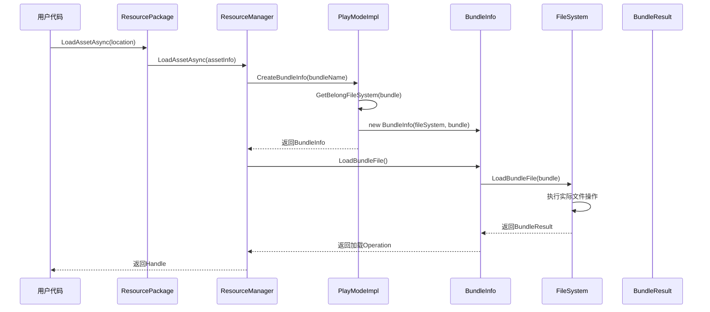
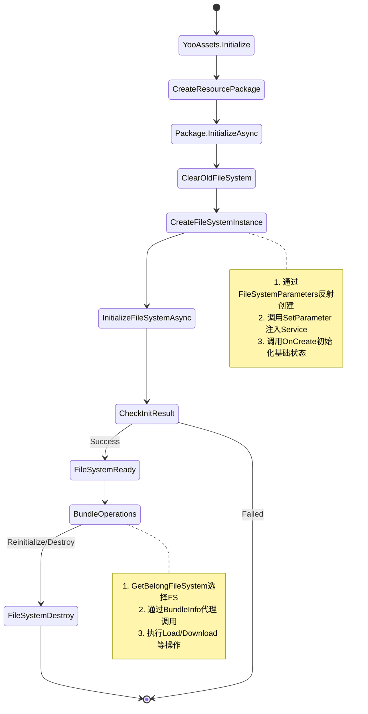

# YooAsset IFileSystem与自定义Service架构深度解析

## 目录
1. [IFileSystem架构设计](#1-ifilesystem架构设计)
2. [IFileSystem使用方式与实现](#2-ifilesystem使用方式与实现)
3. [FileSystem运作机制](#3-filesystem运作机制)
4. [自定义Service服务功能](#4-自定义service服务功能)
5. [Service扩展实践](#5-service扩展实践)
6. [架构设计模式分析](#6-架构设计模式分析)
7. [最佳实践与注意事项](#7-最佳实践与注意事项)

---

## 1. IFileSystem架构设计

### 1.1 核心接口定义

`IFileSystem`是YooAsset文件系统的核心抽象接口，它定义了统一的文件操作规范：

```csharp
internal interface IFileSystem
{
    // 基本属性
    string PackageName { get; }           // 包裹名称
    string FileRoot { get; }             // 文件根目录
    int FileCount { get; }               // 文件数量

    // 初始化和生命周期
    FSInitializeFileSystemOperation InitializeFileSystemAsync();
    void OnCreate(string packageName, string packageRoot);
    void OnDestroy();

    // 包裹相关操作
    FSLoadPackageManifestOperation LoadPackageManifestAsync(string packageVersion, int timeout);
    FSRequestPackageVersionOperation RequestPackageVersionAsync(bool appendTimeTicks, int timeout);

    // Bundle操作
    FSDownloadFileOperation DownloadFileAsync(PackageBundle bundle, DownloadFileOptions options);
    FSLoadBundleOperation LoadBundleFile(PackageBundle bundle);

    // 文件查询
    bool Belong(PackageBundle bundle);           // 查询文件归属
    bool Exists(PackageBundle bundle);           // 查询文件是否存在
    bool NeedDownload(PackageBundle bundle);     // 是否需要下载
    bool NeedUnpack(PackageBundle bundle);      // 是否需要解压
    bool NeedImport(PackageBundle bundle);       // 是否需要导入

    // 文件读写
    string GetBundleFilePath(PackageBundle bundle);
    byte[] ReadBundleFileData(PackageBundle bundle);
    string ReadBundleFileText(PackageBundle bundle);

    // 缓存清理
    FSClearCacheFilesOperation ClearCacheFilesAsync(PackageManifest manifest, ClearCacheFilesOptions options);

    // 自定义参数
    void SetParameter(string name, object value);
}
```

### 1.2 设计特点

1. **统一抽象**：所有文件系统实现都遵循相同的接口，保证了可扩展性
2. **异步操作**：所有耗时操作都返回异步Operation对象，支持协程模式
3. **Bundle导向**：操作对象以PackageBundle为单位，而非直接操作文件路径
4. **生命周期管理**：提供创建和销毁方法，支持资源管理
5. **参数化配置**：通过`SetParameter`支持运行时参数注入

### 1.3 文件系统架构层次

```
ResourcePackage (资源包裹)
├── ResourceManager (资源管理器)
└── PlayModeImpl (运行模式实现)
    ├── List<IFileSystem> (文件系统列表)
    ├── IBundleQuery (Bundle查询接口)
    └── IPlayMode (运行模式接口)
        ├── LoadBundleFile()
        ├── DownloadFileAsync()
        └── GetBelongFileSystem()
```
---

```
  sequenceDiagram
      participant User as 用户
      participant RM as ResourceManager
      participant PI as PlayModeImpl
      participant FS as IFileSystem
      participant Bundle as AssetBundle文件

      User->>RM: LoadAssetAsync("Player")
      RM->>PI: GetBundleInfo("player_assets")
      PI->>FS: GetBelongFileSystem(bundle)
      FS-->>PI: DefaultCacheFileSystem

      PI->>FS: LoadBundleFile(bundle)
      Note over FS: FileSystem负责：<br/>1. 检查文件是否存在<br/>2. 如果需要则下载<br/>3. 加载AssetBundle对象
      FS->>Bundle: 加载物理文件
      Bundle-->>FS: 返回AssetBundle对象

      FS-->>PI: 返回BundleResult
      PI-->>RM: 返回BundleInfo

      Note over RM: ResourceManager负责：<br/>1. 创建Provider<br/>2. 管理引用计数<br/>3. 创建Handle
      RM->>RM: 创建AssetProvider
      RM-->>User: 返回AssetHandle
```
## 2. IFileSystem使用方式与实现

### 2.1 核心实现类详解

#### 2.1.1 DefaultBuildinFileSystem（内置文件系统）
**用途**：处理本地已存在的AssetBundle文件，支持解压包的加载

**核心特性**：
```csharp
// 核心字段
protected Dictionary<string, FileWrapper> _wrappers;  // 文件包装器
protected Dictionary<string, string> _buildinFilePathMapping;  // 路径映射
protected IFileSystem _unpackFileSystem;  // 解压文件系统引用

// 关键配置
public EOverwriteInstallClearMode InstallClearMode { get; set; }  // 安装清理模式
public EFileVerifyLevel FileVerifyLevel { get; set; }  // 文件校验级别
public IDecryptionServices DecryptionServices { get; set; }  // 解密服务
```

**使用场景**：
- 离线游戏模式
- 资源预打包场景
- 需要文件解压的场景

#### 2.1.2 DefaultCacheFileSystem（缓存文件系统）
**用途**：处理网络下载的文件缓存，支持断点续传和文件验证

**核心特性**：
```csharp
// 核心字段
protected Dictionary<string, RecordFileElement> _records;  // 文件记录
protected Dictionary<string, string> _bundleDataFilePathMapping;  // 数据文件映射
protected Dictionary<string, string> _bundleInfoFilePathMapping;  // 信息文件映射

// 关键配置
public IRemoteServices RemoteServices { get; set; }  // 远程服务接口
public DownloadCenterOperation DownloadCenter { get; set; }  // 下载中心
public int DownloadMaxConcurrency { get; set; }  // 最大并发数
public bool DisableOnDemandDownload { get; set; }  // 是否禁用边玩边下
```

**使用场景**：
- 在线游戏模式
- 热更新场景
- 需要断点续传的场景

#### 2.1.3 DefaultEditorFileSystem（编辑器文件系统）
**用途**：编辑器模拟模式下使用，直接读取Unity Assets目录下的文件

**特点**：
- 支持热重载
- 支持实时编辑
- 加速开发调试

#### 2.1.4 平台特定文件系统
YooAsset为不同平台提供了专门的文件系统实现：

| 文件系统 | 平台 | 特点 |
|---------|------|------|
| DefaultWebServerFileSystem | WebGL-服务端 | 直接从Web服务器加载 |
| DefaultWebRemoteFileSystem | WebGL-远程 | 支持网络下载和缓存 |
| WechatFileSystem | 微信小游戏 | 适配微信存储机制 |
| TiktokFileSystem | 抖音小游戏 | 适配抖音存储机制 |
| AlipayFileSystem | 支付宝小游戏 | 适配支付宝存储机制 |

### 2.2 FileSystem创建机制

#### 2.2.1 FileSystemParameters配置
```csharp
public class FileSystemParameters
{
    public string FileSystemClass { get; }  // 文件系统类名
    public string PackageRoot { get; }      // 包裹根目录
    public Dictionary<string, object> CreateParameters { get; }  // 自定义参数

    // 创建FileSystem实例
    internal IFileSystem CreateFileSystem(string packageName)
    {
        Type classType = Type.GetType(FileSystemClass);
        var instance = (IFileSystem)System.Activator.CreateInstance(classType, true);

        // 设置自定义参数
        foreach (var param in CreateParameters)
        {
            instance.SetParameter(param.Key, param.Value);
        }

        instance.OnCreate(packageName, PackageRoot);
        return instance;
    }
}
```

#### 2.2.2 异步初始化流程
```csharp
public class InitializationOperation : AsyncOperationBase
{
    private enum ESteps
    {
        None,
        Prepare,
        ClearOldFileSystem,
        InitFileSystem,
        CheckInitResult,
        Done,
    }

    internal override void InternalUpdate()
    {
        if (_steps == ESteps.InitFileSystem)
        {
            // 创建FileSystem实例
            IFileSystem fileSystemInstance = fileSystemParams.CreateFileSystem(_impl.PackageName);
            _impl.FileSystems.Add(fileSystemInstance);

            // 异步初始化
            _initFileSystemOp = fileSystemInstance.InitializeFileSystemAsync();
            AddChildOperation(_initFileSystemOp);
            _steps = ESteps.CheckInitResult;
        }
    }
}
```

### 2.3 多文件系统支持

YooAsset支持一个ResourcePackage包含多个FileSystem：

```csharp
// Host模式下同时使用Buildin和Cache FileSystem
var initParams = new HostPlayModeParameters();
initParams.BuildinFileSystemParameters = FileSystemParameters.CreateDefaultBuildinFileSystemParameters(
    decryptionServices, packageRoot);
initParams.CacheFileSystemParameters = FileSystemParameters.CreateDefaultCacheFileSystemParameters(
    remoteServices, decryptionServices, packageRoot);
```

---

## 3. FileSystem完整生命周期管理

### 3.1 FileSystem创建的完整流程

#### 3.1.1 创建流程的起点
YooAsset的初始化流程始于用户调用资源包创建方法：

```csharp
// 第一步：创建ResourcePackage
// 文件：YooAssets.cs:116-126
public static ResourcePackage CreatePackage(string packageName)
{
    if (_packages.Exists(x => x.PackageName == packageName))
    {
        YooLogger.Error($"Package {packageName} already existed !");
        return null;
    }

    ResourcePackage package = new ResourcePackage(packageName);
    _packages.Add(package);
    return package;
}
```

#### 3.1.2 初始化触发FileSystem创建
当用户调用`package.InitializeAsync()`时，会触发FileSystem的创建：

```csharp
// 第二步：ResourcePackage初始化
// 文件：ResourcePackage.cs:98-142
public InitializationOperation InitializeAsync(InitializeParameters parameters)
{
    // 创建PlayModeImpl实例
    var playModeImpl = new PlayModeImpl(PackageName, _playMode);
    _bundleQuery = playModeImpl;
    _playModeImpl = playModeImpl;
    _resourceManager.Initialize(parameters, _bundleQuery);

    // 根据不同的PlayMode创建对应的FileSystem
    InitializationOperation initializeOperation;
    if (_playMode == EPlayMode.EditorSimulateMode)
    {
        var initializeParameters = parameters as EditorSimulateModeParameters;
        initializeOperation = playModeImpl.InitializeAsync(initializeParameters.EditorFileSystemParameters);
    }
    else if (_playMode == EPlayMode.OfflinePlayMode)
    {
        var initializeParameters = parameters as OfflinePlayModeParameters;
        initializeOperation = playModeImpl.InitializeAsync(initializeParameters.BuildinFileSystemParameters);
    }
    else if (_playMode == EPlayMode.HostPlayMode)
    {
        var initializeParameters = parameters as HostPlayModeParameters;
        initializeOperation = playModeImpl.InitializeAsync(
            initializeParameters.BuildinFileSystemParameters,
            initializeParameters.CacheFileSystemParameters); // 注意：支持多FileSystem
    }
    // ... 其他模式
    return initializeOperation;
}
```

#### 3.1.3 FileSystem实例化的核心过程
FileSystem的实际创建发生在`InitializationOperation.InternalUpdate()`方法中：

```csharp
// 第三步：FileSystem实例创建
// 文件：InitializationOperation.cs:63-96
private enum ESteps
{
    None,
    Prepare,
    ClearOldFileSystem,  // 清理旧的FileSystem
    InitFileSystem,      // 创建新的FileSystem
    CheckInitResult,     // 验证初始化结果
    Done,
}

internal override void InternalUpdate()
{
    if (_steps == ESteps.ClearOldFileSystem)
    {
        // 清理旧的文件系统
        foreach (var fileSystem in _impl.FileSystems)
        {
            fileSystem.OnDestroy();
        }
        _impl.FileSystems.Clear();
        _steps = ESteps.InitFileSystem;
    }

    if (_steps == ESteps.InitFileSystem)
    {
        // 创建FileSystem实例的关键代码
        IFileSystem fileSystemInstance = fileSystemParams.CreateFileSystem(_impl.PackageName);
        if (fileSystemInstance == null)
        {
            _steps = ESteps.Done;
            Status = EOperationStatus.Failed;
            Error = "Failed to create file system instance !";
            return;
        }

        // 添加到PlayModeImpl的FileSystem列表中
        _impl.FileSystems.Add(fileSystemInstance);

        // 异步初始化FileSystem
        _initFileSystemOp = fileSystemInstance.InitializeFileSystemAsync();
        _initFileSystemOp.StartOperation();
        AddChildOperation(_initFileSystemOp);
        _steps = ESteps.CheckInitResult;
    }
}
```

#### 3.1.4 FileSystem反射创建机制
`FileSystemParameters.CreateFileSystem()`方法通过反射创建具体实例：

```csharp
// 第四步：反射创建FileSystem实例
// 文件：FileSystemParameters.cs:47-66
internal IFileSystem CreateFileSystem(string packageName)
{
    // 获取FileSystem类名
    Type classType = Type.GetType(FileSystemClass);
    if (classType == null)
    {
        YooLogger.Error($"Can not found file system class type {FileSystemClass}");
        return null;
    }

    // 通过反射创建实例
    var instance = (IFileSystem)System.Activator.CreateInstance(classType, true);

    // 设置自定义参数（Service注入等）
    foreach (var param in CreateParameters)
    {
        instance.SetParameter(param.Key, param.Value);
    }

    // 调用OnCreate方法进行初始化
    instance.OnCreate(packageName, PackageRoot);
    return instance;
}
```

### 3.2 FileSystem的初始化流程

#### 3.2.1 InitializeFileSystemAsync的具体实现
每个FileSystem都需要实现`InitializeFileSystemAsync()`方法：

```csharp
// DefaultEditorFileSystem示例
// 文件：DefaultEditorFileSystem.cs:71-75
public virtual FSInitializeFileSystemOperation InitializeFileSystemAsync()
{
    var operation = new DEFSInitializeOperation(this);
    return operation;
}

// DefaultCacheFileSystem示例
// 文件：DefaultCacheFileSystem.cs:197-201
public virtual FSInitializeFileSystemOperation InitializeFileSystemAsync()
{
    var operation = new DCFSInitializeOperation(this);
    return operation;
}
```

#### 3.2.2 异步初始化的执行过程
初始化操作按以下步骤执行：

1. **Prepare阶段**：验证参数和环境
2. **ClearOldFileSystem阶段**：清理旧的FileSystem实例
3. **InitFileSystem阶段**：创建新的FileSystem实例
4. **CheckInitResult阶段**：验证初始化结果
5. **Done阶段**：完成初始化

```csharp
// 初始化操作的步骤控制
// 文件：InitializationOperation.cs:63-122
if (_steps == ESteps.CheckInitResult)
{
    _initFileSystemOp.UpdateOperation();
    if (_initFileSystemOp.Status == EOperationStatus.Succeed)
    {
        _steps = ESteps.InitFileSystem; // 继续初始化下一个FileSystem（多FileSystem场景）
        if (_paramsIndex >= _paramCount)
        {
            _steps = ESteps.Done;
        }
    }
    else if (_initFileSystemOp.Status == EOperationStatus.Failed)
    {
        _steps = ESteps.Done;
        Status = EOperationStatus.Failed;
        Error = _initFileSystemOp.Error;
    }
}
```

### 3.3 FileSystem的使用和驱动机制

#### 3.3.1 PlayModeImpl中的FileSystem管理
PlayModeImpl管理一个FileSystem列表，支持多FileSystem并存：

```csharp
// PlayModeImpl中的FileSystem列表
// 文件：PlayModeImpl.cs:11-12
public readonly List<IFileSystem> FileSystems = new List<IFileSystem>(10);
```

#### 3.3.2 Bundle到FileSystem的映射机制
当需要操作特定Bundle时，系统通过`GetBelongFileSystem`方法找到对应的FileSystem：

```csharp
// Bundle归属检查机制
// 文件：PlayModeImpl.cs:227-240
public IFileSystem GetBelongFileSystem(PackageBundle packageBundle)
{
    for (int i = 0; i < FileSystems.Count; i++)
    {
        IFileSystem fileSystem = FileSystems[i];
        if (fileSystem.Belong(packageBundle))
        {
            return fileSystem;
        }
    }
    YooLogger.Error($"Can not found belong file system : {packageBundle.BundleName}");
    return null;
}
```

每个FileSystem实现自己的`Belong`方法来判断是否处理特定Bundle：

```csharp
// DefaultEditorFileSystem：处理所有Bundle（编辑器模式）
// 文件：DefaultEditorFileSystem.cs:153-156
public virtual bool Belong(PackageBundle bundle)
{
    return true; // Editor文件系统认为所有Bundle都属于它
}

// DefaultCacheFileSystem：只处理需要缓存的Bundle
public override bool Belong(PackageBundle bundle)
{
    return NeedDownload(bundle) || NeedImport(bundle) || NeedUnpack(bundle);
}
```

#### 3.3.3 资源加载请求的路由机制
完整的资源加载请求路由流程：



#### 3.3.4 BundleInfo作为FileSystem的适配器
BundleInfo封装了FileSystem和PackageBundle的映射关系：

```csharp
// BundleInfo的构造和功能
// 文件：BundleInfo.cs:23-42
public class BundleInfo
{
    private readonly IFileSystem _fileSystem;
    private readonly PackageBundle _packageBundle;

    public BundleInfo(IFileSystem fileSystem, PackageBundle packageBundle)
    {
        _fileSystem = fileSystem;
        _packageBundle = packageBundle;
    }

    // 代理FileSystem的加载操作
    public FSLoadBundleOperation LoadBundleFile()
    {
        return _fileSystem.LoadBundleFile(_packageBundle);
    }

    // 代理FileSystem的下载操作
    public FSDownloadFileOperation DownloadFileAsync(DownloadFileOptions options)
    {
        return _fileSystem.DownloadFileAsync(_packageBundle, options);
    }
}
```

### 3.4 多FileSystem的管理策略

#### 3.4.1 多FileSystem的创建
以Host模式为例，可以同时创建内置文件系统和缓存文件系统：

```csharp
// Host模式支持多FileSystem
// 文件：ResourcePackage.cs:119-121
else if (_playMode == EPlayMode.HostPlayMode)
{
    var initializeParameters = parameters as HostPlayModeParameters;
    initializeOperation = playModeImpl.InitializeAsync(
        initializeParameters.BuildinFileSystemParameters,     // 内置文件系统
        initializeParameters.CacheFileSystemParameters);      // 缓存文件系统
}
```

#### 3.4.2 主文件系统的概念
FileSystems列表中的最后一个FileSystem被称为主文件系统：

```csharp
// 获取主文件系统
// 文件：PlayModeImpl.cs:216-222
public IFileSystem GetMainFileSystem()
{
    int count = FileSystems.Count;
    if (count == 0)
        return null;
    return FileSystems[count - 1]; // 最后一个即为主文件系统
}
```

#### 3.4.3 FileSystem的优先级机制
在多FileSystem环境下，系统按以下规则选择FileSystem：

1. **顺序检查**：按FileSystems列表顺序检查每个FileSystem的`Belong`方法
2. **首次匹配**：使用第一个返回`true`的FileSystem
3. **功能优先**：对于需要下载的Bundle，优先使用支持下载的FileSystem

```csharp
// FileSystem选择的具体逻辑
public IFileSystem GetBelongFileSystem(PackageBundle packageBundle)
{
    for (int i = 0; i < FileSystems.Count; i++)
    {
        IFileSystem fileSystem = FileSystems[i];
        if (fileSystem.Belong(packageBundle))
        {
            return fileSystem; // 返回第一个匹配的FileSystem
        }
    }
    return null;
}
```

### 3.5 FileSystem的销毁机制

#### 3.5.1 销毁时机
FileSystem的销毁发生在以下时机：

1. **重新初始化时**：`ResourcePackage.InitializeAsync()`会先销毁现有FileSystem
2. **ResourcePackage销毁时**：调用`ResourcePackage.DestroyPackage()`
3. **YooAssets销毁时**：调用`YooAssets.Destroy()`

#### 3.5.2 销毁流程的具体实现

```csharp
// PlayModeImpl中的FileSystem销毁
// 文件：PlayModeImpl.cs:61-68
void IPlayMode.DestroyFileSystem()
{
    foreach (var fileSystem in FileSystems)
    {
        fileSystem.OnDestroy(); // 调用每个FileSystem的OnDestroy方法
    }
    FileSystems.Clear(); // 清空FileSystem列表
}
```

在重新初始化时，会先清理旧的FileSystem：

```csharp
// 初始化操作中的清理逻辑
// 文件：InitializationOperation.cs:66-71
foreach (var fileSystem in _impl.FileSystems)
{
    fileSystem.OnDestroy(); // 销毁旧的FileSystem
}
_impl.FileSystems.Clear(); // 清空列表
```

#### 3.5.3 FileSystem的OnDestroy方法实现
每个FileSystem需要实现自己的`OnDestroy()`方法来执行资源清理：

```csharp
// DefaultCacheFileSystem的销毁实现
// 文件：DefaultCacheFileSystem.cs:363-372
public override void OnDestroy()
{
    if (DownloadCenter != null)
    {
        DownloadCenter.DestroyAll();
        DownloadCenter = null;
    }

    _records.Clear();
    _bundleDataFilePathMapping.Clear();
    _bundleInfoFilePathMapping.Clear();
    _bundlePackageNameMapping.Clear();
}

// DefaultBuildinFileSystem的销毁实现
public override void OnDestroy()
{
    if (_unpackFileSystem != null)
    {
        _unpackFileSystem.OnDestroy();
        _unpackFileSystem = null;
    }

    _wrappers.Clear();
    _buildinFilePathMapping.Clear();
}
```

### 3.6 完整的FileSystem生命周期图



---

## 4. FileSystem运作机制总结

基于前面的详细分析，我们可以总结出FileSystem的核心运作机制：

### 4.1 架构层次关系
```
YooAssets (全局管理)
└── ResourcePackage (资源包裹)
    └── PlayModeImpl (运行模式实现)
        └── List<IFileSystem> (文件系统列表)
            └── BundleInfo (Bundle与FileSystem的桥接)
                └── BundleResult (具体的资源加载操作)
```

### 4.2 关键运作机制总结

1. **创建机制**：通过`FileSystemParameters`反射创建，支持Service注入
2. **选择机制**：通过`Belong()`方法决定Bundle归属哪个FileSystem
3. **路由机制**：通过`BundleInfo`代理模式封装FileSystem操作
4. **多文件系统**：支持多个FileSystem并存，通过优先级选择
5. **异步初始化**：所有FileSystem支持异步初始化流程

### 4.3 交互流程总结

1. **初始化阶段**：YooAssets → ResourcePackage → PlayModeImpl → FileSystem
2. **资源加载阶段**：用户请求 → ResourceManager → PlayModeImpl → FileSystem → BundleResult
3. **销毁阶段**：FileSystem.OnDestroy() → 资源清理 → 内存释放

这种设计使得YooAsset能够灵活支持多种运行模式和平台，同时保持良好的扩展性和可维护性。

---

## 5. 自定义Service服务功能

### 4.1 Service系统架构

YooAsset的Service系统采用了**接口分离**和**依赖注入**的设计模式：

```
┌─────────────────────────────────────────────────────┐
│              Service Layer (服务层)                 │
│  ┌─────────────┐  ┌─────────────┐  ┌─────────────┐   │
│  │ IRemote     │  │ IDecryption │  │ IEncryption│   │
│  │ Services    │  │ Services    │  │ Services    │   │
│  └─────────────┘  └─────────────┘  └─────────────┘   │
│  ┌─────────────┐  ┌─────────────┐  ┌─────────────┐   │
│  │ IManifest   │  │ IManifest   │  │ IWebDecryp- │   │
│  │ Process     │  │ Restore     │  │ tion        │   │
│  │ Services    │  │ Services    │  │ Services    │   │
│  └─────────────┘  └─────────────┘  └─────────────┘   │
│  ┌─────────────┐                                    │
│  │ ICopyLocal  │  ┌─────────────┐                   │
│  │ File        │  │   其他服务  │                   │
│  │ Services    │  │    接口     │                   │
│  └─────────────┘  └─────────────┘                   │
└─────────────────────────────────────────────────────┘
```

### 4.2 核心Service接口

#### 4.2.1 IRemoteServices（远程资源服务）
```csharp
public interface IRemoteServices
{
    string GetRemoteMainURL(string fileName);
    string GetRemoteFallbackURL(string fileName);
}
```

#### 4.2.2 IDecryptionServices（解密服务）
```csharp
public interface IDecryptionServices
{
    DecryptResult LoadAssetBundle(DecryptFileInfo fileInfo);
    DecryptResult LoadAssetBundleAsync(DecryptFileInfo fileInfo);
    DecryptResult LoadAssetBundleFallback(DecryptFileInfo fileInfo);
    byte[] ReadFileData(DecryptFileInfo fileInfo);
    string ReadFileText(DecryptFileInfo fileInfo);
}
```

#### 4.2.3 IEncryptionServices（加密服务）
```csharp
public interface IEncryptionServices
{
    EncryptResult Encrypt(EncryptFileInfo fileInfo);
}
```

#### 4.2.4 IWebDecryptionServices（Web解密服务）
```csharp
public interface IWebDecryptionServices
{
    WebDecryptResult LoadAssetBundle(WebDecryptFileInfo fileInfo);
}
```

#### 4.2.5 清单处理服务
```csharp
public interface IManifestProcessServices
{
    byte[] ProcessManifest(byte[] fileData);
}

public interface IManifestRestoreServices
{
    byte[] RestoreManifest(byte[] fileData);
}
```

### 4.3 Service注册机制

#### 4.3.1 构建阶段注册
```csharp
public class BuildParameters
{
    public IEncryptionServices EncryptionServices;
    public IManifestProcessServices ManifestProcessServices;
    public IManifestRestoreServices ManifestRestoreServices;
}
```

#### 4.3.2 运行阶段注册
```csharp
// 创建自定义Service
var decryptionService = new CustomDecryptionService();
var remoteService = new CustomRemoteService();

// 注册Service到FileSystem
var fileSystemParams = FileSystemParameters.CreateDefaultCacheFileSystemParameters(
    remoteService, decryptionService, packageRoot);

// 添加额外参数
fileSystemParams.AddParameter(FileSystemParametersDefine.MANIFEST_SERVICES, manifestService);
```

#### 4.3.3 参数传递机制
```csharp
public class FileSystemParametersDefine
{
    public const string REMOTE_SERVICES = "REMOTE_SERVICES";
    public const string DECRYPTION_SERVICES = "DECRYPTION_SERVICES";
    public const string MANIFEST_SERVICES = "MANIFEST_SERVICES";
    public const string COPY_LOCAL_FILE_SERVICES = "COPY_LOCAL_FILE_SERVICES";
}
```

### 4.4 Service生命周期

1. **构建阶段**：创建Encryption和Manifest服务
2. **初始化阶段**：注入到FileSystem中
3. **运行阶段**：在资源加载过程中调用
4. **销毁阶段**：随FileSystem一起销毁

---

## 6. Service扩展实践

### 5.1 文件偏移加密实现

```csharp
/// <summary>
/// 文件偏移加密方式
/// </summary>
public class TestFileOffsetEncryption : IEncryptionServices
{
    public EncryptResult Encrypt(EncryptFileInfo fileInfo)
    {
        // 说明：对TestRes3资源目录进行加密
        if (fileInfo.BundleName.Contains("_testres3_"))
        {
            int offset = 32;
            byte[] fileData = File.ReadAllBytes(fileInfo.FileLoadPath);
            var encryptedData = new byte[fileData.Length + offset];
            Buffer.BlockCopy(fileData, 0, encryptedData, offset, fileData.Length);

            EncryptResult result = new EncryptResult();
            result.Encrypted = true;
            result.EncryptedData = encryptedData;
            return result;
        }
        else
        {
            EncryptResult result = new EncryptResult();
            result.Encrypted = false;
            return result;
        }
    }
}

/// <summary>
/// 资源文件偏移解密类
/// </summary>
public class TestFileOffsetDecryption : IDecryptionServices
{
    DecryptResult IDecryptionServices.LoadAssetBundle(DecryptFileInfo fileInfo)
    {
        DecryptResult decryptResult = new DecryptResult();
        decryptResult.ManagedStream = null;
        decryptResult.Result = AssetBundle.LoadFromFile(
            fileInfo.FileLoadPath,
            fileInfo.FileLoadCRC,
            GetFileOffset());
        return decryptResult;
    }

    private static ulong GetFileOffset()
    {
        return 32;
    }

    public byte[] ReadFileData(DecryptFileInfo fileInfo)
    {
        string filePath = GetBuildinFileLoadPath(fileInfo.BundleName);
        byte[] fileData = File.ReadAllBytes(filePath);

        // 跳过偏移字节
        var resultData = new byte[fileData.Length - GetFileOffset()];
        Buffer.BlockCopy(fileData, GetFileOffset(), resultData, 0, resultData.Length);
        return resultData;
    }
}
```

### 5.2 文件流加密实现

```csharp
/// <summary>
/// 资源文件解密流
/// </summary>
public class BundleStream : FileStream
{
    public const byte KEY = 64;

    public BundleStream(string path, FileMode mode, FileAccess access, FileShare share)
        : base(path, mode, access, share)
    {
    }

    public override int Read(byte[] array, int offset, int count)
    {
        var index = base.Read(array, offset, count);
        for (int i = 0; i < array.Length; i++)
        {
            array[i] ^= KEY;
        }
        return index;
    }
}

/// <summary>
/// WebGL平台解密类
/// </summary>
public class TestWebFileMemoryDecryption : IWebDecryptionServices
{
    public WebDecryptResult LoadAssetBundle(WebDecryptFileInfo fileInfo)
    {
        for (int i = 0; i < fileInfo.FileData.Length; i++)
        {
            fileInfo.FileData[i] ^= BundleStream.KEY;
        }

        WebDecryptResult decryptResult = new WebDecryptResult();
        decryptResult.Result = AssetBundle.LoadFromMemory(fileInfo.FileData);
        return decryptResult;
    }
}
```

### 5.3 资源清单加密实现

```csharp
/// <summary>
/// 资源清单加密服务
/// </summary>
public class TestProcessManifest : IManifestProcessServices
{
    byte[] IManifestProcessServices.ProcessManifest(byte[] fileData)
    {
        return XorCrypto.Crypto(fileData, "YOO");
    }
}

/// <summary>
/// 资源清单解密服务
/// </summary>
public class TestRestoreManifest : IManifestRestoreServices
{
    byte[] IManifestRestoreServices.RestoreManifest(byte[] fileData)
    {
        return XorCrypto.Crypto(fileData, "YOO");
    }
}

/// <summary>
/// 异或加密工具类
/// </summary>
public class XorCrypto
{
    public static byte[] Crypto(byte[] data, string key)
    {
        byte[] keyBytes = System.Text.Encoding.UTF8.GetBytes(key);
        return Crypto(data, keyBytes);
    }

    public static byte[] Crypto(byte[] data, byte[] key)
    {
        if (data == null)
            throw new ArgumentNullException(nameof(data));

        if (key == null || key.Length == 0)
            throw new ArgumentException("Key cannot be null or empty");

        byte[] result = new byte[data.Length];
        for (int i = 0; i < data.Length; i++)
        {
            result[i] = (byte)(data[i] ^ key[i % key.Length]);
        }

        return result;
    }
}
```

### 5.4 远程服务定制实现

```csharp
/// <summary>
/// 自定义远程服务
/// </summary>
public class CustomRemoteServices : IRemoteServices
{
    private readonly string[] _mainUrls;
    private readonly string[] _fallbackUrls;
    private readonly Dictionary<string, string> _urlCache;

    public CustomRemoteServices(string[] mainUrls, string[] fallbackUrls = null)
    {
        _mainUrls = mainUrls;
        _fallbackUrls = fallbackUrls ?? mainUrls;
        _urlCache = new Dictionary<string, string>();
    }

    public string GetRemoteMainURL(string fileName)
    {
        if (_urlCache.TryGetValue($"main_{fileName}", out string cachedUrl))
        {
            return cachedUrl;
        }

        // 实现负载均衡或CDN选择逻辑
        int index = Mathf.Abs(fileName.GetHashCode()) % _mainUrls.Length;
        string url = $"{_mainUrls[index]}/{fileName}";

        _urlCache[$"main_{fileName}"] = url;
        return url;
    }

    public string GetRemoteFallbackURL(string fileName)
    {
        if (_urlCache.TryGetValue($"fallback_{fileName}", out string cachedUrl))
        {
            return cachedUrl;
        }

        int index = Mathf.Abs(fileName.GetHashCode()) % _fallbackUrls.Length;
        string url = $"{_fallbackUrls[index]}/{fileName}";

        _urlCache[$"fallback_{fileName}"] = url;
        return url;
    }
}
```

### 5.5 完整的Service配置示例

```csharp
public class ServiceConfigExample
{
    public IEnumerator InitializePackageWithServices()
    {
        // 创建资源包
        var package = YooAssets.CreatePackage("MyPackage");

        // 配置自定义Service
        var fileDecryption = new TestFileStreamDecryption();
        var manifestServices = new TestRestoreManifest();
        var remoteServices = new CustomRemoteServices(
            new string[] { "https://cdn1.example.com", "https://cdn2.example.com" },
            new string[] { "https://backup1.example.com", "https://backup2.example.com" }
        );

        // 初始化参数配置
        var initParams = new HostPlayModeParameters();
        initParams.BuildinFileSystemParameters = FileSystemParameters.CreateDefaultBuildinFileSystemParameters(
            fileDecryption, packageRoot);
        initParams.CacheFileSystemParameters = FileSystemParameters.CreateDefaultCacheFileSystemParameters(
            remoteServices, fileDecryption, packageRoot);

        // 添加额外参数
        initParams.BuildinFileSystemParameters.AddParameter(
            FileSystemParametersDefine.MANIFEST_SERVICES, manifestServices);
        initParams.BuildinFileSystemParameters.AddParameter(
            FileSystemParametersDefine.DISABLE_CATALOG_FILE, true);

        // 初始化资源包
        var initializeOp = package.InitializeAsync(initParams);
        yield return initializeOp;

        if (initializeOp.Status == EOperationStatus.Succeed)
        {
            Debug.Log("Package initialized with custom services successfully!");
        }
    }
}
```

---

## 7. 架构设计模式分析

### 6.1 应用的设计模式

#### 6.1.1 策略模式（Strategy Pattern）
不同的FileSystem实现代表不同的资源加载策略，可以根据运行模式和环境选择合适的策略：

```csharp
// 策略接口
interface IFileSystem
{
    FSLoadBundleOperation LoadBundleFile(PackageBundle bundle);
}

// 具体策略
class DefaultCacheFileSystem : IFileSystem { }
class DefaultBuildinFileSystem : IFileSystem { }
class DefaultEditorFileSystem : IFileSystem { }

// 上下文
class PlayModeImpl
{
    private List<IFileSystem> _fileSystems;

    public FSLoadBundleOperation LoadBundleFile(PackageBundle bundle)
    {
        IFileSystem fileSystem = GetBelongFileSystem(bundle);
        return fileSystem.LoadBundleFile(bundle);
    }
}
```

#### 6.1.2 工厂模式（Factory Pattern）
FileSystemParameters创建FileSystem实例，支持自定义参数配置：

```csharp
// 抽象工厂
interface IFileSystemFactory
{
    IFileSystem CreateFileSystem(string packageName, FileSystemParameters parameters);
}

// 具体工厂
class DefaultFileSystemFactory : IFileSystemFactory
{
    public IFileSystem CreateFileSystem(string packageName, FileSystemParameters parameters)
    {
        Type classType = Type.GetType(parameters.FileSystemClass);
        var instance = (IFileSystem)Activator.CreateInstance(classType, true);

        foreach (var param in parameters.CreateParameters)
        {
            instance.SetParameter(param.Key, param.Value);
        }

        return instance;
    }
}
```

#### 6.1.3 适配器模式（Adapter Pattern）
BundleResult适配不同类型的资源包，提供统一的资源加载接口：

```csharp
// 适配器
abstract class BundleResult
{
    public abstract FSLoadAssetOperation LoadAssetAsync(AssetInfo assetInfo);
}

// 被适配者
class AssetBundle { }

// 适配器实现
class AssetBundleResult : BundleResult
{
    private readonly AssetBundle _assetBundle;

    public override FSLoadAssetOperation LoadAssetAsync(AssetInfo assetInfo)
    {
        return new AssetBundleLoadAssetOperation(_packageBundle, _assetBundle, assetInfo);
    }
}
```

#### 6.1.4 观察者模式（Observer Pattern）
异步Operation支持完成回调和进度监控：

```csharp
// 主题
abstract class AsyncOperationBase
{
    public event System.Action<AsyncOperationBase> Completed;

    protected void InvokeCompleted()
    {
        Completed?.Invoke(this);
    }
}

// 观察者
class ResourceManager
{
    public void LoadAssetAsync(string location)
    {
        var operation = CreateLoadOperation();
        operation.Completed += OnLoadCompleted;
    }

    private void OnLoadCompleted(AsyncOperationBase operation)
    {
        // 处理完成事件
    }
}
```

#### 6.1.5 依赖注入模式（Dependency Injection）
Service系统通过参数注入实现依赖管理：

```csharp
// 依赖注入器
class FileSystemParameters
{
    public void AddParameter<T>(T service)
    {
        CreateParameters.Add(typeof(T).Name, service);
    }
}

// 依赖接收者
class DefaultCacheFileSystem : IFileSystem
{
    public override void SetParameter(string name, object value)
    {
        if (name == nameof(IRemoteServices))
        {
            RemoteServices = (IRemoteServices)value;
        }
    }
}
```

### 6.2 SOLID设计原则

#### 6.2.1 单一职责原则（SRP）
- 每个FileSystem只负责特定的文件存储方式
- 每个Service只负责特定的功能领域
- BundleResult专注于资源加载和生命周期管理

#### 6.2.2 开闭原则（OCP）
- 通过IFileSystem接口扩展新的文件系统，无需修改现有代码
- 通过Service接口扩展新功能，不影响现有实现

#### 6.2.3 里氏替换原则（LSP）
- 任何FileSystem实现都可以替换IFileSystem接口
- 任何Service实现都可以替换对应的接口

#### 6.2.4 接口隔离原则（ISP）
- 将大的FileSystem接口拆分为多个功能相关的接口
- Service接口按功能领域分离，避免接口污染

#### 6.2.5 依赖倒置原则（DIP）
- 高层模块（ResourceManager）依赖抽象（IFileSystem、Service接口）
- 不依赖具体的实现类

---

## 8. 最佳实践与注意事项

### 7.1 FileSystem最佳实践

#### 7.1.1 选择合适的文件系统
```csharp
// 编辑器开发阶段
var editorParams = FileSystemParameters.CreateDefaultEditorFileSystemParameters(packageRoot);

// 离线包发布
var builtinParams = FileSystemParameters.CreateDefaultBuildinFileSystemParameters(
    decryptionServices, packageRoot);

// 在线热更新
var cacheParams = FileSystemParameters.CreateDefaultCacheFileSystemParameters(
    remoteServices, decryptionServices, packageRoot);

// WebGL平台
var webParams = FileSystemParameters.CreateDefaultWebServerFileSystemParameters(
    webDecryptionServices);
```

#### 7.1.2 多文件系统组合使用
```csharp
// 推荐的组合：Buildin + Cache
var initParams = new HostPlayModeParameters();
initParams.BuildinFileSystemParameters = builtinParams;  // 本地资源
initParams.CacheFileSystemParameters = cacheParams;      // 网络资源缓存
```

#### 7.1.3 文件系统性能优化
1. **合理设置并发数**：根据网络状况调整`DownloadMaxConcurrency`
2. **启用断点续传**：确保下载文件完整性
3. **配置文件校验**：设置合适的`FileVerifyLevel`

### 7.2 Service最佳实践

#### 7.2.1 加密服务设计原则
```csharp
public class GoodEncryptionService : IEncryptionServices
{
    public EncryptResult Encrypt(EncryptFileInfo fileInfo)
    {
        try
        {
            // 1. 性能优化：批量处理大文件
            // 2. 内存管理：及时释放大数组
            // 3. 异常处理：妥善处理IO异常
            // 4. 线程安全：考虑多线程环境
        }
        catch (Exception ex)
        {
            YooLogger.Error($"Encryption failed for {fileInfo.BundleName}: {ex.Message}");
            return new EncryptResult { Encrypted = false };
        }
    }
}
```

#### 7.2.2 解密服务注意事项
```csharp
public class SafeDecryptionService : IDecryptionServices
{
    public DecryptResult LoadAssetBundle(DecryptFileInfo fileInfo)
    {
        // 1. 参数验证
        if (string.IsNullOrEmpty(fileInfo.FileLoadPath))
            throw new ArgumentException("File path is null or empty");

        // 2. 文件存在性检查
        if (!File.Exists(fileInfo.FileLoadPath))
            return new DecryptResult { Result = null };

        // 3. 资源释放管理
        using (var stream = CreateDecryptionStream(fileInfo.FileLoadPath))
        {
            // 4. 异常处理和回退机制
            try
            {
                return LoadFromStream(stream, fileInfo.FileLoadCRC);
            }
            catch
            {
                return LoadAssetBundleFallback(fileInfo);
            }
        }
    }
}
```

#### 7.2.3 远程服务设计
```csharp
public class RobustRemoteServices : IRemoteServices
{
    private readonly HttpClient _httpClient;
    private readonly Dictionary<string, string[]> _cdnUrls;

    public string GetRemoteMainURL(string fileName)
    {
        // 1. CDN负载均衡
        // 2. URL缓存机制
        // 3. 失败回退策略
        // 4. 超时和重试机制
    }
}
```

### 7.3 常见问题与解决方案

#### 7.3.1 内存泄漏问题
**问题**：Service中创建的资源没有及时释放
**解决方案**：
```csharp
public class MemoryAwareService : IDisposable
{
    private bool _disposed = false;
    private List<IDisposable> _resources = new List<IDisposable>();

    public void Dispose()
    {
        if (!_disposed)
        {
            foreach (var resource in _resources)
            {
                resource?.Dispose();
            }
            _resources.Clear();
            _disposed = true;
        }
    }
}
```

#### 7.3.2 线程安全问题
**问题**：多线程环境下Service状态不一致
**解决方案**：
```csharp
public class ThreadSafeService : IRemoteServices
{
    private readonly object _lock = new object();
    private readonly Dictionary<string, string> _cache;

    public string GetRemoteMainURL(string fileName)
    {
        lock (_lock)
        {
            if (_cache.TryGetValue(fileName, out string url))
            {
                return url;
            }

            url = GenerateURL(fileName);
            _cache[fileName] = url;
            return url;
        }
    }
}
```

#### 7.3.3 异常处理问题
**问题**：Service异常导致整个加载流程失败
**解决方案**：
```csharp
public class FaultTolerantService : IDecryptionServices
{
    public DecryptResult LoadAssetBundle(DecryptFileInfo fileInfo)
    {
        try
        {
            return PrimaryDecryption(fileInfo);
        }
        catch (Exception ex)
        {
            YooLogger.Warning($"Primary decryption failed: {ex.Message}, trying fallback");
            return FallbackDecryption(fileInfo);
        }
    }
}
```

### 7.4 性能优化建议

#### 7.4.1 Service性能优化
1. **缓存机制**：合理使用缓存减少重复计算
2. **异步操作**：避免阻塞主线程
3. **批量处理**：减少IO操作次数
4. **内存池**：复用大对象减少GC压力

#### 7.4.2 FileSystem性能优化
1. **预加载**：提前加载常用资源
2. **并发控制**：合理设置并发数量
3. **压缩算法**：选择合适的压缩方式
4. **CDN优化**：使用就近的CDN节点

### 7.5 调试和监控

#### 7.5.1 日志记录
```csharp
public class InstrumentedService : IDecryptionServices
{
    public DecryptResult LoadAssetBundle(DecryptFileInfo fileInfo)
    {
        var stopwatch = Stopwatch.StartNew();
        YooLogger.Log($"Starting decryption for {fileInfo.BundleName}");

        try
        {
            var result = DoDecryption(fileInfo);
            stopwatch.Stop();
            YooLogger.Log($"Decryption completed in {stopwatch.ElapsedMilliseconds}ms");
            return result;
        }
        catch (Exception ex)
        {
            YooLogger.Error($"Decryption failed for {fileInfo.BundleName}: {ex}");
            throw;
        }
    }
}
```

#### 7.5.2 性能监控
```csharp
public class MonitoringService : IRemoteServices
{
    private static readonly Dictionary<string, long> _callCount = new Dictionary<string, long>();
    private static readonly Dictionary<string, long> _totalTime = new Dictionary<string, long>();

    public string GetRemoteMainURL(string fileName)
    {
        var stopwatch = Stopwatch.StartNew();

        try
        {
            return GenerateURL(fileName);
        }
        finally
        {
            stopwatch.Stop();
            RecordMetrics("GetRemoteMainURL", stopwatch.ElapsedMilliseconds);
        }
    }

    private void RecordMetrics(string method, long elapsedMs)
    {
        lock (_callCount)
        {
            if (!_callCount.ContainsKey(method))
            {
                _callCount[method] = 0;
                _totalTime[method] = 0;
            }
            _callCount[method]++;
            _totalTime[method] += elapsedMs;
        }
    }
}
```

---

## 总结

YooAsset的IFileSystem与Service系统展现了优秀的架构设计：

### 核心优势
1. **高度模块化**：FileSystem和Service各司其职，便于维护和扩展
2. **灵活可扩展**：通过接口抽象支持自定义实现
3. **跨平台支持**：为不同平台提供了专门适配
4. **异步友好**：全面支持异步操作模式
5. **性能优化**：内置多种性能优化机制

### 适用场景
- 单机游戏的资源管理
- 在线游戏的热更新系统
- WebGL平台的资源加载
- 小游戏平台的资源适配
- 需要资源加密保护的项目

### 扩展方向
- 新的存储介质支持
- 更多加密算法集成
- 智能CDN选择
- 资源预加载策略
- 性能监控和分析

通过合理使用IFileSystem和Service系统，开发者可以构建出高效、安全、可扩展的资源管理解决方案，满足各种复杂的游戏开发需求。