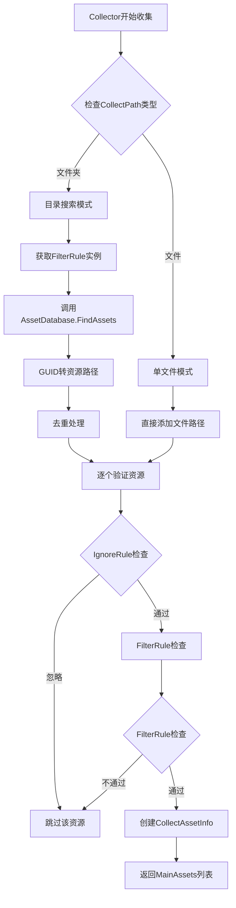

# YooAsset各个Collector的MainAssets寻找机制

通过深入分析YooAsset源码，详细解释各个Collector类型如何寻找和处理MainAssets。

### 🎯 核心概念：什么是MainAssets？

在YooAsset中，**MainAssets**指的是**被Collector直接收集的主要资源对象**，而不是依赖资源。每个Collector都会收集自己范围内的MainAssets。

### 🔍 MainAssets寻找流程图



---

## 📋 三种Collector的MainAssets寻找方式

### 1. MainAssetCollector的MainAssets寻找

#### 🎯 寻找机制
```csharp
// AssetBundleCollector.cs:140-189
public List<CollectAssetInfo> GetAllCollectAssets(CollectCommand command, AssetBundleCollectorGroup group)
{
    // 1. 检查是否被忽略
    if (CollectorType == ECollectorType.MainAssetCollector)
    {
        // 正常收集，不会被忽略
    }

    // 2. 收集资源路径
    List<string> findAssets = new List<string>();
    if (AssetDatabase.IsValidFolder(CollectPath))
    {
        // 文件夹模式：搜索所有符合条件的资源
        IFilterRule filterRuleInstance = AssetBundleCollectorSettingData.GetFilterRuleInstance(FilterRuleName);
        string findAssetType = filterRuleInstance.FindAssetType;
        string[] findResult = EditorTools.FindAssets(findAssetType, searchFolder);
        findAssets.AddRange(findResult);
    }
    else
    {
        // 单文件模式：直接添加指定文件
        string assetPath = CollectPath;
        findAssets.Add(assetPath);
    }

    // 3. 逐个处理收集到的资源
    foreach (string assetPath in findAssets)
    {
        var assetInfo = new AssetInfo(assetPath);
        if (command.IgnoreRule.IsIgnore(assetInfo) == false && IsCollectAsset(group, assetInfo))
        {
            var collectAssetInfo = CreateCollectAssetInfo(command, group, assetInfo);
            result.Add(assetPath, collectAssetInfo);
        }
    }
}
```

#### 💡 MainAssets特征
- **直接收集**：从指定路径或目录直接收集
- **清单可见**：会写入资源清单，可通过API加载
- **完整信息**：包含地址、标签、依赖关系等完整信息
- **引用管理**：支持引用计数和生命周期管理

### 2. StaticAssetCollector的MainAssets寻找

#### 🎯 寻找机制
```csharp
// StaticAssetCollector使用相同的收集逻辑
// AssetBundleCollector.cs:142-147
bool ignoreStaticCollector = command.IsFlagSet(ECollectFlags.IgnoreStaticCollector);
if (ignoreStaticCollector)
{
    if (CollectorType == ECollectorType.StaticAssetCollector)
        return new List<CollectAssetInfo>(); // 被忽略，返回空列表
}
// 如果没被忽略，使用与MainAssetCollector相同的收集逻辑
```

#### 💡 MainAssets特征
- **相同收集方式**：与MainAssetCollector使用相同的资源搜索和过滤逻辑
- **清单不可见**：收集后不写入资源清单
- **不可直接加载**：无法通过YooAsset API直接访问
- **隐式加载**：当加载引用它的主资源时自动加载

### 3. DependAssetCollector的MainAssets寻找

#### 🎯 寻找机制
```csharp
// DependAssetCollector也使用相同的收集逻辑
// AssetBundleCollector.cs:149-154
bool ignoreDependCollector = command.IsFlagSet(ECollectFlags.IgnoreDependCollector);
if (ignoreDependCollector)
{
    if (CollectorType == ECollectorType.DependAssetCollector)
        return new List<CollectAssetInfo>(); // 被忽略，返回空列表
}
// 如果没被忽略，使用相同的收集逻辑，但会在构建时进行零引用清理
```

#### 💡 MainAssets特征
- **依赖验证**：构建时检查是否被MainAssets或StaticAssets引用
- **零引用清理**：如果没有主资源引用则会被移除
- **共享优化**：多个主资源可以共享同一个依赖资源
- **清单不可见**：不写入资源清单，无法直接加载

---

## 🔧 资源搜索和过滤详解

### 资源搜索过程

#### 1. Unity API调用
```csharp
// EditorTools.cs:193-221
public static string[] FindAssets(string searchType, string[] searchInFolders)
{
    string[] guids;
    if (string.IsNullOrEmpty(searchType) || searchType == EAssetSearchType.All.ToString())
        guids = AssetDatabase.FindAssets(string.Empty, searchInFolders);
    else
        guids = AssetDatabase.FindAssets($"t:{searchType}", searchInFolders);

    // GUID转路径并去重
    HashSet<string> result = new HashSet<string>();
    for (int i = 0; i < guids.Length; i++)
    {
        string guid = guids[i];
        string assetPath = AssetDatabase.GUIDToAssetPath(guid);
        if (result.Contains(assetPath) == false)
        {
            result.Add(assetPath);
        }
    }
    return result.ToArray();
}
```

#### 2. 搜索类型过滤
```csharp
// DefaultFilterRule.cs中的不同搜索类型
[EAssetSearchType.All]        // 搜索所有类型
[EAssetSearchType.Prefab]     // 只搜索预制体 (.prefab)
[EAssetSearchType.Scene]      // 只搜索场景 (.unity)
[EAssetSearchType.Texture2D]  // 只搜索2D纹理
[EAssetSearchType.AudioClip]  // 只搜索音频片段
// ... 更多类型
```

### 资源过滤过程

#### 1. IgnoreRule检查
```csharp
// 检查资源是否应该被忽略
if (command.IgnoreRule.IsIgnore(assetInfo) == false)
{
    // 继续后续处理
}
```

#### 2. FilterRule检查
```csharp
// AssetBundleCollector.cs:238
private bool IsCollectAsset(AssetBundleCollectorGroup group, AssetInfo assetInfo)
{
    var filterRuleInstance = AssetBundleCollectorSettingData.GetFilterRuleInstance(FilterRuleName);
    return filterRuleInstance.IsCollectAsset(new FilterRuleData(assetInfo.AssetPath, CollectPath, group.GroupName, UserData));
}
```

#### 3. 过滤规则示例
```csharp
// 只收集预制体
public class CollectPrefab : IFilterRule
{
    public bool IsCollectAsset(FilterRuleData data)
    {
        return Path.GetExtension(data.AssetPath) == ".prefab";
    }
}

// 只收集场景
public class CollectScene : IFilterRule
{
    public bool IsCollectAsset(FilterRuleData data)
    {
        string extension = Path.GetExtension(data.AssetPath);
        return extension == ".unity" || extension == ".scene";
    }
}
```

---

## 📊 MainAssets处理结果

### CollectAssetInfo结构
```csharp
public class CollectAssetInfo
{
    public ECollectorType CollectorType { get; }     // 收集器类型
    public string BundleName { get; }               // 资源包名称
    public string Address { get; }                   // 可寻址地址
    public AssetInfo AssetInfo { get; }              // Unity资源信息
    public List<string> AssetTags { get; }           // 资源标签
    public List<AssetInfo> DependAssets { get; }     // 依赖资源列表
}
```

### 处理流程差异

| 处理步骤 | MainAssetCollector | StaticAssetCollector | DependAssetCollector |
|----------|------------------|-------------------|-------------------|
| **资源搜索** | ✅ 标准搜索 | ✅ 标准搜索 | ✅ 标准搜索 |
| **忽略检查** | ❌ 不会被忽略 | ✅ 可被忽略 | ✅ 可被忽略 |
| **清单写入** | ✅ 写入清单 | ❌ 不写入 | ❌ 不写入 |
| **依赖分析** | ✅ 分析依赖 | ✅ 分析依赖 | ❌ 自身不分析 |
| **零引用清理** | N/A | N/A | ✅ 清理零引用 |
| **标签保留** | ✅ 保留标签 | ❌ 清除标签 | ❌ 清除标签 |

---

## 💡 实际使用示例

### 配置示例
```xml
<!-- MainAssetCollector：收集场景文件 -->
<Collector CollectPath="Assets/GameRes/Scenes"
          CollectorType="MainAssetCollector"
          FilterRuleName="CollectScene"
          Tags="Scene,Level" />

<!-- StaticAssetCollector：收集场景专用材质 -->
<Collector CollectPath="Assets/GameRes/Materials/SceneSpecific"
          CollectorType="StaticAssetCollector"
          FilterRuleName="CollectMaterial" />

<!-- DependAssetCollector：收集共享纹理 -->
<Collector CollectPath="Assets/GameRes/Textures/Shared"
          CollectorType="DependAssetCollector"
          FilterRuleName="CollectTexture2D" />
```

### 搜索结果示例
```
MainAssetCollector - Scenes文件夹:
├── MainMenu.unity (MainAsset)
├── Level1.unity (MainAsset)
└── Level2.unity (MainAsset)

StaticAssetCollector - SceneSpecific文件夹:
├── MainMenu_Mat.mat (MainAsset)
├── Level1_Ground.mat (MainAsset)
└── Level2_Wall.mat (MainAsset)

DependAssetCollector - Shared文件夹:
├── Wood_Texture.jpg (MainAsset)
├── Metal_Texture.jpg (MainAsset)
└── Concrete_Texture.jpg (MainAsset)
```

### 构建时的处理
```csharp
// 1. 零引用依赖清理
foreach (var dependAsset in dependAssets)
{
    if (isNotReferencedByMainAssets(dependAsset))
    {
        removeAssetFromBuild(dependAsset); // 移除未引用的依赖
    }
}

// 2. 资源清单生成
foreach (var asset in mainAssets)
{
    addToManifest(asset); // 只有MainAssetCollector的资源写入清单
}
```

---

## 🔄 构建时特殊处理

### 零引用依赖清理机制
```csharp
// TaskGetBuildMap.cs:151-195
// 1. 获取所有主资源引用的依赖资源集合
HashSet<string> allDependAsset = new HashSet<string>();
foreach (var collectAsset in allCollectAssets)
{
    var collectorType = collectAsset.CollectorType;
    if (collectorType == ECollectorType.MainAssetCollector || collectorType == ECollectorType.StaticAssetCollector)
    {
        foreach (var dependAsset in collectAsset.DependAssets)
        {
            allDependAsset.Add(dependAsset.AssetPath);
        }
    }
}

// 2. 找出所有零引用的依赖资源
List<CollectAssetInfo> removeList = new List<CollectAssetInfo>();
foreach (var collectAssetInfo in allCollectAssets)
{
    var collectorType = collectAssetInfo.CollectorType;
    if (collectorType == ECollectorType.DependAssetCollector)
    {
        if (allDependAsset.Contains(collectAssetInfo.AssetInfo.AssetPath) == false)
            removeList.Add(collectAssetInfo);
    }
}

// 3. 移除所有零引用的依赖资源
foreach (var removeValue in removeList)
{
    // 生成警告并记录
    BuildLogger.Warning($"Found undepended asset and remove it : {removeValue.AssetInfo.AssetPath}");
    allCollectAssets.Remove(removeValue);
}
```

### 标签处理差异
```csharp
// TaskGetBuildMap.cs:38-45
if (collectAssetInfo.CollectorType != ECollectorType.MainAssetCollector)
{
    // 只有MainAssetCollector的资源才能保留标签
    if (collectAssetInfo.AssetTags.Count > 0)
    {
        collectAssetInfo.AssetTags.Clear();
        BuildLogger.Warning("Remove asset tags that don't work");
    }
}
```

---

## ⚠️ 常见问题和解决方案

### 1. 资源搜索不到
```csharp
// ❌ 问题：路径错误或过滤规则不当
<Collector CollectPath="Assets/GameRes/Textures"
          FilterRuleName="CollectAudioClip" /> // 错误：在纹理文件夹收集音频

// ✅ 解决：使用正确的过滤规则
<Collector CollectPath="Assets/GameRes/Textures"
          FilterRuleName="CollectTexture2D" />
```

### 2. DependAssetCollector资源丢失
```csharp
// ⚠️ 问题：依赖资源没有被任何主资源引用
// 解决：确保至少有一个主资源引用了该依赖资源
```

### 3. Static vs Depend 混淆
```csharp
// ❌ 错误：把场景专用资源放在DependAssetCollector
<Collector CollectPath="Assets/GameRes/Scenes/MainMenu/Materials"
          CollectorType="DependAssetCollector" /> // 错误

// ✅ 正确：场景专用资源应该用StaticAssetCollector
<Collector CollectPath="Assets/GameRes/Scenes/MainMenu/Materials"
          CollectorType="StaticAssetCollector" /> // 正确
```

---

## 🎉 总结

YooAsset中各个Collector的MainAssets寻找机制具有以下特点：

### 🔍 统一的搜索机制
- **三种类型使用相同的核心搜索逻辑**
- **基于Unity的AssetDatabase.FindAssets() API**
- **支持文件夹和单文件两种模式**
- **内置去重和错误处理**

### 🎯 类型差异处理
- **MainAssetCollector**：完整功能，写入清单，保留标签
- **StaticAssetCollector**：相同搜索，不写入清单，可被忽略
- **DependAssetCollector**：相同搜索，不写入清单，可被忽略，零引用清理

### 🛠️ 灵活的过滤系统
- **IgnoreRule**：控制是否忽略特定资源
- **FilterRule**：控制收集哪些类型的资源
- **自定义规则**：支持扩展自己的过滤逻辑

### 📊 智能构建处理
- **零引用清理**：自动移除未使用的依赖资源
- **标签过滤**：只有主资源保留标签信息
- **去重处理**：避免资源重复收集

这种设计确保了资源收集的**一致性**、**灵活性**和**效率**，为不同的使用场景提供了合适的处理策略！

### 关键要点
1. **统一搜索**：三种Collector使用相同的底层搜索机制
2. **分类处理**：根据类型差异进行不同的后续处理
3. **智能优化**：自动清理零引用和重复资源
4. **灵活配置**：支持丰富的过滤和忽略规则
5. **构建安全**：确保依赖关系的完整性和有效性