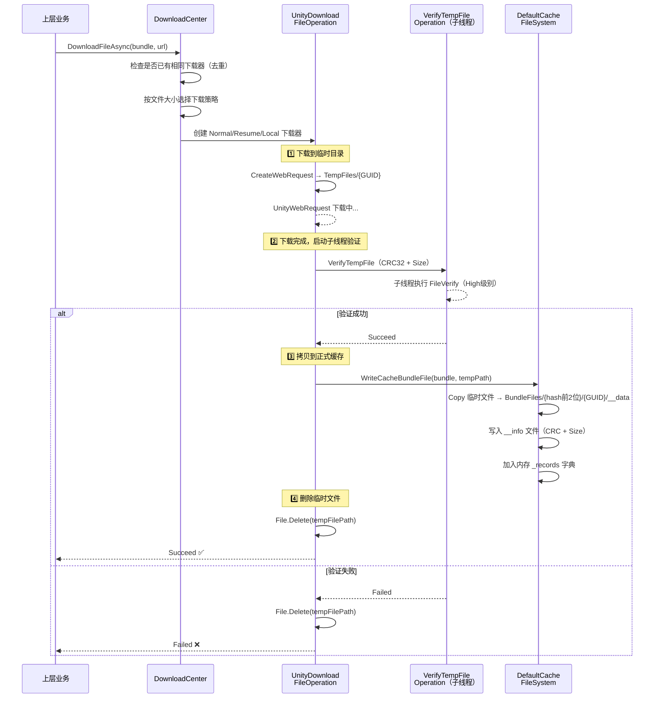

# YooAsset Bundle 下载存储机制深度解析

## 目录
1. [整体目录架构](#1-整体目录架构)
2. [缓存根目录（平台差异）](#2-缓存根目录平台差异)
3. [三级目录划分：下载目录 vs 缓存目录 vs 清单目录](#3-三级目录划分下载目录-vs-缓存目录-vs-清单目录)
4. [单个 Bundle 的双文件存储结构](#4-单个-bundle-的双文件存储结构)
5. [完整下载→存储流程](#5-完整下载存储流程)
6. [断点续传的临时文件策略](#6-断点续传的临时文件策略)
7. [覆盖安装检测（AppFootPrint）](#7-覆盖安装检测appfootprint)
8. [设计巧思总结](#8-设计巧思总结)

---

## 1. 整体目录架构

YooAsset 的本地存储采用**三区隔离**设计，将临时文件、正式缓存文件、清单文件分别存储在不同目录下：

```
{CacheRoot}/                                    # 平台相关的缓存根目录
└── {PackageName}/                              # 包裹名称（如 "DefaultPackage"）
    ├── TempFiles/                              # 📥 下载临时目录
    │   ├── {BundleGUID_A}                      # 正在下载的临时文件（裸文件）
    │   └── {BundleGUID_B}                      # 支持断点续传
    │
    ├── BundleFiles/                            # 📦 正式缓存目录（哈希分桶）
    │   ├── 2a/                                 # FileHash 前两位作为子目录
    │   │   └── {BundleGUID}/                   # Bundle GUID 目录
    │   │       ├── __data                      # 实际的 Bundle 数据文件
    │   │       └── __info                      # 元信息文件（CRC + Size）
    │   ├── 3f/
    │   │   └── {BundleGUID}/
    │   │       ├── __data
    │   │       └── __info
    │   └── ...
    │
    └── ManifestFiles/                          # 📋 清单文件目录
        ├── {PackageName}_{Version}.bytes       # 资源清单二进制文件
        ├── {PackageName}_{Version}.hash        # 清单哈希校验文件
        └── ApplicationFootPrint.bytes          # 应用版本水印文件
```

> **核心思想**：下载是"脏"的（可能失败、中断），缓存是"干净"的（已验证）。两者**物理隔离**，永远不会让半成品污染正式缓存。

---

## 2. 缓存根目录（平台差异）

YooAsset 根据运行平台自动选择不同的缓存根目录。由 `YooAssetSettingsData` 统一管理：

```csharp
// YooAssetSettingsData.cs
internal static string GetYooDefaultCacheRoot()
{
#if UNITY_EDITOR
    return GetYooEditorCacheRoot();        // 项目根目录/yoo
#elif UNITY_STANDALONE_WIN
    return GetYooStandaloneWinCacheRoot(); // Application.dataPath/yoo
#elif UNITY_STANDALONE_LINUX
    return GetYooStandaloneLinuxCacheRoot(); // Application.dataPath/yoo
#elif UNITY_STANDALONE_OSX
    return GetYooStandaloneMacCacheRoot(); // Application.persistentDataPath/yoo
#else
    return GetYooMobileCacheRoot();        // Application.persistentDataPath/yoo
#endif
}
```

| 平台 | 缓存根目录 | 说明 |
|------|-----------|------|
| **Editor** | `{ProjectRoot}/yoo` | 方便开发者直接在文件管理器中查看调试 |
| **Windows** | `{Application.dataPath}/yoo` | 与游戏安装目录同级 |
| **Linux** | `{Application.dataPath}/yoo` | 同 Windows |
| **macOS** | `{persistentDataPath}/yoo` | macOS 沙盒策略，必须使用持久化目录 |
| **Mobile** | `{persistentDataPath}/yoo` | iOS/Android 沙盒机制，只能写入 persistentDataPath |

其中 `yoo` 是默认的文件夹名称，可通过 `YooAssetSettings.DefaultYooFolderName` 自定义。

---

## 3. 三级目录划分：下载目录 vs 缓存目录 vs 清单目录

### 3.1 目录常量定义

```csharp
// DefaultCacheFileSystemDefine.cs
internal class DefaultCacheFileSystemDefine
{
    public const string BundleDataFileName = "__data";         // 数据文件名
    public const string BundleInfoFileName = "__info";         // 信息文件名
    public const string BundleFilesFolderName = "BundleFiles"; // 正式缓存目录
    public const string TempFilesFolderName = "TempFiles";     // 临时下载目录
    public const string ManifestFilesFolderName = "ManifestFiles"; // 清单目录
    public const string AppFootPrintFileName = "ApplicationFootPrint.bytes"; // 版本水印
}
```

### 3.2 目录初始化

```csharp
// DefaultCacheFileSystem.OnCreate()
public virtual void OnCreate(string packageName, string packageRoot)
{
    PackageName = packageName;

    if (string.IsNullOrEmpty(packageRoot))
        _packageRoot = GetDefaultCachePackageRoot(packageName);
    else
        _packageRoot = packageRoot;

    // 三个目录独立构建，互不干扰
    _cacheBundleFilesRoot = PathUtility.Combine(_packageRoot, "BundleFiles");
    _cacheManifestFilesRoot = PathUtility.Combine(_packageRoot, "ManifestFiles");
    _tempFilesRoot = PathUtility.Combine(_packageRoot, "TempFiles");
}
```

### 3.3 三个目录的职责对比

| 目录 | 职责 | 生命周期 | 文件状态 |
|------|------|---------|---------|
| `TempFiles/` | 存放正在下载的文件 | 下载中 → 验证后删除 | **不可信**（可能不完整、损坏） |
| `BundleFiles/` | 存放已验证的正式缓存 | 持久化（直到手动清理） | **已验证**（CRC校验通过） |
| `ManifestFiles/` | 存放资源清单和版本信息 | 跟随版本更新 | **已验证** |

> **设计巧思 #1**：**临时目录是"垃圾桶"级别的安全区**。无论下载过程中发生什么（崩溃、断网、电量耗尽），临时文件都不会影响已有的正式缓存。重启后系统只认 `BundleFiles/` 里的文件。

---

## 4. 单个 Bundle 的双文件存储结构

每个 Bundle 在正式缓存中以**双文件**形式存储：

```
BundleFiles/
└── {hash前2位}/          # ← 哈希分桶（见下方解析）
    └── {BundleGUID}/     # ← 以 GUID 为名的独立目录
        ├── __data        # 实际的 Bundle 二进制数据
        └── __info        # 元信息（12字节：4字节CRC + 8字节Size）
```

### 4.1 数据文件路径构建

```csharp
// DefaultCacheFileSystem.cs
public string GetBundleDataFilePath(PackageBundle bundle)
{
    // 取 FileHash 前两个字符作为分桶目录名
    string folderName = bundle.FileHash.Substring(0, 2);
    
    // 完整路径：BundleFiles/{hash前2位}/{BundleGUID}/__data
    filePath = PathUtility.Combine(_cacheBundleFilesRoot, folderName, 
                                   bundle.BundleGUID, "__data");
    
    // 可选：追加文件扩展名（如 .bundle）
    if (AppendFileExtension)
        filePath += bundle.FileExtension;
    
    return filePath;
}
```

### 4.2 信息文件的二进制结构

```csharp
// __info 文件只有12字节，极其紧凑
public void WriteBundleInfoFile(string filePath, uint dataFileCRC, long dataFileSize)
{
    using (FileStream fs = new FileStream(filePath, FileMode.Create, FileAccess.Write, FileShare.Read))
    {
        _sharedBuffer.Clear();
        _sharedBuffer.WriteUInt32(dataFileCRC);    // 4 字节：CRC32 校验码
        _sharedBuffer.WriteInt64(dataFileSize);    // 8 字节：文件大小
        _sharedBuffer.WriteToStream(fs);
        fs.Flush();
    }
}
```

> **设计巧思 #2**：**数据和元信息分离**。`__info` 只有12字节，读取验证时不需要碰真正的数据文件，减少IO开销。初始化时只需读取数千个小文件（12字节）即可重建全部缓存索引，而不用对每个Bundle做完整的CRC校验。

> **设计巧思 #3**：**哈希分桶**。用 `FileHash.Substring(0, 2)` 取前两位作为子目录，将文件散布到最多 256 个子目录中（00~ff）。这解决了操作系统在单目录下文件数过多时的性能退化问题（如 ext4 在 >10000 文件时目录查找变慢）。

### 4.3 临时文件路径构建

```csharp
public string GetTempFilePath(PackageBundle bundle)
{
    // 临时文件直接用 BundleGUID 命名，没有分桶，没有子文件
    // TempFiles/{BundleGUID}
    filePath = PathUtility.Combine(_tempFilesRoot, bundle.BundleGUID);
    return filePath;
}
```

> 临时文件是一个裸文件（不分 `__data` / `__info`），因为它只是下载的中间产物，不需要元信息管理。

---

## 5. 完整下载→存储流程



### 关键代码：WriteCacheBundleFile

```csharp
public bool WriteCacheBundleFile(PackageBundle bundle, string copyPath)
{
    // 防御：同一个文件不应该被写入两次
    if (_records.ContainsKey(bundle.BundleGUID))
        throw new Exception("Should never get here !");

    string infoFilePath = GetBundleInfoFilePath(bundle);
    string dataFilePath = GetBundleDataFilePath(bundle);

    try
    {
        // 清理残留旧文件
        if (File.Exists(infoFilePath)) File.Delete(infoFilePath);
        if (File.Exists(dataFilePath)) File.Delete(dataFilePath);

        // 确保目录存在
        FileUtility.CreateFileDirectory(dataFilePath);

        // 拷贝数据文件（临时文件 → 正式缓存）
        FileInfo fileInfo = new FileInfo(copyPath);
        fileInfo.CopyTo(dataFilePath);

        // 写入元信息文件
        WriteBundleInfoFile(infoFilePath, bundle.FileCRC, bundle.FileSize);
    }
    catch (Exception e)
    {
        YooLogger.Error($"Failed to write cache file ! {e.Message}");
        return false;
    }

    // 加入内存记录（标记为"已验证可用"）
    var recordFileElement = new RecordFileElement(infoFilePath, dataFilePath, bundle.FileCRC, bundle.FileSize);
    return RecordBundleFile(bundle.BundleGUID, recordFileElement);
}
```

> **设计巧思 #4**：**先拷贝再删除，而非移动**。用 `CopyTo` + `Delete` 而非 `File.Move`，确保即使拷贝过程中崩溃，也不会丢失临时文件（断点续传仍可恢复）。只有拷贝完全成功并注册到内存后，才删除临时文件。

---

## 6. 断点续传的临时文件策略

DownloadCenter 根据文件大小自动选择下载策略：

```csharp
// DownloadCenterOperation.cs
public UnityDownloadFileOperation DownloadFileAsync(PackageBundle bundle, string url)
{
    bool isLocalFile = DownloadSystemHelper.IsRequestLocalFile(url);
    
    if (isLocalFile)
    {
        // 本地文件（Unpack）→ 直接拷贝
        return new UnityDownloadLocalFileOperation(fileSystem, bundle, url);
    }
    else if (bundle.FileSize >= _fileSystem.ResumeDownloadMinimumSize)
    {
        // 大文件 → 断点续传
        return new UnityDownloadResumeFileOperation(fileSystem, bundle, url);
    }
    else
    {
        // 小文件 → 普通下载
        return new UnityDownloadNormalFileOperation(fileSystem, bundle, url);
    }
}
```

### 6.1 普通下载 vs 断点续传的差异

| 特性 | NormalDownload | ResumeDownload |
|------|---------------|----------------|
| **临时文件处理** | 开始前删除旧临时文件 | 保留旧临时文件，从断点处继续 |
| **DownloadHandler** | `new DownloadHandlerFile(path)` | `new DownloadHandlerFile(path, append: true)` |
| **removeFileOnAbort** | `true`（中断即删除） | `false`（中断保留，下次续传） |
| **HTTP Header** | 无 | `Range: bytes={offset}-` |
| **适用场景** | 小文件 | 大文件（超过 ResumeDownloadMinimumSize） |

### 6.2 断点续传核心逻辑

```csharp
// UnityDownloadResumeFileOperation.cs
if (_steps == ESteps.CreateRequest)
{
    FileUtility.CreateFileDirectory(_tempFilePath);
    
    _fileOriginLength = 0;
    long fileBeginLength = -1;
    
    if (File.Exists(_tempFilePath))
    {
        FileInfo fileInfo = new FileInfo(_tempFilePath);
        if (fileInfo.Length >= _bundle.FileSize)
        {
            // 文件已满或异常，删除重下
            File.Delete(_tempFilePath);
        }
        else
        {
            // 从上次断点继续
            fileBeginLength = fileInfo.Length;
            _fileOriginLength = fileBeginLength;
            DownloadedBytes = _fileOriginLength;
        }
    }
    
    CreateWebRequest(fileBeginLength);
}

private void CreateWebRequest(long fileBeginLength)
{
    var handler = new DownloadHandlerFile(_tempFilePath, true); // append=true
    handler.removeFileOnAbort = false;  // 中断不删除！
    _webRequest = DownloadSystemHelper.NewUnityWebRequestGet(_requestURL);
    _webRequest.downloadHandler = handler;
    if (fileBeginLength > 0)
        _webRequest.SetRequestHeader("Range", $"bytes={fileBeginLength}-");
    _webRequest.SendWebRequest();
}
```

> **设计巧思 #5**：**临时文件即是断点续传的"记忆"**。不需要额外的进度文件或数据库来记录下载进度，临时文件的当前大小就是断点位置。极简而可靠。

---

## 7. 覆盖安装检测（AppFootPrint）

当应用版本更新（覆盖安装）时，旧的缓存清单可能与新版本不兼容。YooAsset 通过 `ApplicationFootPrint` 机制检测：

```csharp
// ApplicationFootPrint.cs
internal class ApplicationFootPrint
{
    /// <summary>
    /// 检测水印是否发生变化
    /// </summary>
    public bool IsDirty()
    {
#if UNITY_EDITOR
        return _footPrint != Application.version;
#else
        return _footPrint != Application.buildGUID;
#endif
    }

    /// <summary>
    /// 覆盖水印
    /// </summary>
    public void Coverage(string packageName)
    {
#if UNITY_EDITOR
        _footPrint = Application.version;
#else
        _footPrint = Application.buildGUID;
#endif
        string footPrintFilePath = _fileSystem.GetSandboxAppFootPrintFilePath();
        FileUtility.WriteAllText(footPrintFilePath, _footPrint);
    }
}
```

水印文件存储在 `ManifestFiles/ApplicationFootPrint.bytes`。初始化时：
1. 读取水印文件，比较 `Application.buildGUID` 是否一致
2. 如果不一致（即发生了覆盖安装），根据 `InstallClearMode` 清理过期缓存
3. 写入新的水印

> **设计巧思 #6**：**版本水印是防止"幽灵缓存"的哨兵**。使用 `Application.buildGUID`（而非版本号）来检测，因为同一版本号可能构建多次，而 `buildGUID` 是唯一的。这确保了即使版本号不变但包体重新构建，旧的清单也会被正确清理。

---

## 8. 设计巧思总结

### 🏆 八大设计亮点

| # | 设计巧思 | 解决的问题 | 实现方式 |
|---|---------|-----------|---------|
| 1 | **三区物理隔离** | 下载失败/中断不影响现有缓存 | TempFiles / BundleFiles / ManifestFiles 独立目录 |
| 2 | **数据与元信息分离** | 快速索引重建，无需扫描大文件 | `__data`（任意大小）+ `__info`（12字节） |
| 3 | **哈希分桶存储** | 避免单目录文件过多导致 FS 性能下降 | `FileHash.Substring(0, 2)` → 256 个子目录 |
| 4 | **先拷贝再删除** | 崩溃安全，不丢失下载进度 | `CopyTo` + `Delete` 而非 `Move` |
| 5 | **临时文件即断点** | 零成本断点续传 | 文件大小 == 已下载字节数，无需额外记录 |
| 6 | **版本水印哨兵** | 覆盖安装后自动清理过期缓存 | `Application.buildGUID` 比对 |
| 7 | **子线程CRC验证** | 不阻塞主线程 | `ThreadPool.QueueUserWorkItem` + 原子操作变量 |
| 8 | **内存缓存映射** | 避免重复磁盘IO | `Dictionary<GUID, RecordFileElement>` 内存字典 |

### 🎯 从 Linus 视角审视的核心设计哲学

**1. 消除特殊情况**

下载器的三种实现（Normal / Resume / Local）对外只暴露 `UnityDownloadFileOperation` 统一接口。上层代码不需要关心是断点续传还是全新下载——`DownloadCenter` 内部自动选择策略。**所有类型的下载最终都走同一条验证→拷贝→记录→清理的路径**。没有 if/else 分支泄露到上层。

**2. 数据结构驱动设计**

整个缓存系统的核心不是"文件管理逻辑"，而是 `Dictionary<string, RecordFileElement>` 这个**内存字典**。文件系统只是字典的持久化映射。`Exists()` 查的是字典、`NeedDownload()` 查的是字典、加载时也是先查字典。这让所有操作的时间复杂度都是 O(1)。

**3. 不信任，但验证**

- 临时文件：**不信任**，必须 CRC 校验后才能进入正式缓存
- 正式缓存：**信任**（已经验证过），但加载失败时会**重新验证**，失败则删除
- 重启后：**不完全信任**，初始化时扫描磁盘 + 批量验证重建内存索引

这就是一个严谨而务实的"信任递进"模型。

### 📐 完整的路径拼接示例

以移动端、默认配置、包名 `DefaultPackage`、某 Bundle 的 FileHash 为 `2a7f...`、BundleGUID 为 `abc123` 为例：

```
/data/data/com.xxx.game/files/yoo/                          ← 缓存根目录
└── DefaultPackage/                                          ← 包裹目录
    ├── TempFiles/
    │   └── abc123                                           ← 下载中的临时文件
    ├── BundleFiles/
    │   └── 2a/                                              ← hash分桶
    │       └── abc123/                                      ← Bundle目录
    │           ├── __data                                   ← Bundle数据（验证后拷贝进来）
    │           └── __info                                   ← 元信息（12字节）
    └── ManifestFiles/
        ├── DefaultPackage_1.0.0.bytes                       ← 资源清单
        ├── DefaultPackage_1.0.0.hash                        ← 清单哈希
        └── ApplicationFootPrint.bytes                       ← 版本水印
```

### 🔄 解压文件系统（DefaultUnpackFileSystem）的变体

解压文件系统继承自缓存文件系统，但使用独立的目录名以防止冲突：

```csharp
// DefaultUnpackFileSystem.cs
public override void OnCreate(string packageName, string rootDirectory)
{
    base.OnCreate(packageName, rootDirectory);
    
    // 重写目录名，与远程缓存隔离
    _cacheBundleFilesRoot = PathUtility.Combine(_packageRoot, "UnpackBundleFiles");
    _cacheManifestFilesRoot = PathUtility.Combine(_packageRoot, "UnpackManifestFiles");
    _tempFilesRoot = PathUtility.Combine(_packageRoot, "UnpackTempFiles");
}
```

这确保了从包体内解压的文件和从网络下载的文件不会混在一起，各自管理、各自清理。

---

> **一句话总结**：YooAsset 的存储设计核心思想是——**让脏数据永远碰不到干净数据**。通过三区隔离、双文件结构、哈希分桶、子线程验证等手段，实现了一个"崩溃安全、高效索引、零特殊情况"的本地缓存系统。