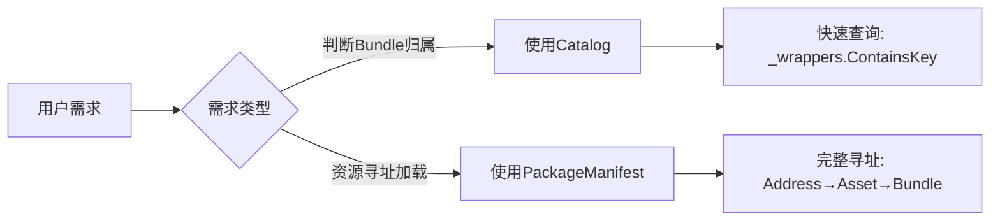
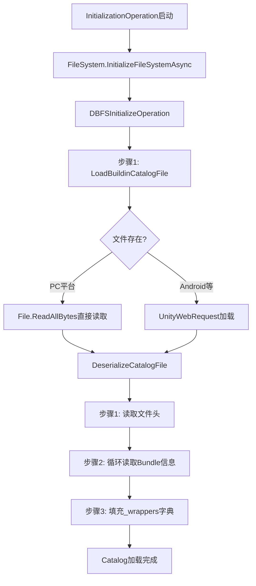
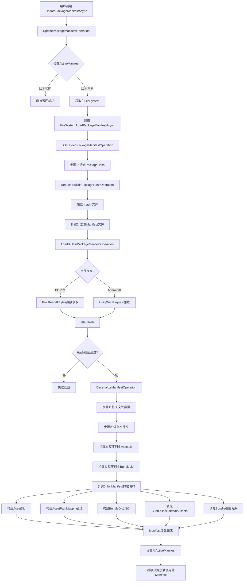
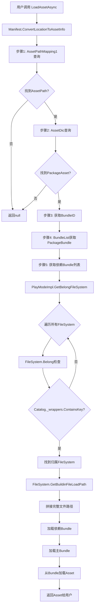

# YooAsset 资源寻址系统完整解析

> **文档说明**：本文档详细解析YooAsset中两个核心组件的工作机制：
> - **Catalog（目录文件）**：用于快速判断Bundle归属关系
> - **PackageManifest（清单文件）**：用于完整的资源寻址和依赖管理

---

## 目录

1. [核心概念对比](#核心概念对比)
2. [Catalog详解](#catalog详解)
3. [PackageManifest详解](#packagemanifest详解)
4. [完整资源加载流程](#完整资源加载流程)
5. [关键代码示例](#关键代码示例)

---

## 核心概念对比

### 职责分工

| 组件 | 核心职责 | 存储内容 | 使用场景 |
|------|---------|---------|---------|
| **Catalog** | Bundle归属判断 | `BundleGUID → FileName` 映射 | FileSystem初始化时加载，判断Bundle是否属于该文件系统 |
| **PackageManifest** | 资源寻址与依赖管理 | 完整的资源信息、Bundle信息、依赖关系 | 资源包更新时加载，用于所有资源加载操作 |

### 关键区别



---

## Catalog详解

### 1. 存储内容

#### 数据结构
```csharp
// DefaultBuildinFileSystem.cs
internal class DefaultBuildinFileSystem : IFileSystem
{
    // Catalog的核心存储：BundleGUID → FileWrapper映射
    private readonly Dictionary<string, FileWrapper> _wrappers = new Dictionary<string, FileWrapper>();
    
    // FileWrapper包含的信息
    internal class FileWrapper
    {
        public string FileName { get; set; }  // Bundle文件名（如：bundle_001.bundle）
    }
}
```

#### 文件格式（二进制）
```
[文件头]
- FileSign: uint (0x4246444E = "DBFN")
- FileVersion: string ("1.0.0")
- FileCount: int (Bundle数量)

[文件体] (循环FileCount次)
- BundleGUID: string (Bundle的唯一标识)
- FileName: string (Bundle的文件名)
```

### 2. 文件位置

#### 目标文件路径
```
StreamingAssets/
└── {PackageName}/
    └── {PackageName}_Catalog.bytes
    
示例：
StreamingAssets/DefaultPackage/DefaultPackage_Catalog.bytes
```

#### 路径获取代码
```csharp
// DefaultBuildinFileSystem.cs
private string GetBuildinCatalogFileLoadPath()
{
    string fileName = $"{_packageName}_Catalog.bytes";
    return PathUtility.Combine(_buildinRootDirectory, fileName);
    // 结果: StreamingAssets/DefaultPackage/DefaultPackage_Catalog.bytes
}
```

### 3. 加载流程

#### 流程图


#### 详细步骤

**阶段1：触发加载**
```csharp
// InitializationOperation.cs
if (_steps == ESteps.InitFileSystem)
{
    // 创建文件系统实例
    IFileSystem fileSystemInstance = fileSystemParams.CreateFileSystem(_impl.PackageName);
    
    // 初始化文件系统（会加载Catalog）
    _initFileSystemOp = fileSystemInstance.InitializeFileSystemAsync();
}
```

**阶段2：文件系统初始化**
```csharp
// DBFSInitializeOperation.cs
internal override void InternalUpdate()
{
    // 步骤1: 加载Catalog文件
    if (_steps == ESteps.LoadBuildinCatalogFile)
    {
        _loadBuildinCatalogFileOp = new LoadBuildinCatalogFileOperation(_fileSystem);
        _loadBuildinCatalogFileOp.StartOperation();
    }
}
```

**阶段3：读取文件数据**
```csharp
// LoadBuildinCatalogFileOperation.cs
internal override void InternalUpdate()
{
    // 步骤1: 尝试直接读取文件
    if (_steps == ESteps.TryLoadFileData)
    {
        string filePath = _fileSystem.GetBuildinCatalogFileLoadPath();
        
        if (File.Exists(filePath))
        {
            _fileData = File.ReadAllBytes(filePath);
            _steps = ESteps.LoadCatalogFile;
        }
        else
        {
            // Android等平台需要通过UnityWebRequest
            _steps = ESteps.RequestFileData;
        }
    }
    
    // 步骤2: 反序列化
    if (_steps == ESteps.LoadCatalogFile)
    {
        _fileSystem.DeserializeCatalogFile(_fileData);
    }
}
```

**阶段4：反序列化**
```csharp
// DefaultBuildinFileSystem.cs
internal void DeserializeCatalogFile(byte[] fileData)
{
    var buffer = new BufferReader(fileData);
    
    // 1. 验证文件头
    uint fileSign = buffer.ReadUInt32();
    if (fileSign != 0x4246444E) // "DBFN"
        throw new Exception("Invalid catalog file!");
    
    string fileVersion = buffer.ReadUTF8();
    if (fileVersion != "1.0.0")
        throw new Exception("Version not compatible!");
    
    // 2. 读取Bundle数量
    int fileCount = buffer.ReadInt32();
    
    // 3. 循环读取每个Bundle信息
    for (int i = 0; i < fileCount; i++)
    {
        string bundleGUID = buffer.ReadUTF8();
        string fileName = buffer.ReadUTF8();
        
        // 4. 填充映射表
        var wrapper = new FileWrapper();
        wrapper.FileName = fileName;
        _wrappers.Add(bundleGUID, wrapper);
    }
}
```

### 4. 使用方式

#### 核心用途：判断Bundle归属
```csharp
// DefaultBuildinFileSystem.cs
public bool Belong(PackageBundle bundle)
{
    // 快速判断：这个Bundle是否属于当前文件系统
    return _wrappers.ContainsKey(bundle.BundleGUID);
}
```

#### 获取Bundle文件路径
```csharp
// DefaultBuildinFileSystem.cs
public string GetBuildinFileLoadPath(PackageBundle bundle)
{
    if (_wrappers.TryGetValue(bundle.BundleGUID, out FileWrapper wrapper))
    {
        // 拼接完整路径
        return PathUtility.Combine(_buildinRootDirectory, wrapper.FileName);
        // 结果: StreamingAssets/DefaultPackage/bundle_001.bundle
    }
    return string.Empty;
}
```

#### 使用场景示例
```csharp
// PlayModeImpl.cs
internal IFileSystem GetBelongFileSystem(PackageBundle bundle)
{
    // 遍历所有文件系统，找到Bundle所属的那个
    foreach (var fileSystem in FileSystems)
    {
        if (fileSystem.Belong(bundle))  // 使用Catalog判断
            return fileSystem;
    }
    return null;
}
```

---

## PackageManifest详解

### 1. 存储内容

#### 数据结构
```csharp
// PackageManifest.cs
internal class PackageManifest
{
    // ========== 序列化字段（存储在文件中） ==========
    
    // 资源列表
    public List<PackageAsset> AssetList;
    
    // Bundle列表
    public List<PackageBundle> BundleList;
    
    // 配置信息
    public string FileVersion;           // 文件版本
    public bool EnableAddressable;       // 是否启用可寻址
    public bool SupportExtensionless;    // 是否支持无后缀名
    public bool LocationToLower;         // 地址是否转小写
    public bool IncludeAssetGUID;        // 是否包含GUID
    public string PackageName;           // 包名
    public string PackageVersion;        // 包版本
    
    // ========== 运行时映射表（InitManifest时构建） ==========
    
    // 资源寻址映射
    public Dictionary<string, PackageAsset> AssetDic;           // AssetPath → PackageAsset
    public Dictionary<string, string> AssetPathMapping1;        // Address → AssetPath
    public Dictionary<string, string> AssetPathMapping2;        // AssetGUID → AssetPath
    
    // Bundle查询映射
    public Dictionary<string, PackageBundle> BundleDic1;        // BundleName → PackageBundle
    public Dictionary<string, PackageBundle> BundleDic2;        // FileName → PackageBundle
    public Dictionary<string, PackageBundle> BundleDic3;        // BundleGUID → PackageBundle
}
```

#### PackageAsset结构
```csharp
internal class PackageAsset
{
    public string Address;              // 可寻址地址（如："UI/MainMenu"）
    public string AssetPath;            // 资源路径（如："Assets/GameRes/UI/MainMenu.prefab"）
    public string AssetGUID;            // 资源GUID
    public string[] AssetTags;          // 资源标签
    public int BundleID;                // 所属Bundle的ID
    public int[] DependBundleIDs;       // 依赖的Bundle ID列表
}
```

#### PackageBundle结构
```csharp
internal class PackageBundle
{
    public int BundleID;                // Bundle ID
    public string BundleName;           // Bundle名称
    public string BundleGUID;           // Bundle GUID
    public string FileName;             // 文件名
    public string FileHash;             // 文件哈希
    public uint FileCRC;                // 文件CRC
    public long FileSize;               // 文件大小
    public bool Encrypted;              // 是否加密
    public string[] Tags;               // 标签
    public int[] DependBundleIDs;       // 依赖的Bundle ID列表
    public List<PackageAsset> IncludeMainAssets;  // 包含的主资源列表
}
```

#### 文件格式（二进制）
```
[文件头]
- FileSign: uint (0x594F4F = "YOO")
- FileVersion: string ("2025.8.28")
- EnableAddressable: bool
- SupportExtensionless: bool
- LocationToLower: bool
- IncludeAssetGUID: bool
- OutputNameStyle: int
- BuildBundleType: int
- BuildPipeline: string
- PackageName: string
- PackageVersion: string
- PackageNote: string

[资源列表]
- AssetCount: int
- [循环AssetCount次]
  - Address: string
  - AssetPath: string
  - AssetGUID: string
  - AssetTags: string[]
  - BundleID: int
  - DependBundleIDs: int[]

[Bundle列表]
- BundleCount: int
- [循环BundleCount次]
  - BundleName: string
  - UnityCRC: uint
  - FileHash: string
  - FileCRC: uint
  - FileSize: long
  - Encrypted: bool
  - Tags: string[]
  - DependBundleIDs: int[]
```

### 2. 文件位置

#### 目标文件路径
```
StreamingAssets/
└── {PackageName}/
    ├── PackageManifest_{version}.hash    # Hash文件
    └── PackageManifest_{version}.bytes   # Manifest文件
    
示例：
StreamingAssets/DefaultPackage/PackageManifest_v1.0.0.hash
StreamingAssets/DefaultPackage/PackageManifest_v1.0.0.bytes
```

#### 路径获取代码
```csharp
// DefaultBuildinFileSystem.cs
public string GetBuildinPackageManifestFilePath(string packageVersion)
{
    string fileName = $"PackageManifest_{packageVersion}.bytes";
    return PathUtility.Combine(_buildinRootDirectory, fileName);
    // 结果: StreamingAssets/DefaultPackage/PackageManifest_v1.0.0.bytes
}

public string GetBuildinPackageHashFilePath(string packageVersion)
{
    string fileName = $"PackageManifest_{packageVersion}.hash";
    return PathUtility.Combine(_buildinRootDirectory, fileName);
    // 结果: StreamingAssets/DefaultPackage/PackageManifest_v1.0.0.hash
}
```

### 3. 加载流程

#### 流程图


#### 详细步骤

**阶段1：触发加载**
```csharp
// 用户调用
var operation = package.UpdatePackageManifestAsync(packageVersion);

// UpdatePackageManifestOperation.cs
internal override void InternalUpdate()
{
    if (_steps == ESteps.LoadPackageManifest)
    {
        // 1. 获取主文件系统（通常是最后一个）
        var mainFileSystem = _impl.GetMainFileSystem();
        
        // 2. 调用文件系统的加载接口
        _loadPackageManifestOp = mainFileSystem.LoadPackageManifestAsync(_packageVersion, _timeout);
        
        _steps = ESteps.CheckLoadManifest;
    }
    
    if (_steps == ESteps.CheckLoadManifest)
    {
        if (_loadPackageManifestOp.IsDone)
        {
            // 3. 加载成功后设置为激活清单
            _impl.ActiveManifest = _loadPackageManifestOp.Manifest;
            _steps = ESteps.Done;
            Status = EOperationStatus.Succeed;
        }
    }
}
```

**阶段2：FileSystem层加载**
```csharp
// DBFSLoadPackageManifestOperation.cs
internal override void InternalUpdate()
{
    // 步骤1: 请求PackageHash文件
    if (_steps == ESteps.RequestBuildinPackageHash)
    {
        _requestBuildinPackageHashOp = new RequestBuildinPackageHashOperation(
            _fileSystem, _packageVersion);
        _requestBuildinPackageHashOp.StartOperation();
        _steps = ESteps.CheckRequestBuildinPackageHash;
    }
    
    // 步骤2: 加载Manifest文件
    if (_steps == ESteps.LoadBuildinPackageManifest)
    {
        string packageHash = _requestBuildinPackageHashOp.PackageHash;
        
        _loadBuildinPackageManifestOp = new LoadBuildinPackageManifestOperation(
            _fileSystem, _packageVersion, packageHash);
        _loadBuildinPackageManifestOp.StartOperation();
        _steps = ESteps.CheckLoadBuildinPackageManifest;
    }
    
    // 步骤3: 检查加载结果
    if (_steps == ESteps.CheckLoadBuildinPackageManifest)
    {
        if (_loadBuildinPackageManifestOp.IsDone)
        {
            Manifest = _loadBuildinPackageManifestOp.Manifest;
            _steps = ESteps.Done;
            Status = EOperationStatus.Succeed;
        }
    }
}
```

**阶段3：文件读取与验证**
```csharp
// LoadBuildinPackageManifestOperation.cs
internal override void InternalUpdate()
{
    // 步骤1: 尝试读取文件
    if (_steps == ESteps.TryLoadFileData)
    {
        string filePath = _fileSystem.GetBuildinPackageManifestFilePath(_packageVersion);
        
        if (File.Exists(filePath))
        {
            _fileData = File.ReadAllBytes(filePath);
            _steps = ESteps.VerifyFileData;
        }
        else
        {
            // Android等平台需要通过UnityWebRequest加载
            _steps = ESteps.RequestFileData;
        }
    }
    
    // 步骤2: 验证Hash
    if (_steps == ESteps.VerifyFileData)
    {
        if (ManifestTools.VerifyManifestData(_fileData, _packageHash))
        {
            _steps = ESteps.LoadManifest;
        }
        else
        {
            _steps = ESteps.Done;
            Status = EOperationStatus.Failed;
            Error = "Failed to verify buildin package manifest file !";
        }
    }
    
    // 步骤3: 反序列化
    if (_steps == ESteps.LoadManifest)
    {
        _deserializer = new DeserializeManifestOperation(
            _fileSystem.ManifestServices, _fileData);
        _deserializer.StartOperation();
        _steps = ESteps.CheckDeserializeManifest;
    }
    
    if (_steps == ESteps.CheckDeserializeManifest)
    {
        if (_deserializer.IsDone)
        {
            Manifest = _deserializer.Manifest;
            _steps = ESteps.Done;
            Status = EOperationStatus.Succeed;
        }
    }
}
```

**阶段4：反序列化**
```csharp
// DeserializeManifestOperation.cs
internal override void InternalUpdate()
{
    // 步骤1: 恢复文件数据（如果有加密）
    if (_steps == ESteps.RestoreFileData)
    {
        if (_services != null)
        {
            var resultData = _services.RestoreManifest(_sourceData);
            if (resultData != null)
                _sourceData = resultData;
        }
        _buffer = new BufferReader(_sourceData);
        _steps = ESteps.DeserializeFileHeader;
    }
    
    // 步骤2: 读取文件头
    if (_steps == ESteps.DeserializeFileHeader)
    {
        // 验证文件标记
        uint fileSign = _buffer.ReadUInt32();
        if (fileSign != 0x594F4F) // "YOO"
            throw new Exception("Invalid manifest file !");
        
        // 验证文件版本
        string fileVersion = _buffer.ReadUTF8();
        if (fileVersion != "2025.8.28")
            throw new Exception("Version not compatible!");
        
        // 读取配置信息
        Manifest = new PackageManifest();
        Manifest.FileVersion = fileVersion;
        Manifest.EnableAddressable = _buffer.ReadBool();
        Manifest.SupportExtensionless = _buffer.ReadBool();
        Manifest.LocationToLower = _buffer.ReadBool();
        Manifest.IncludeAssetGUID = _buffer.ReadBool();
        Manifest.OutputNameStyle = _buffer.ReadInt32();
        Manifest.BuildBundleType = _buffer.ReadInt32();
        Manifest.BuildPipeline = _buffer.ReadUTF8();
        Manifest.PackageName = _buffer.ReadUTF8();
        Manifest.PackageVersion = _buffer.ReadUTF8();
        Manifest.PackageNote = _buffer.ReadUTF8();
        
        _packageAssetCount = _buffer.ReadInt32();
        _steps = ESteps.DeserializeAssetList;
    }
    
    // 步骤3: 反序列化资源列表
    if (_steps == ESteps.DeserializeAssetList)
    {
        while (_packageAssetCount > 0)
        {
            var packageAsset = new PackageAsset();
            packageAsset.Address = _buffer.ReadUTF8();
            packageAsset.AssetPath = _buffer.ReadUTF8();
            packageAsset.AssetGUID = _buffer.ReadUTF8();
            packageAsset.AssetTags = _buffer.ReadUTF8Array();
            packageAsset.BundleID = _buffer.ReadInt32();
            packageAsset.DependBundleIDs = _buffer.ReadInt32Array();
            
            ManifestTools.FillAssetCollection(Manifest, packageAsset);
            _packageAssetCount--;
        }
        
        _packageBundleCount = _buffer.ReadInt32();
        _steps = ESteps.DeserializeBundleList;
    }
    
    // 步骤4: 反序列化Bundle列表
    if (_steps == ESteps.DeserializeBundleList)
    {
        while (_packageBundleCount > 0)
        {
            var packageBundle = new PackageBundle();
            packageBundle.BundleName = _buffer.ReadUTF8();
            packageBundle.UnityCRC = _buffer.ReadUInt32();
            packageBundle.FileHash = _buffer.ReadUTF8();
            packageBundle.FileCRC = _buffer.ReadUInt32();
            packageBundle.FileSize = _buffer.ReadInt64();
            packageBundle.Encrypted = _buffer.ReadBool();
            packageBundle.Tags = _buffer.ReadUTF8Array();
            packageBundle.DependBundleIDs = _buffer.ReadInt32Array();
            
            ManifestTools.FillBundleCollection(Manifest, packageBundle);
            _packageBundleCount--;
        }
        
        _steps = ESteps.InitManifest;
    }
    
    // 步骤5: 初始化Manifest
    if (_steps == ESteps.InitManifest)
    {
        ManifestTools.InitManifest(Manifest);
        _steps = ESteps.Done;
        Status = EOperationStatus.Succeed;
    }
}
```

**阶段5：构建映射关系**
```csharp
// ManifestTools.cs
public static void InitManifest(PackageManifest manifest)
{
    // 1. 构建 AssetDic: AssetPath → PackageAsset
    manifest.AssetDic = new Dictionary<string, PackageAsset>(manifest.AssetList.Count);
    foreach (var packageAsset in manifest.AssetList)
    {
        manifest.AssetDic[packageAsset.AssetPath] = packageAsset;
    }
    
    // 2. 构建 AssetPathMapping1: Address/Location → AssetPath
    manifest.AssetPathMapping1 = new Dictionary<string, string>(manifest.AssetList.Count);
    foreach (var packageAsset in manifest.AssetList)
    {
        if (!string.IsNullOrEmpty(packageAsset.Address))
            manifest.AssetPathMapping1[packageAsset.Address] = packageAsset.AssetPath;
        
        // 支持无后缀名寻址
        if (manifest.SupportExtensionless)
        {
            string addressWithoutExt = Path.GetFileNameWithoutExtension(packageAsset.Address);
            manifest.AssetPathMapping1[addressWithoutExt] = packageAsset.AssetPath;
        }
    }
    
    // 3. 构建 AssetPathMapping2: AssetGUID → AssetPath
    if (manifest.IncludeAssetGUID)
    {
        manifest.AssetPathMapping2 = new Dictionary<string, string>(manifest.AssetList.Count);
        foreach (var packageAsset in manifest.AssetList)
        {
            if (!string.IsNullOrEmpty(packageAsset.AssetGUID))
                manifest.AssetPathMapping2[packageAsset.AssetGUID] = packageAsset.AssetPath;
        }
    }
    
    // 4. 构建 BundleDic1: BundleName → PackageBundle
    manifest.BundleDic1 = new Dictionary<string, PackageBundle>(manifest.BundleList.Count);
    foreach (var packageBundle in manifest.BundleList)
    {
        packageBundle.BundleID = manifest.BundleList.IndexOf(packageBundle);
        manifest.BundleDic1[packageBundle.BundleName] = packageBundle;
    }
    
    // 5. 构建 BundleDic2: FileName → PackageBundle
    manifest.BundleDic2 = new Dictionary<string, PackageBundle>(manifest.BundleList.Count);
    foreach (var packageBundle in manifest.BundleList)
    {
        manifest.BundleDic2[packageBundle.FileName] = packageBundle;
    }
    
    // 6. 构建 BundleDic3: BundleGUID → PackageBundle
    manifest.BundleDic3 = new Dictionary<string, PackageBundle>(manifest.BundleList.Count);
    foreach (var packageBundle in manifest.BundleList)
    {
        manifest.BundleDic3[packageBundle.BundleGUID] = packageBundle;
    }
    
    // 7. 填充Bundle内包含的主资源列表
    foreach (var packageAsset in manifest.AssetList)
    {
        int bundleID = packageAsset.BundleID;
        var packageBundle = manifest.BundleList[bundleID];
        packageBundle.IncludeMainAssets.Add(packageAsset);
    }
    
    // 8. 填充Bundle引用关系（反向依赖）
    for (int index = 0; index < manifest.BundleList.Count; index++)
    {
        var sourceBundle = manifest.BundleList[index];
        foreach (int dependIndex in sourceBundle.DependBundleIDs)
        {
            var dependBundle = manifest.BundleList[dependIndex];
            dependBundle.AddReferenceBundleID(index); // 记录谁依赖我
        }
    }
}
```

### 4. 使用方式

#### 核心用途1：资源寻址
```csharp
// PackageManifest.cs
public AssetInfo ConvertLocationToAssetInfo(string location, Type assetType)
{
    // 步骤1: Address → AssetPath
    if (!AssetPathMapping1.TryGetValue(location, out string assetPath))
    {
        // 如果支持GUID寻址，尝试通过GUID查找
        if (IncludeAssetGUID && AssetPathMapping2 != null)
        {
            if (!AssetPathMapping2.TryGetValue(location, out assetPath))
                return null;
        }
        else
        {
            return null;
        }
    }
    
    // 步骤2: AssetPath → PackageAsset
    if (!AssetDic.TryGetValue(assetPath, out PackageAsset packageAsset))
        return null;
    
    // 步骤3: 创建AssetInfo
    return new AssetInfo(PackageName, packageAsset, assetType);
}
```

#### 核心用途2：获取Bundle信息
```csharp
// PackageManifest.cs
public PackageBundle GetMainPackageBundle(PackageAsset packageAsset)
{
    // 通过BundleID获取Bundle
    return BundleList[packageAsset.BundleID];
}

public PackageBundle GetPackageBundleByBundleName(string bundleName)
{
    // 通过BundleName查询
    if (BundleDic1.TryGetValue(bundleName, out PackageBundle packageBundle))
        return packageBundle;
    return null;
}

public PackageBundle GetPackageBundleByBundleGUID(string bundleGUID)
{
    // 通过BundleGUID查询
    if (BundleDic3.TryGetValue(bundleGUID, out PackageBundle packageBundle))
        return packageBundle;
    return null;
}
```

#### 核心用途3：获取依赖关系
```csharp
// PackageManifest.cs
public PackageBundle[] GetAssetAllDependencies(PackageAsset packageAsset)
{
    List<PackageBundle> result = new List<PackageBundle>();
    
    // 遍历所有依赖的Bundle ID
    foreach (int bundleID in packageAsset.DependBundleIDs)
    {
        var dependBundle = BundleList[bundleID];
        result.Add(dependBundle);
    }
    
    return result.ToArray();
}
```

#### 使用场景示例
```csharp
// 完整的资源加载流程
public void LoadAsset(string address)
{
    // 1. 通过Manifest进行资源寻址
    var assetInfo = _manifest.ConvertLocationToAssetInfo(address, typeof(GameObject));
    if (assetInfo == null)
    {
        Debug.LogError($"Asset not found: {address}");
        return;
    }
    
    // 2. 获取主Bundle
    var mainBundle = _manifest.GetMainPackageBundle(assetInfo.Asset);
    
    // 3. 获取依赖Bundle列表
    var dependBundles = _manifest.GetAssetAllDependencies(assetInfo.Asset);
    
    // 4. 通过FileSystem判断Bundle归属并加载
    var fileSystem = GetBelongFileSystem(mainBundle);
    if (fileSystem != null)
    {
        // 先加载依赖Bundle
        foreach (var dependBundle in dependBundles)
        {
            LoadBundle(dependBundle);
        }
        
        // 再加载主Bundle
        LoadBundle(mainBundle);
    }
}
```

---

## 完整资源加载流程

### 流程图


### 详细步骤说明

#### 步骤1：资源寻址（使用PackageManifest）
```csharp
// 输入: Address = "UI/MainMenu"
// 输出: AssetInfo

// 1.1 Address → AssetPath
AssetPathMapping1["UI/MainMenu"] → "Assets/GameRes/UI/MainMenu.prefab"

// 1.2 AssetPath → PackageAsset
AssetDic["Assets/GameRes/UI/MainMenu.prefab"] → PackageAsset {
    Address = "UI/MainMenu",
    AssetPath = "Assets/GameRes/UI/MainMenu.prefab",
    BundleID = 123,
    DependBundleIDs = [124, 125]
}

// 1.3 BundleID → PackageBundle
BundleList[123] → PackageBundle {
    BundleID = 123,
    BundleName = "ui_mainmenu",
    BundleGUID = "abc123...",
    FileName = "bundle_123.bundle"
}
```

#### 步骤2：判断Bundle归属（使用Catalog）
```csharp
// 输入: PackageBundle
// 输出: IFileSystem

// 2.1 遍历所有FileSystem
foreach (var fileSystem in FileSystems)
{
    // 2.2 使用Catalog判断归属
    if (fileSystem.Belong(bundle))  // _wrappers.ContainsKey(bundle.BundleGUID)
    {
        return fileSystem;
    }
}
```

#### 步骤3：获取Bundle文件路径（使用Catalog）
```csharp
// 输入: PackageBundle
// 输出: 完整文件路径

// 3.1 从Catalog获取FileName
_wrappers[bundle.BundleGUID] → FileWrapper { FileName = "bundle_123.bundle" }

// 3.2 拼接完整路径
PathUtility.Combine(_buildinRootDirectory, wrapper.FileName)
→ "StreamingAssets/DefaultPackage/bundle_123.bundle"
```

#### 步骤4：加载Bundle和Asset
```csharp
// 4.1 加载依赖Bundle
foreach (int dependBundleID in packageAsset.DependBundleIDs)
{
    var dependBundle = manifest.BundleList[dependBundleID];
    LoadBundle(dependBundle);
}

// 4.2 加载主Bundle
LoadBundle(mainBundle);

// 4.3 从Bundle加载Asset
var asset = mainBundle.LoadAsset(assetInfo.AssetPath);
```

### 关键代码示例

#### 完整的资源加载实现
```csharp
// PlayModeImpl.cs
public AssetHandle LoadAssetAsync(string location, Type assetType)
{
    // 步骤1: 使用Manifest进行资源寻址
    var assetInfo = ActiveManifest.ConvertLocationToAssetInfo(location, assetType);
    if (assetInfo == null)
    {
        var handle = new AssetHandle();
        handle.SetError($"Asset not found: {location}");
        return handle;
    }
    
    // 步骤2: 获取主Bundle
    var mainBundle = ActiveManifest.GetMainPackageBundle(assetInfo.Asset);
    
    // 步骤3: 获取依赖Bundle列表
    var dependBundles = ActiveManifest.GetAssetAllDependencies(assetInfo.Asset);
    
    // 步骤4: 判断Bundle归属（使用Catalog）
    var fileSystem = GetBelongFileSystem(mainBundle);
    if (fileSystem == null)
    {
        var handle = new AssetHandle();
        handle.SetError($"FileSystem not found for bundle: {mainBundle.BundleName}");
        return handle;
    }
    
    // 步骤5: 加载Bundle
    var loader = new BundleLoader(fileSystem, mainBundle, dependBundles);
    return loader.LoadAssetAsync(assetInfo);
}

internal IFileSystem GetBelongFileSystem(PackageBundle bundle)
{
    // 遍历所有文件系统，使用Catalog判断归属
    foreach (var fileSystem in FileSystems)
    {
        if (fileSystem.Belong(bundle))  // 使用Catalog快速判断
            return fileSystem;
    }
    return null;
}
```

---

## 关键代码示例

### 示例1：Catalog的完整使用
```csharp
// DefaultBuildinFileSystem.cs
internal class DefaultBuildinFileSystem : IFileSystem
{
    private readonly Dictionary<string, FileWrapper> _wrappers = new Dictionary<string, FileWrapper>();
    
    // 初始化时加载Catalog
    public FSInitializeFileSystemOperation InitializeFileSystemAsync()
    {
        var operation = new DBFSInitializeOperation(this);
        // 内部会调用 LoadBuildinCatalogFile 加载Catalog
        return operation;
    }
    
    // 反序列化Catalog文件
    internal void DeserializeCatalogFile(byte[] fileData)
    {
        var buffer = new BufferReader(fileData);
        
        uint fileSign = buffer.ReadUInt32();
        string fileVersion = buffer.ReadUTF8();
        int fileCount = buffer.ReadInt32();
        
        for (int i = 0; i < fileCount; i++)
        {
            string bundleGUID = buffer.ReadUTF8();
            string fileName = buffer.ReadUTF8();
            
            var wrapper = new FileWrapper();
            wrapper.FileName = fileName;
            _wrappers.Add(bundleGUID, wrapper);
        }
    }
    
    // 判断Bundle是否属于当前文件系统
    public bool Belong(PackageBundle bundle)
    {
        return _wrappers.ContainsKey(bundle.BundleGUID);
    }
    
    // 获取Bundle的完整加载路径
    public string GetBuildinFileLoadPath(PackageBundle bundle)
    {
        if (_wrappers.TryGetValue(bundle.BundleGUID, out FileWrapper wrapper))
        {
            return PathUtility.Combine(_buildinRootDirectory, wrapper.FileName);
        }
        return string.Empty;
    }
}
```

### 示例2：PackageManifest的完整使用
```csharp
// PackageManifest.cs
internal class PackageManifest
{
    // 资源寻址：Address → AssetInfo
    public AssetInfo ConvertLocationToAssetInfo(string location, Type assetType)
    {
        // 步骤1: Address → AssetPath
        if (!AssetPathMapping1.TryGetValue(location, out string assetPath))
            return null;
        
        // 步骤2: AssetPath → PackageAsset
        if (!AssetDic.TryGetValue(assetPath, out PackageAsset packageAsset))
            return null;
        
        // 步骤3: 创建AssetInfo
        return new AssetInfo(PackageName, packageAsset, assetType);
    }
    
    // 获取主Bundle
    public PackageBundle GetMainPackageBundle(PackageAsset packageAsset)
    {
        return BundleList[packageAsset.BundleID];
    }
    
    // 获取所有依赖Bundle
    public PackageBundle[] GetAssetAllDependencies(PackageAsset packageAsset)
    {
        List<PackageBundle> result = new List<PackageBundle>();
        foreach (int bundleID in packageAsset.DependBundleIDs)
        {
            result.Add(BundleList[bundleID]);
        }
        return result.ToArray();
    }
    
    // 通过BundleGUID查询Bundle
    public PackageBundle GetPackageBundleByBundleGUID(string bundleGUID)
    {
        if (BundleDic3.TryGetValue(bundleGUID, out PackageBundle packageBundle))
            return packageBundle;
        return null;
    }
}
```

### 示例3：两者协同工作
```csharp
// PlayModeImpl.cs
internal class PlayModeImpl
{
    internal PackageManifest ActiveManifest;  // 当前激活的Manifest
    internal List<IFileSystem> FileSystems;   // 所有文件系统（包含Catalog）
    
    // 完整的资源加载流程
    public AssetHandle LoadAssetAsync(string location, Type assetType)
    {
        // ========== 使用PackageManifest进行资源寻址 ==========
        
        // 1. Address → AssetInfo
        var assetInfo = ActiveManifest.ConvertLocationToAssetInfo(location, assetType);
        if (assetInfo == null)
            return CreateErrorHandle($"Asset not found: {location}");
        
        // 2. 获取主Bundle
        var mainBundle = ActiveManifest.GetMainPackageBundle(assetInfo.Asset);
        
        // 3. 获取依赖Bundle列表
        var dependBundles = ActiveManifest.GetAssetAllDependencies(assetInfo.Asset);
        
        // ========== 使用Catalog判断Bundle归属 ==========
        
        // 4. 找到Bundle所属的FileSystem
        var fileSystem = GetBelongFileSystem(mainBundle);
        if (fileSystem == null)
            return CreateErrorHandle($"FileSystem not found for bundle: {mainBundle.BundleName}");
        
        // 5. 获取Bundle的完整文件路径
        string bundlePath = fileSystem.GetBuildinFileLoadPath(mainBundle);
        
        // 6. 加载Bundle和Asset
        return LoadAssetFromBundle(bundlePath, assetInfo);
    }
    
    // 使用Catalog判断Bundle归属
    internal IFileSystem GetBelongFileSystem(PackageBundle bundle)
    {
        foreach (var fileSystem in FileSystems)
        {
            // 调用FileSystem.Belong，内部使用Catalog判断
            if (fileSystem.Belong(bundle))
                return fileSystem;
        }
        return null;
    }
}
```

---

## 总结

### Catalog vs PackageManifest

| 特性 | Catalog | PackageManifest |
|------|---------|-----------------|
| **文件名** | `{PackageName}_Catalog.bytes` | `PackageManifest_{version}.bytes` |
| **文件大小** | 小（仅BundleGUID和FileName） | 大（完整资源信息） |
| **加载时机** | FileSystem初始化时 | 资源包更新时 |
| **存储内容** | `BundleGUID → FileName` | 完整的资源、Bundle、依赖信息 |
| **主要用途** | 快速判断Bundle归属 | 资源寻址和依赖管理 |
| **查询性能** | O(1) 字典查询 | O(1) 多级字典查询 |
| **更新频率** | 随资源包更新 | 随资源包更新 |

### 协同工作流程

```
用户请求加载资源
    ↓
[PackageManifest] Address → AssetPath → PackageAsset → BundleID → PackageBundle
    ↓
[Catalog] 判断Bundle归属 → 找到对应的FileSystem
    ↓
[Catalog] 获取Bundle文件路径 → 拼接完整路径
    ↓
加载Bundle → 加载Asset → 返回给用户
```

### 设计优势

1. **职责分离**：Catalog负责归属判断，Manifest负责资源寻址
2. **性能优化**：Catalog轻量级，快速判断；Manifest完整信息，精确寻址
3. **灵活扩展**：支持多FileSystem，每个FileSystem有独立的Catalog
4. **版本管理**：Manifest支持多版本共存，Catalog随FileSystem更新

---

## 附录：文件结构示例

### StreamingAssets目录结构
```
StreamingAssets/
└── DefaultPackage/
    ├── DefaultPackage_Catalog.bytes          # Catalog文件
    ├── PackageManifest_v1.0.0.hash          # Manifest Hash文件
    ├── PackageManifest_v1.0.0.bytes         # Manifest文件
    ├── bundle_001.bundle                     # Bundle文件
    ├── bundle_002.bundle
    └── ...
```

### Catalog文件内容示例（逻辑结构）
```json
{
  "FileSign": "DBFN",
  "FileVersion": "1.0.0",
  "FileCount": 3,
  "Bundles": [
    {
      "BundleGUID": "abc123...",
      "FileName": "bundle_001.bundle"
    },
    {
      "BundleGUID": "def456...",
      "FileName": "bundle_002.bundle"
    },
    {
      "BundleGUID": "ghi789...",
      "FileName": "bundle_003.bundle"
    }
  ]
}
```

### PackageManifest文件内容示例（逻辑结构）
```json
{
  "FileSign": "YOO",
  "FileVersion": "2025.8.28",
  "PackageName": "DefaultPackage",
  "PackageVersion": "1.0.0",
  "EnableAddressable": true,
  "AssetList": [
    {
      "Address": "UI/MainMenu",
      "AssetPath": "Assets/GameRes/UI/MainMenu.prefab",
      "AssetGUID": "xyz123...",
      "BundleID": 0,
      "DependBundleIDs": [1, 2]
    }
  ],
  "BundleList": [
    {
      "BundleID": 0,
      "BundleName": "ui_mainmenu",
      "BundleGUID": "abc123...",
      "FileName": "bundle_001.bundle",
      "FileHash": "hash123...",
      "FileSize": 1024000,
      "DependBundleIDs": [1, 2]
    }
  ]
}
```

---

**文档版本**: 1.0  
**创建日期**: 2025-12-22  
**适用版本**: YooAsset 2.3.16+
