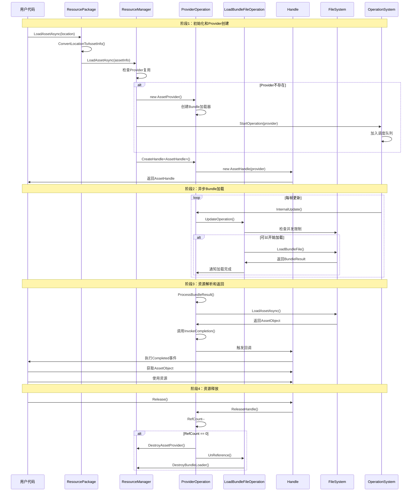

# YooAsset完整资源加载流程分析

## 一、整体架构概览

### 1.1 核心组件关系图

```
┌─────────────────────────────────────────────────────────┐
│                   YooAssets (全局管理器)                   │
│              ┌───────────────┬───────────────┐            │
│              │ ResourcePackage1 │ ResourcePackage2 │ ...        │
└──────────────┴───────────────┴───────────────┘
         │                       │
         ▼                       ▼
┌─────────────────────────────────────────────────────────┐
│                ResourcePackage (资源包管理)                │
│           ┌─────────────────────────────────────┐        │
│           │           ResourceManager          │        │
│           │         (资源管理核心)              │        │
└────────────┴─────────────────────────────────────┴────────
                      │
         ┌────────────┼────────────┐
         ▼            ▼            ▼
┌─────────────────────────────────────────────────────────┐
│              ProviderOperation (资源加载协调)              │
│   ┌───────────────┬─────────────┬─────────────┐          │
│   │ AssetProvider │ SceneProvider│ SubAssetsProvider│     │
└───┴───────────────┴─────────────┴─────────────┘
         │            │            │
         ▼            ▼            ▼
┌─────────────────────────────────────────────────────────┐
│             Handle (用户接口层)                          │
│  ┌─────────────┬─────────────┬─────────────┐             │
│  │ AssetHandle │ SceneHandle │ SubAssetsHandle│            │
└──┴─────────────┴─────────────┴─────────────┘
```

### 1.2 系统层次结构

| 层级 | 组件 | 职责 | 主要接口 |
|------|------|------|----------|
| **全局管理层** | YooAssets | 系统初始化、包管理 | Initialize, CreatePackage |
| **资源包管理层** | ResourcePackage | 包生命周期管理、API入口 | InitializeAsync, LoadAssetAsync |
| **资源管理核心** | ResourceManager | Provider管理、并发控制 | LoadAssetAsync, UnloadUnusedAssets |
| **资源加载协调** | ProviderOperation | 资源加载协调、状态管理 | CreateHandle, ProcessBundleResult |
| **用户接口层** | Handle | 用户友好的API、代理调用 | AssetObject, InstantiateSync |
| **底层执行层** | LoadBundleFileOperation | 实际的文件加载操作 | LoadBundleFile, UpdateOperation |

## 二、系统初始化流程

### 2.1 YooAssets.Initialize() 完整流程

```csharp
// 步骤1：系统初始化检查
public static void Initialize(ILogger logger = null)
{
    if (_isInitialize)
    {
        UnityEngine.Debug.LogWarning($"{nameof(YooAssets)} is initialized !");
        return;
    }

    // 步骤2：设置日志系统
    YooLogger.Logger = logger;

    // 步骤3：创建驱动器GameObject
    _isInitialize = true;
    _driver = new UnityEngine.GameObject($"[{nameof(YooAssets)}]");
    _driver.AddComponent<YooAssetsDriver>();
    UnityEngine.Object.DontDestroyOnLoad(_driver);

    // 步骤4：初始化异步操作系统
    OperationSystem.Initialize();
}
```

**初始化要点**：
- 创建全局驱动器对象，管理整个系统的生命周期
- 初始化OperationSystem，为异步操作提供调度基础
- 设置自定义日志系统（可选）
- 支持运行时重新初始化（编辑器环境）

### 2.2 ResourcePackage创建过程

```csharp
// 创建资源包
public static ResourcePackage CreatePackage(string packageName)
{
    // 1. 参数验证
    CheckException(packageName);
    if (ContainsPackage(packageName))
        throw new Exception($"Package {packageName} already existed !");

    // 2. 创建ResourcePackage实例
    ResourcePackage package = new ResourcePackage(packageName);

    // 3. 注册到全局管理器
    _packages.Add(package);
    return package;
}
```

**设计特点**：
- 每个ResourcePackage独立管理自己的资源
- 支持多包同时管理，适合模块化项目
- 包名唯一性检查，避免冲突

### 2.3 ResourcePackage初始化详解

```csharp
public InitializationOperation InitializeAsync(InitializeParameters parameters)
{
    // 1. 重置初始化状态（失败重试支持）
    ResetInitializeAfterFailed();
    CheckInitializeParameters(parameters);

    // 2. 创建ResourceManager
    _resourceManager = new ResourceManager(PackageName);

    // 3. 创建运行模式实现
    var playModeImpl = new PlayModeImpl(PackageName, parameters);
    _bundleQuery = playModeImpl;
    _playModeImpl = playModeImpl;

    // 4. 初始化ResourceManager
    _resourceManager.Initialize(parameters, _bundleQuery);

    // 5. 根据运行模式初始化文件系统
    InitializationOperation initializeOperation;
    switch (parameters)
    {
        case OfflinePlayModeParameters offlineParams:
            initializeOperation = playModeImpl.InitializeAsync(offlineParams.BuildinFileSystemParameters);
            break;
        case HostPlayModeParameters hostParams:
            initializeOperation = playModeImpl.InitializeAsync(hostParams.BuildinFileSystemParameters, hostParams.CacheFileSystemParameters);
            break;
        case WebPlayModeParameters webParams:
            initializeOperation = playModeImpl.InitializeAsync(webParams.WebServerFileSystemParameters, webParams.WebRemoteFileSystemParameters);
            break;
        default:
            throw new NotImplementedException($"Unsupported play mode: {parameters.GetType()}");
    }

    // 6. 启动初始化操作
    _isInitialize = true;
    OperationSystem.StartOperation(PackageName, initializeOperation);
    return initializeOperation;
}
```

**初始化流程要点**：
- **失败重试支持**：ResetInitializeAfterFailed() 允许初始化失败后重新尝试
- **运行模式抽象**：PlayModeImpl封装不同运行模式的具体实现
- **文件系统初始化**：根据不同运行模式初始化对应的文件系统
- **异步启动**：初始化过程是异步的，避免阻塞主线程

## 三、ResourceManager核心架构

### 3.1 ResourceManager的核心职责

```csharp
internal class ResourceManager
{
    // Provider管理字典 (GUID -> Provider)
    internal readonly Dictionary<string, ProviderOperation> ProviderDic = new Dictionary<string, ProviderOperation>(5000);

    // Bundle加载器管理字典 (BundleName -> Loader)
    internal readonly Dictionary<string, LoadBundleFileOperation> LoaderDic = new Dictionary<string, LoadBundleFileOperation>(5000);

    // 场景句柄管理列表
    internal readonly List<SceneHandle> SceneHandles = new List<SceneHandle>(100);

    // 配置参数
    public bool WebGLForceSyncLoadAsset { private set; get; }
    public bool UseWeakReferenceHandle { private set; get; }
    public int BundleLoadingMaxConcurrency { private set; get; }

    // 并发控制计数器
    private int _bundleLoadingCounter = 0;

    // Bundle查询服务
    private IBundleQuery _bundleQuery;
}
```

### 3.2 ResourceManager与ResourcePackage的关系

```csharp
// ResourcePackage中的ResourceManager创建
_resourceManager = new ResourceManager(PackageName);
_resourceManager.Initialize(parameters, _bundleQuery);
```

**关系分析**：
- **持有关系**：ResourcePackage持有ResourceManager实例
- **生命周期同步**：ResourcePackage销毁时ResourceManager也会被销毁
- **配置传递**：ResourcePackage将初始化参数和Bundle查询服务传递给ResourceManager
- **API委托**：ResourcePackage的资源加载API实际上是委托给ResourceManager执行

### 3.3 ResourceManager初始化详解

```csharp
public void Initialize(InitializeParameters parameters, IBundleQuery bundleServices)
{
    // 1. 并发控制参数
    _bundleLoadingMaxConcurrency = parameters.BundleLoadingMaxConcurrency;

    // 2. WebGL特殊处理参数
    WebGLForceSyncLoadAsset = parameters.WebGLForceSyncLoadAsset;

    // 3. Handle引用模式参数
    UseWeakReferenceHandle = parameters.UseWeakReferenceHandle;

    // 4. Bundle查询服务
    _bundleQuery = bundleServices;

    // 5. 注册场景卸载事件
    SceneManager.sceneUnloaded += OnSceneUnloaded;
}
```

### 3.4 ResourceManager的资源加载流程

```csharp
public AssetHandle LoadAssetAsync(AssetInfo assetInfo, uint priority)
{
    // 1. 参数验证
    if (LockLoadOperation)
    {
        return CreateErrorProvider(assetInfo, "The load operation locked !");
    }

    if (assetInfo.IsInvalid)
    {
        return CreateErrorProvider(assetInfo, assetInfo.Error);
    }

    // 2. 尝试复用现有Provider
    string providerGUID = nameof(LoadAssetAsync) + assetInfo.GUID;
    ProviderOperation provider = TryGetAssetProvider(providerGUID);

    // 3. 如果没有复用对象，创建新的Provider
    if (provider == null)
    {
        provider = new AssetProvider(this, providerGUID, assetInfo);
        provider.InitProviderDebugInfo();
        ProviderDic.Add(providerGUID, provider);
        OperationSystem.StartOperation(PackageName, provider);
    }

    // 4. 设置优先级并创建Handle
    provider.Priority = priority;
    return provider.CreateHandle<AssetHandle>();
}
```

**复用机制详解**：
- **Provider级复用**：相同资源的多次加载会复用同一个ProviderOperation
- **GUID作为唯一标识**：使用`LoadAssetAsync + GUID`作为Provider的唯一标识
- **引用计数管理**：通过Provider的RefCount管理资源的生命周期

## 四、ProviderOperation核心机制

### 4.1 ProviderOperation的创建条件

ProviderOperation在以下情况下被创建：

#### 1. **首次加载资源时**
```csharp
// ResourceManager.LoadAssetAsync() 中
if (provider == null)
{
    provider = new AssetProvider(this, providerGUID, assetInfo);
    ProviderDic.Add(providerGUID, provider);
    OperationSystem.StartOperation(PackageName, provider);
}
```

#### 2. **不同资源类型需要不同的Provider**
```csharp
// ResourceManager中的资源加载方法
public AssetHandle LoadAssetAsync(AssetInfo assetInfo, uint priority)
{
    // 创建 AssetProvider
    provider = new AssetProvider(this, providerGUID, assetInfo);
}

public SubAssetsHandle LoadSubAssetsAsync(AssetInfo assetInfo, uint priority)
{
    // 创建 SubAssetsProvider
    provider = new SubAssetsProvider(this, providerGUID, assetInfo);
}

public SceneHandle LoadSceneAsync(AssetInfo assetInfo, uint priority)
{
    // 创建 SceneProvider
    provider = new SceneProvider(this, providerGUID, assetInfo);
}
```

### 4.2 ProviderOperation构造函数详解

```csharp
public ProviderOperation(ResourceManager manager, string providerGUID, AssetInfo assetInfo)
{
    // 1. 基础属性设置
    _resManager = manager;
    ProviderGUID = providerGUID;
    MainAssetInfo = assetInfo;

    // 2. 创建主Bundle加载器
    _mainBundleLoader = manager.CreateMainBundleFileLoader(assetInfo);
    _mainBundleLoader.AddProvider(this);
    _bundleLoaders.Add(_mainBundleLoader);

    // 3. 创建依赖Bundle加载器
    var dependLoaders = manager.CreateDependBundleFileLoaders(assetInfo);
    if (dependLoaders.Count > 0)
        _bundleLoaders.AddRange(dependLoaders);

    // 4. 增加所有Bundle加载器的引用计数
    foreach (var bundleLoader in _bundleLoaders)
    {
        bundleLoader.Reference();
    }

    // 5. 初始化状态
    _steps = ESteps.StartBundleLoader;
}
```

**Bundle加载器创建过程**：
```csharp
// ResourceManager.CreateMainBundleFileLoader()
private LoadBundleFileOperation CreateMainBundleFileLoader(AssetInfo assetInfo)
{
    string mainBundleName = _bundleQuery.GetMainBundleName(assetInfo);

    // 尝试复用现有的Bundle加载器
    if (LoaderDic.TryGetValue(mainBundleName, out LoadBundleFileOperation loader))
    {
        return loader;
    }

    // 创建新的Bundle加载器
    var bundleInfo = _bundleQuery.GetMainBundleInfo(assetInfo);
    var loadBundleInfo = new LoadBundleInfo(bundleInfo);
    loader = new LoadBundleFileOperation(this, loadBundleInfo);
    LoaderDic.Add(mainBundleName, loader);
    return loader;
}
```

### 4.3 ProviderOperation的状态管理

```csharp
// 状态枚举
private enum ESteps
{
    StartBundleLoader,    // 启动Bundle加载器
    WaitBundleLoader,     // 等待Bundle加载完成
    ProcessBundleResult,  // 处理Bundle结果
    Success,              // 成功
    Fail                  // 失败
}

// 状态流转逻辑
internal override void InternalUpdate()
{
    switch (_steps)
    {
        case ESteps.StartBundleLoader:
            // 启动所有Bundle加载器
            foreach (var bundleLoader in _bundleLoaders)
            {
                bundleLoader.StartOperation();
                AddChildOperation(bundleLoader);
            }
            _steps = ESteps.WaitBundleLoader;
            break;

        case ESteps.WaitBundleLoader:
            // 等待所有Bundle加载完成
            if (CheckBundleLoadersComplete())
            {
                _steps = ESteps.ProcessBundleResult;
            }
            break;

        case ESteps.ProcessBundleResult:
            // 处理Bundle结果，加载具体资源
            ProcessBundleResult();
            break;
    }
}
```

### 4.4 ProviderOperation与ResourceManager的协作

#### **Provider注册和管理**
```csharp
// ResourceManager中管理Provider
public void DestroyAssetProvider(ProviderOperation provider)
{
    string guid = provider.ProviderGUID;
    if (ProviderDic.ContainsKey(guid))
    {
        ProviderDic.Remove(guid);
    }
}
```

#### **Bundle加载器共享和引用计数**
```csharp
// Bundle加载器的引用管理
public LoadBundleFileOperation CreateMainBundleFileLoader(AssetInfo assetInfo)
{
    string mainBundleName = _bundleQuery.GetMainBundleName(assetInfo);

    if (LoaderDic.TryGetValue(mainBundleName, out LoadBundleFileOperation loader))
    {
        // 复用现有加载器，增加引用计数
        loader.Reference();
        return loader;
    }

    // 创建新加载器
    var bundleInfo = _bundleQuery.GetMainBundleInfo(assetInfo);
    var loadBundleInfo = new LoadBundleInfo(bundleInfo);
    loader = new LoadBundleFileOperation(this, loadBundleInfo);
    LoaderDic.Add(mainBundleName, loader);
    return loader;
}
```

## 五、Handle系统代理机制

### 5.1 Handle的创建和与ProviderOperation的关联

#### **HandleFactory创建Handle**
```csharp
internal static class HandleFactory
{
    private static readonly Dictionary<Type, Func<ProviderOperation, HandleBase>> _handleFactory =
    new Dictionary<Type, Func<ProviderOperation, HandleBase>>()
    {
        { typeof(AssetHandle), operation => new AssetHandle(operation) },
        { typeof(SceneHandle), operation => new SceneHandle(operation) },
        { typeof(SubAssetsHandle), operation => new SubAssetsHandle(operation) },
        { typeof(AllAssetsHandle), operation => new AllAssetsHandle(operation) },
        { typeof(RawFileHandle), operation => new RawFileHandle(operation) }
    };

    public static HandleBase CreateHandle(ProviderOperation operation, Type type)
    {
        if (_handleFactory.TryGetValue(type, out var factory))
        {
            return factory(operation);
        }
        throw new NotImplementedException($"Handle type {type.FullName} is not supported.");
    }
}
```

#### **ProviderOperation创建Handle**
```csharp
public T CreateHandle<T>() where T : HandleBase
{
    if (IsDestroyed)
        throw new System.Exception($"Provider has been destroyed !");

    // 引用计数增加
    RefCount++;

    // 通过工厂创建Handle
    HandleBase handle = HandleFactory.CreateHandle(this, typeof(T));

    // 根据配置选择引用管理方式
    if (_resManager.UseWeakReferenceHandle)
    {
        var weakRef = new WeakReference<HandleBase>(handle);
        _weakReferences.AddLast(weakRef);
    }
    else
    {
        _handles.Add(handle);
    }

    return handle as T;
}
```

### 5.2 Handle的代理调用机制

#### **HandleBase基类设计**
```csharp
public abstract class HandleBase : IEnumerator, IDisposable
{
    private readonly AssetInfo _assetInfo;
    internal ProviderOperation Provider { private set; get; }

    internal HandleBase(ProviderOperation provider)
    {
        Provider = provider;
        _assetInfo = provider.MainAssetInfo;
    }

    // 代理调用Provider的方法
    public virtual EOperationStatus Status
    {
        get
        {
            if (IsValidWithWarning == false)
                return EOperationStatus.None;
            return Provider.Status;
        }
    }

    public virtual float Progress
    {
        get
        {
            if (IsValidWithWarning == false)
                return 0f;
            return Provider.Progress;
        }
    }

    public virtual bool IsDone => Status == EOperationStatus.Failed || Status == EOperationStatus.Succeed;

    // 异步支持
    public virtual Task Task => Provider.Task;
}
```

#### **具体Handle的实现**
```csharp
public sealed class AssetHandle : HandleBase
{
    private Action<AssetHandle> _callback;

    internal AssetHandle(ProviderOperation provider) : base(provider)
    {
    }

    // 资源对象访问
    public UnityEngine.Object AssetObject
    {
        get
        {
            if (IsValidWithWarning == false)
                return null;
            return Provider.AssetObject;
        }
    }

    // 类型安全访问
    public TAsset GetAssetObject<TAsset>() where TAsset : UnityEngine.Object
    {
        if (IsValidWithWarning == false)
            return null;
        return Provider.AssetObject as TAsset;
    }

    // 事件回调
    public event Action<AssetHandle> Completed
    {
        add
        {
            if (IsValidWithWarning == false)
                throw new Exception($"Asset handle is invalid : {GetAssetInfo().AssetPath}");

            if (Provider.IsDone)
                value.Invoke(this);  // 立即执行
            else
                _callback += value;  // 延迟执行
        }
        remove
        {
            if (IsValidWithWarning == false)
                throw new Exception($"Asset handle is invalid : {GetAssetInfo().AssetPath}");
            _callback -= value;
        }
    }

    // 触发回调
    internal override void InvokeCallback()
    {
        _callback?.Invoke(this);
    }
}
```

### 5.3 Handle的生命周期管理

#### **Handle的释放流程**
```csharp
public void Release()
{
    if (IsValidWithWarning == false)
        return;

    try
    {
        // 通知Provider减少引用计数
        Provider.ReleaseHandle(this);

        // 清理引用
        Provider = null;

        // 清理回调
        _callback = null;
    }
    catch (Exception e)
    {
        YooLogger.Error($"Handle release failed: {e.Message}");
    }
}
```

#### **Provider中的Handle管理**
```csharp
public void ReleaseHandle(HandleBase handle)
{
    if (RefCount <= 0)
        throw new System.Exception("Should never get here !");

    RefCount--;

    // 从集合中移除Handle
    if (_resManager.UseWeakReferenceHandle)
    {
        RemoveWeakReference(handle);
    }
    else
    {
        _handles.Remove(handle);
    }

    // 检查是否可以销毁Provider
    if (CanDestroyProvider())
    {
        OnDestroyProvider();
    }
}

// 销毁条件检查
public bool CanDestroyProvider()
{
    // 正在加载中的任务不可以销毁
    if (IsLoading)
        return false;

    // 引用计数为0时可以销毁
    return RefCount <= 0;
}
```

## 六、完整资源加载数据流

### 6.1 从用户请求到资源返回的完整流程



### 6.2 各阶段的详细调用关系

#### **阶段1：初始化和Provider创建**
```csharp
// 1. 用户调用
var handle = package.LoadAssetAsync<GameObject>("Prefabs/Cube");

// 2. ResourcePackage处理
public AssetHandle LoadAssetAsync(string location)
{
    AssetInfo assetInfo = ConvertLocationToAssetInfo(location, typeof(GameObject));
    return LoadAssetInternal(assetInfo, false, 0);
}

private AssetHandle LoadAssetInternal(AssetInfo assetInfo, bool waitForAsyncComplete, uint priority)
{
    assetInfo.LoadMethod = AssetInfo.ELoadMethod.LoadAsset;
    var handle = _resourceManager.LoadAssetAsync(assetInfo, priority);
    if (waitForAsyncComplete)
        handle.WaitForAsyncComplete();
    return handle;
}

// 3. ResourceManager处理
public AssetHandle LoadAssetAsync(AssetInfo assetInfo, uint priority)
{
    string providerGUID = nameof(LoadAssetAsync) + assetInfo.GUID;

    // 检查复用
    ProviderOperation provider = TryGetAssetProvider(providerGUID);
    if (provider == null)
    {
        provider = new AssetProvider(this, providerGUID, assetInfo);
        provider.InitProviderDebugInfo();
        ProviderDic.Add(providerGUID, provider);
        OperationSystem.StartOperation(PackageName, provider);
    }

    provider.Priority = priority;
    return provider.CreateHandle<AssetHandle>();
}
```

#### **阶段2：异步Bundle加载**
```csharp
// LoadBundleFileOperation的执行流程
public void UpdateOperation()
{
    switch (_steps)
    {
        case ESteps.CheckConcurrency:
            if (_resManager.BundleLoadingIsBusy())
                return;
            _steps = ESteps.LoadBundleFile;
            break;

        case ESteps.LoadBundleFile:
            if (_loadBundleOp == null)
            {
                _resManager.BundleLoadingCounter++;
                _loadBundleOp = LoadBundleInfo.LoadBundleFile();
                _loadBundleOp.StartOperation();
            }

            _loadBundleOp.UpdateOperation();
            DownloadProgress = _loadBundleOp.DownloadProgress;
            DownloadedBytes = _loadBundleOp.DownloadedBytes;

            if (_loadBundleOp.IsDone)
            {
                if (_loadBundleOp.Status == EOperationStatus.Succeed)
                {
                    Result = _loadBundleOp.Result;
                    Status = EOperationStatus.Succeed;
                }
                else
                {
                    Status = EOperationStatus.Failed;
                    Error = _loadBundleOp.Error;
                }

                _resManager.BundleLoadingCounter--;
            }
            break;
    }
}
```

#### **阶段3：资源解析和返回**
```csharp
// AssetProvider处理Bundle结果
protected override void ProcessBundleResult()
{
    if (_loadAssetOp == null)
    {
        _loadAssetOp = BundleResultObject.LoadAssetAsync(MainAssetInfo);
        _loadAssetOp.StartOperation();
        AddChildOperation(_loadAssetOp);
    }

    _loadAssetOp.UpdateOperation();
    Progress = _loadAssetOp.Progress;

    if (_loadAssetOp.IsDone)
    {
        if (_loadAssetOp.Status == EOperationStatus.Succeed)
        {
            AssetObject = _loadAssetOp.Result;
            InvokeCompletion(string.Empty, EOperationStatus.Succeed);
        }
        else
        {
            InvokeCompletion(_loadAssetOp.Error, EOperationStatus.Failed);
        }
    }
}
```

### 6.3 错误处理和状态管理

#### **ResourceInfo验证错误**
```csharp
public AssetInfo ConvertLocationToAssetInfo(string location, System.Type assetType)
{
    // 检查资源是否存在
    if (_bundleQuery.AssetExists(location) == false)
    {
        YooLogger.Error($"Asset location is invalid: {location}");
        AssetInfo assetInfo = new AssetInfo();
        assetInfo.SetAsError($"Asset location is invalid: {location}");
        return assetInfo;
    }

    // 获取资源信息
    var provider = _bundleQuery.GetAssetInfo(location, assetType);
    if (provider.IsInvalid)
    {
        YooLogger.Error($"Asset provider is invalid: {location}");
        return provider;
    }

    return provider;
}
```

#### **ProviderOperation错误处理**
```csharp
protected bool CheckBundleLoadersComplete()
{
    foreach (var bundleLoader in _bundleLoaders)
    {
        if (bundleLoader.IsDone == false)
            return false;

        if (bundleLoader.Status != EOperationStatus.Succeed)
        {
            string bundleName = bundleLoader.LoadBundleInfo.BundleName;
            InvokeCompletion($"Bundle load failed: {bundleName} Error: {bundleLoader.Error}", EOperationStatus.Failed);
            return false;
        }
    }
    return true;
}
```

#### **Handle有效性检查**
```csharp
internal bool IsValidWithWarning
{
    get
    {
        if (Provider != null && Provider.IsDestroyed == false)
        {
            return true;
        }
        else
        {
            if (Provider == null)
                YooLogger.Warning($"Operation handle is released: {_assetInfo.AssetPath}");
            else if (Provider.IsDestroyed)
                YooLogger.Warning($"Provider is destroyed: {_assetInfo.AssetPath}");
            return false;
        }
    }
}
```

## 七、各组件协作关系详解

### 7.1 组件职责边界总结

| 组件 | 核心职责 | 管理对象 | 生命周期管理 |
|------|----------|----------|--------------|
| **YooAssets** | 全局系统管理、包注册 | ResourcePackage列表 | 系统级生命周期 |
| **ResourcePackage** | 包生命周期、API入口 | ResourceManager, BundleQuery | 包级生命周期 |
| **ResourceManager** | Provider管理、并发控制 | ProviderOperation, BundleLoader | 资源管理生命周期 |
| **ProviderOperation** | 资源加载协调、状态管理 | Handle, BundleLoader | 加载任务生命周期 |
| **LoadBundleFileOperation** | Bundle文件加载执行 | ProviderOperation列表 | Bundle加载生命周期 |
| **Handle** | 用户接口、代理调用 | ProviderOperation引用 | 用户使用生命周期 |

### 7.2 数据流向和控制流传递

#### **数据流向**
```
用户请求(location) → AssetInfo → ProviderGUID → ProviderOperation → BundleFileLoader → FileSystem → BundleResult → AssetObject → Handle.AssetObject
```

#### **控制流传递**
```
用户调用 → API检查 → Provider创建 → Bundle加载启动 → 异步调度 → 加载完成 → 结果处理 → 回调通知 → 资源返回
```

#### **引用计数传递**
```
Handle创建 → Provider.RefCount++ → BundleLoader.RefCount++
Handle释放 → Provider.RefCount-- → BundleLoader.RefCount--
引用归零 → Provider销毁 → BundleLoader销毁
```

### 7.3 关键设计模式应用

#### **1. 代理模式 (Proxy Pattern)**
- **Handle作为Provider的代理**：Handle封装了Provider的复杂性，提供简洁的用户接口
- **接口统一**：所有Handle类型都遵循相同的接口规范

#### **2. 工厂模式 (Factory Pattern)**
- **HandleFactory**：统一创建不同类型的Handle，支持类型安全的创建
- **Provider创建**：ResourceManager根据资源类型创建不同的Provider

#### **3. 单例模式 (Singleton Pattern)**
- **YooAssets**：全局唯一的资源系统管理器
- **ResourceManager**：每个ResourcePackage内唯一的资源管理器

#### **4. 观察者模式 (Observer Pattern)**
- **Completed事件**：Handle支持多个观察者监听加载完成事件
- **Provider通知**：Provider完成时通知所有关联的Handle

#### **5. 复合模式 (Composite Pattern)**
- **ProviderOperation管理BundleLoader**：Provider作为复合对象管理多个BundleLoader
- **层级管理**：多级复用和管理形成复合结构

### 7.4 引用计数的深度实现

YooAsset的引用计数机制是整个资源管理的核心，它通过多级引用计数确保资源的正确生命周期管理。

#### **7.4.1 引用计数的层级结构**

```
Handle引用计数 → Provider引用计数 → BundleLoader引用计数
     ↓              ↓                    ↓
用户持有Handle   Provider管理Handle   BundleLoader管理资源
     ↓              ↓                    ↓
Handle释放       Provider销毁        BundleLoader卸载
```

#### **7.4.2 ProviderOperation中的引用计数实现**

##### **Provider引用计数属性**
```csharp
// ProviderOperation.cs:63
public int RefCount { private set; get; } = 0;
```

##### **Handle创建时的引用计数增加**
```csharp
// ProviderOperation.cs:244-260
public T CreateHandle<T>() where T : HandleBase
{
    // 1. Provider引用计数增加
    RefCount++;

    // 2. 通过工厂创建Handle
    HandleBase handle = HandleFactory.CreateHandle(this, typeof(T));

    // 3. 根据配置选择引用管理方式
    if (_resManager.UseWeakReferenceHandle)
    {
        // 弱引用模式：使用WeakReference
        var weakRef = new WeakReference<HandleBase>(handle);
        _weakReferences.AddLast(weakRef);
    }
    else
    {
        // 强引用模式：使用HashSet
        _handles.Add(handle);
    }

    return handle as T;
}
```

##### **Handle释放时的引用计数减少**
```csharp
// ProviderOperation.cs:265-283
public void ReleaseHandle(HandleBase handle)
{
    if (RefCount <= 0)
        throw new System.Exception("Should never get here !");

    // 从Handle集合中移除
    if (_resManager.UseWeakReferenceHandle)
    {
        if (RemoveWeakReference(handle) == false)
            throw new Exception("Should never get here !");
    }
    else
    {
        if (_handles.Remove(handle) == false)
            throw new Exception("Should never get here !");
    }

    // Provider引用计数减少
    RefCount--;
}
```

##### **Provider销毁条件检查**
```csharp
// ProviderOperation.cs:230-240
public bool CanDestroyProvider()
{
    // 正在加载中的任务不可以销毁
    if (IsLoading)
        return false;

    // 引用计数为0时可以销毁
    return RefCount <= 0;
}

private bool IsLoading
{
    get
    {
        return _steps == ESteps.WaitBundleLoader || _steps == ESteps.ProcessBundleResult;
    }
}
```

#### **7.4.3 LoadBundleFileOperation中的引用计数实现**

##### **BundleLoader引用计数属性**
```csharp
// LoadBundleFileOperation.cs:36
public int RefCount { private set; get; } = 0;
```

##### **BundleLoader的引用管理**
```csharp
// LoadBundleFileOperation.cs:147-158
public void Reference()
{
    RefCount++;
}

public void Release()
{
    RefCount--;
}
```

##### **BundleLoader销毁条件**
```csharp
// LoadBundleFileOperation.cs:163-173
public void DestroyLoader()
{
    IsDestroyed = true;

    // 注意：正在加载中的任务不可以销毁
    if (_steps == ESteps.LoadBundleFile)
        throw new Exception($"Bundle file loader is not done : {LoadBundleInfo.Bundle.BundleName}");

    if (RefCount > 0)
        throw new Exception($"Bundle file loader ref is not zero : {LoadBundleInfo.Bundle.BundleName}");

    if (Result != null)
        Result.UnloadBundleFile();
}
```

#### **7.4.4 弱引用模式的实现**

##### **弱引用清理机制**
```csharp
// ProviderOperation.cs:396-410
private void TryCleanupWeakReference()
{
    if (_resManager.UseWeakReferenceHandle == false)
        return;

    var currentNode = _weakReferences.First;
    while (currentNode != null)
    {
        var nextNode = currentNode.Next;

        // 检查弱引用是否仍然有效
        if (currentNode.Value.TryGetTarget(out HandleBase target) == false)
        {
            // 引用已失效，移除并减少引用计数
            _weakReferences.Remove(currentNode);
            RefCount--;
        }

        currentNode = nextNode;
    }
}
```

##### **弱引用Handle的移除**
```csharp
// ProviderOperation.cs:372-390
private bool RemoveWeakReference(HandleBase handle)
{
    var currentNode = _weakReferences.First;
    while (currentNode != null)
    {
        if (currentNode.Value.TryGetTarget(out HandleBase target))
        {
            if (ReferenceEquals(target, handle))
            {
                _weakReferences.Remove(currentNode);
                return true;
            }
        }
        currentNode = currentNode.Next;
    }
    return false;
}
```

#### **7.4.5 引用计数的完整生命周期**

##### **阶段1：资源加载时的引用计数建立**
```csharp
// ResourceManager.LoadAssetAsync()中
string providerGUID = nameof(LoadAssetAsync) + assetInfo.GUID;
ProviderOperation provider = TryGetAssetProvider(providerGUID);

if (provider == null)
{
    // 1. 创建新的Provider
    provider = new AssetProvider(this, providerGUID, assetInfo);

    // 2. Provider创建时会增加BundleLoader的引用计数
    // 见ProviderOperation构造函数：
    foreach (var bundleLoader in _bundleLoaders)
    {
        bundleLoader.Reference(); // BundleLoader.RefCount++
    }

    ProviderDic.Add(providerGUID, provider);
    OperationSystem.StartOperation(PackageName, provider);
}

// 3. 创建Handle时会增加Provider的引用计数
provider.Priority = priority;
return provider.CreateHandle<AssetHandle>(); // Provider.RefCount++
```

##### **阶段2：资源使用期间的引用计数维护**
```csharp
// 在资源使用期间，如果创建多个Handle
var handle1 = provider.CreateHandle<AssetHandle>(); // Provider.RefCount++
var handle2 = provider.CreateHandle<AssetHandle>(); // Provider.RefCount++

// BundleLoader的引用计数保持不变，因为同一个Provider共享BundleLoader
```

##### **阶段3：资源释放时的引用计数减少**
```csharp
// Handle释放时
handle1.Release(); // Provider.RefCount--
handle2.Release(); // Provider.RefCount--

// Provider检查是否可以销毁
if (provider.CanDestroyProvider()) // RefCount <= 0 && !IsLoading
{
    // Provider销毁时会减少BundleLoader的引用计数
    foreach (var bundleLoader in provider._bundleLoaders)
    {
        bundleLoader.Release(); // BundleLoader.RefCount--
    }

    ResourceManager.DestroyAssetProvider(provider);
}
```

#### **7.4.6 引用计数的调试和监控**

##### **获取引用计数信息**
```csharp
// ResourceManager中获取调试信息
internal List<DebugProviderInfo> GetDebugProviderInfos()
{
    List<DebugProviderInfo> result = new List<DebugProviderInfo>();
    foreach (var provider in ProviderDic.Values)
    {
        result.Add(new DebugProviderInfo
        {
            ProviderGUID = provider.ProviderGUID,
            AssetPath = provider.MainAssetInfo.AssetPath,
            RefCount = provider.RefCount,
            Status = provider.Status.ToString(),
            IsDestroyed = provider.IsDestroyed,
            BundleCount = provider._bundleLoaders.Count
        });
    }
    return result;
}
```

##### **BundleLoader的引用计数监控**
```csharp
// ResourceManager中获取BundleLoader调试信息
internal List<DebugBundleLoaderInfo> GetDebugBundleLoaderInfos()
{
    List<DebugBundleLoaderInfo> result = new List<DebugBundleLoaderInfo>();
    foreach (var loader in LoaderDic.Values)
    {
        result.Add(new DebugBundleLoaderInfo
        {
            BundleName = loader.LoadBundleInfo.Bundle.BundleName,
            RefCount = loader.RefCount,
            Status = loader.Status.ToString(),
            IsDestroyed = loader.IsDestroyed,
            ProviderCount = loader.ProviderList.Count
        });
    }
    return result;
}
```

#### **7.4.7 引用计数的最佳实践**

##### **1. 及时释放Handle**
```csharp
// 推荐：使用using语句确保及时释放
using (var handle = await YooAssets.LoadAssetAsync<GameObject>("Prefabs/Player"))
{
    var player = Instantiate(handle.AssetObject);
    // 使用player...
    // handle会在using块结束时自动释放
}

// 推荐：在不需要时立即释放
var handle = await YooAssets.LoadAssetAsync<GameObject>("Prefabs/UI");
var uiPanel = Instantiate(handle.AssetObject);
handle.Release(); // 立即释放Handle
```

##### **2. 弱引用模式的使用场景**
```csharp
// 适合大量短期Handle的场景
resourceManager.UseWeakReferenceHandle = true;

// 例如：加载大量临时特效
async void LoadTemporaryEffects()
{
    var handles = new List<AssetHandle>();
    foreach (var effectPath in effectPaths)
    {
        var handle = await YooAssets.LoadAssetAsync<GameObject>(effectPath);
        handles.Add(handle);

        var effect = Instantiate(handle.AssetObject);
        var effectController = effect.GetComponent<EffectController>();
        effectController.OnEffectComplete += () => {
            Destroy(effect);
            // Handle会在弱引用清理时自动释放，无需手动调用Release()
        };
    }

    // 定期清理弱引用
    InvokeRepeating(nameof(CleanupWeakReferences), 1f, 1f);
}

private void CleanupWeakReferences()
{
    // 触发弱引用清理
    YooAssets.UnloadUnusedAssets();
}
```

##### **3. 引用计数泄漏的检测**
```csharp
// 定期检查引用计数异常
public void CheckReferenceLeaks()
{
    var package = YooAssets.GetPackage("DefaultPackage");
    var providerInfos = package.GetDebugProviderInfos();

    foreach (var info in providerInfos)
    {
        if (info.RefCount > 0 && info.Status == "Succeed")
        {
            Debug.LogWarning($"Potential reference leak: {info.AssetPath}, RefCount: {info.RefCount}");
        }
    }

    var loaderInfos = package.GetDebugBundleLoaderInfos();
    foreach (var info in loaderInfos)
    {
        if (info.RefCount > 0 && info.Status == "Succeed")
        {
            Debug.LogWarning($"Potential bundle reference leak: {info.BundleName}, RefCount: {info.RefCount}");
        }
    }
}
```

### 7.5 性能优化机制

#### **1. 多级复用机制**
- **Bundle级复用**：相同Bundle的多个Provider共享同一个LoadBundleFileOperation
- **Provider级复用**：相同资源的多次加载共享同一个ProviderOperation
- **引用计数管理**：通过多级引用计数精确控制资源的生命周期

#### **2. 并发控制机制**
```csharp
public bool BundleLoadingIsBusy()
{
    return _bundleLoadingCounter >= _bundleLoadingMaxConcurrency;
}

private int _bundleLoadingCounter = 0;
public int BundleLoadingMaxConcurrency { private set; get; }
```

#### **3. 内存管理机制**
- **弱引用支持**：可选的弱引用Handle模式，减少内存占用
- **自动清理**：引用计数归零时自动销毁对象
- **延迟清理**：弱引用的定期清理机制

#### **4. 异步调度优化**
- **时间片控制**：防止单帧执行时间过长
- **优先级调度**：重要资源优先加载
- **批量处理**：提高异步操作的执行效率

## 八、总结

### 8.1 架构优势

YooAsset的资源加载流程体现了精心设计的架构优势：

1. **分层清晰**：每层职责明确，降低系统复杂度
2. **复用高效**：多级复用机制显著提升性能
3. **接口统一**：Handle提供一致的用户接口
4. **异步友好**：完整的异步编程支持
5. **扩展性强**：支持自定义Provider和Handle类型
6. **内存安全**：完善的引用计数和自动清理机制

### 8.2 协作关系总结

ResourcePackage、ResourceManager、Provider、Handle形成了清晰的协作关系：

- **ResourcePackage**：作为资源包的管理入口，负责初始化和API统一
- **ResourceManager**：作为资源管理的核心，负责Provider的生命周期和复用
- **Provider**：作为资源加载的协调者，负责Bundle加载和资源解析
- **Handle**：作为用户接口，负责代理调用和生命周期管理

这种设计既保证了系统的高效性能，又提供了友好的用户接口，是一个典型的企业级资源管理系统的优秀实现。

### 8.3 关键创新点

1. **分层代理架构**：Handle-Provider-Loader的三层代理设计
2. **智能复用机制**：基于GUID和引用计数的多级复用
3. **异步操作体系**：基于AsyncOperationBase的统一异步框架
4. **生命周期管理**：精确的引用计数和自动清理机制
5. **错误处理机制**：完整的错误检查和处理流程

这些创新点使得YooAsset能够处理复杂的游戏资源管理需求，同时保持良好的性能和稳定性。