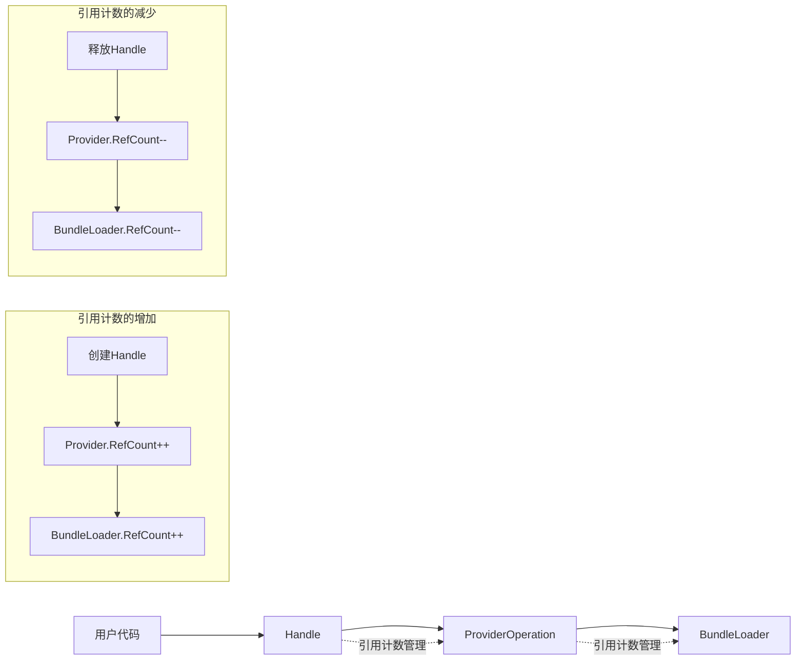
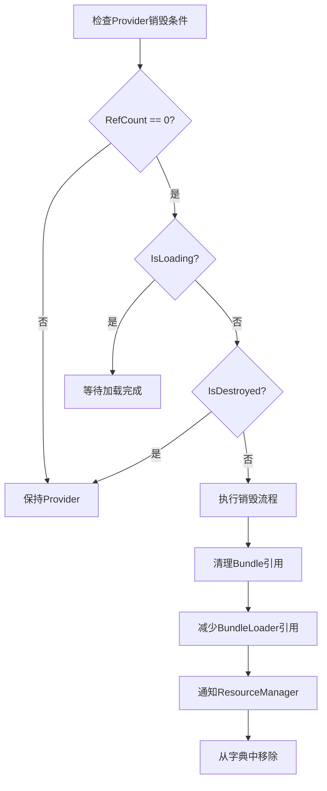
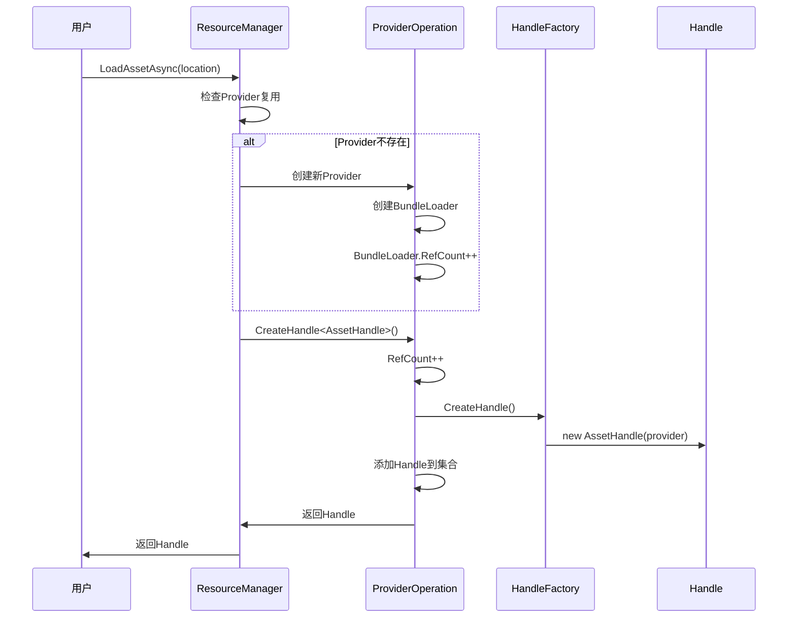

# YooAsset引用计数机制深度解析

## 目录

1. [引言](#1-引言)
2. [引用计数的整体架构设计](#2-引用计数的整体架构设计)
3. [RefCount增减的触发时机](#3-refcount增减的触发时机)
4. [Provider的加载/卸载机制](#4-provider的加载卸载机制)
5. [Handle的生命周期管理](#5-handle的生命周期管理)
6. [BundleLoader的加载/卸载机制](#6-bundleloader的加载卸载机制)
7. [WeakReference机制的深度分析](#7-weakreference机制的深度分析)
8. [强引用vs弱引用对比](#8-强引用vs弱引用对比)
9. [完整的加载/卸载实例追踪](#9-完整的加载卸载实例追踪)
10. [最佳实践与注意事项](#10-最佳实践与注意事项)

---

## 1. 引言

YooAsset的引用计数机制是其资源管理的核心，它通过三层引用计数架构确保资源的正确加载和卸载，防止内存泄漏和重复加载。本文将深入分析这个机制的每个环节。

### 1.1 为什么需要引用计数？

在游戏开发中，资源管理是一个复杂的问题：
- **资源共享**：多个游戏对象可能使用同一个资源
- **内存优化**：及时释放不再使用的资源
- **性能考虑**：避免重复加载相同资源
- **生命周期管理**：确保资源在使用期间不被意外释放

### 1.2 引用计数的核心思想

```
资源被引用 → 引用计数+1 → 保持加载状态
资源被释放 → 引用计数-1 → 检查计数
计数归零    → 自动卸载    → 释放内存
```

---

## 2. 引用计数的整体架构设计

### 2.1 三层引用计数架构

YooAsset采用三层引用计数架构，每层都有明确的职责：

```
┌─────────────────────────────────────────────────────────┐
│                    Handle层 (用户接口层)                  │
│  管理用户与资源的交互，提供友好的API接口                  │
│  RefCount: 管理用户对资源的引用次数                      │
└─────────────────────────────────────────────────────────┘
                              │
                              ▼ 引用计数管理
┌─────────────────────────────────────────────────────────┐
│                  Provider层 (资源协调层)                  │
│  协调资源加载过程，管理Handle的生命周期                    │
│  RefCount: 管理Handle对Provider的引用次数                │
└─────────────────────────────────────────────────────────┘
                              │
                              ▼ 引用计数管理
┌─────────────────────────────────────────────────────────┐
│                BundleLoader层 (文件加载层)               │
│  实际的Bundle文件加载操作，管理资源的物理存储              │
│  RefCount: 管理Provider对BundleLoader的引用次数         │
└─────────────────────────────────────────────────────────┘
```

### 2.2 核心数据结构

#### ProviderOperation中的引用计数
```csharp
public class ProviderOperation : AsyncOperationBase
{
    // Provider的引用计数 - 管理Handle的引用
    public int RefCount { private set; get; } = 0;

    // Handle管理 - 支持强引用和弱引用两种模式
    private readonly HashSet<HandleBase> _handles = new HashSet<HandleBase>();
    private readonly LinkedList<WeakReference<HandleBase>> _weakReferences =
        new LinkedList<WeakReference<HandleBase>>();

    // Bundle加载器管理
    private readonly List<LoadBundleFileOperation> _bundleLoaders;
}
```

#### LoadBundleFileOperation中的引用计数
```csharp
public class LoadBundleFileOperation : AsyncOperationBase
{
    // BundleLoader的引用计数 - 管理Provider的引用
    public int RefCount { private set; get; } = 0;

    // 引用此BundleLoader的Provider列表
    private readonly List<ProviderOperation> _providerList = new List<ProviderOperation>();
}
```

### 2.3 引用计数的流转关系



---

## 3. RefCount增减的触发时机

### 3.1 RefCount增加的触发时机

#### 时机1：用户创建Handle时
```csharp
// ResourceManager.LoadAssetAsync()
public AssetHandle LoadAssetAsync(AssetInfo assetInfo, uint priority)
{
    // 1. 尝试获取现有Provider
    ProviderOperation provider = TryGetAssetProvider(providerGUID);

    if (provider == null)
    {
        // 2. 创建新Provider时，BundleLoader引用计数增加
        provider = new AssetProvider(this, providerGUID, assetInfo);
        ProviderDic.Add(providerGUID, provider);
        OperationSystem.StartOperation(PackageName, provider);
    }

    // 3. 创建Handle时，Provider引用计数增加
    return provider.CreateHandle<AssetHandle>();
}
```

#### ProviderOperation.CreateHandle()实现
```csharp
public T CreateHandle<T>() where T : HandleBase
{
    // 引用计数增加！
    RefCount++;

    HandleBase handle = HandleFactory.CreateHandle(this, typeof(T));

    if (_resManager.UseWeakReferenceHandle)
    {
        // 弱引用模式
        var weakRef = new WeakReference<HandleBase>(handle);
        _weakReferences.AddLast(weakRef);
    }
    else
    {
        // 强引用模式
        _handles.Add(handle);
    }

    return handle as T;
}
```

#### 时机2：Provider创建时的BundleLoader引用增加
```csharp
public ProviderOperation(ResourceManager manager, string providerGUID, AssetInfo assetInfo)
{
    // 创建Bundle加载器时
    _mainBundleLoader = manager.CreateMainBundleFileLoader(assetInfo);
    _mainBundleLoader.AddProvider(this);
    _bundleLoaders.Add(_mainBundleLoader);

    // 创建依赖Bundle加载器时
    var dependLoaders = manager.CreateDependBundleFileLoaders(assetInfo);
    if (dependLoaders.Count > 0)
        _bundleLoaders.AddRange(dependLoaders);

    // 增加所有Bundle加载器的引用计数
    foreach (var bundleLoader in _bundleLoaders)
    {
        bundleLoader.Reference(); // BundleLoader.RefCount++
    }
}
```

### 3.2 RefCount减少的触发时机

#### 时机1：用户释放Handle时
```csharp
// HandleBase.Release()
public void Release()
{
    if (IsValidWithWarning == false)
        return;

    try
    {
        // 通知Provider减少引用计数
        Provider.ReleaseHandle(this);
        Provider = null;
    }
    catch (Exception e)
    {
        YooLogger.Error($"Handle release failed: {e.Message}");
    }
}
```

#### ProviderOperation.ReleaseHandle()实现
```csharp
public void ReleaseHandle(HandleBase handle)
{
    if (RefCount <= 0)
        throw new System.Exception("Should never get here !");

    // 从Handle集合中移除
    if (_resManager.UseWeakReferenceHandle)
    {
        RemoveWeakReference(handle);
    }
    else
    {
        _handles.Remove(handle);
    }

    // 引用计数减少！
    RefCount--;
    // 注意：这里不调用CanDestroyProvider()或OnDestroyProvider()
    // Provider的销毁由BundleLoader的周期性检查机制触发
}
```

#### 时机2：Provider销毁时的BundleLoader引用减少
```csharp
protected virtual void OnDestroyProvider()
{
    IsDestroyed = true;

    // 清理Bundle引用
    if (BundleResultObject != null)
    {
        BundleResultObject.ReleaseBundleFile();
        BundleResultObject = null;
    }

    // 减少BundleLoader的引用计数
    foreach (var bundleLoader in _bundleLoaders)
    {
        bundleLoader.Release(); // BundleLoader.RefCount--
    }

    // 通知ResourceManager销毁Provider
    _resManager.DestroyAssetProvider(this);
}
```

### 3.3 引用计数归零的处理逻辑

#### Provider的销毁条件
```csharp
public bool CanDestroyProvider()
{
    // 正在加载中的任务不可以销毁
    if (IsLoading)
        return false;

    // 引用计数为0且没有关联的Handle时可以销毁
    return RefCount <= 0;
}

private bool IsLoading
{
    get
    {
        return _steps == ESteps.WaitBundleLoader ||
               _steps == ESteps.ProcessBundleResult;
    }
}
```

#### BundleLoader的销毁条件
```csharp
public bool CanDestroyLoader()
{
    // 正在加载中的任务不可以销毁
    if (_steps == ESteps.LoadBundleFile)
        return false;

    // 引用计数为0时可以销毁
    return RefCount <= 0;
}

public void DestroyLoader()
{
    IsDestroyed = true;

    // 安全检查
    if (_steps == ESteps.LoadBundleFile)
        throw new Exception($"Bundle file loader is not done");

    if (RefCount > 0)
        throw new Exception($"Bundle file loader ref is not zero");

    // 实际卸载Bundle
    if (Result != null)
        Result.UnloadBundleFile();
}
```

---

## 4. Provider的加载/卸载机制

### 4.1 Provider的创建时机

#### 条件1：首次加载特定资源时
```csharp
// ResourceManager.LoadAssetAsync()
string providerGUID = nameof(LoadAssetAsync) + assetInfo.GUID;
ProviderOperation provider = TryGetAssetProvider(providerGUID);

if (provider == null)
{
    // 首次加载，创建新的Provider
    provider = new AssetProvider(this, providerGUID, assetInfo);
    ProviderDic.Add(providerGUID, provider);
    OperationSystem.StartOperation(PackageName, provider);
}
```

#### 条件2：不同资源类型需要不同的Provider
```csharp
// 不同类型资源的Provider创建
public AssetHandle LoadAssetAsync(AssetInfo assetInfo, uint priority)
{
    // 创建 AssetProvider
    provider = new AssetProvider(this, providerGUID, assetInfo);
}

public SubAssetsHandle LoadSubAssetsAsync(AssetInfo assetInfo, uint priority)
{
    // 创建 SubAssetsProvider
    provider = new SubAssetsProvider(this, providerGUID, assetInfo);
}

public SceneHandle LoadSceneAsync(AssetInfo assetInfo, uint priority)
{
    // 创建 SceneProvider
    provider = new SceneProvider(this, providerGUID, assetInfo);
}
```

### 4.2 Provider的复用机制

#### 基于GUID的复用策略
```csharp
// Provider的唯一标识：LoadAssetAsync + 资源GUID
string providerGUID = nameof(LoadAssetAsync) + assetInfo.GUID;

// 复用检查
ProviderOperation provider = TryGetAssetProvider(providerGUID);
if (provider != null)
{
    // 复用现有Provider，共享已加载的资源
    return provider.CreateHandle<AssetHandle>();
}
```

#### 复用的好处
- **性能提升**：避免重复加载相同资源
- **内存优化**：多个请求共享同一个资源实例
- **一致性**：确保同一资源在不同地方的一致性

### 4.3 Provider的销毁时机

#### 销毁条件检查


#### 销毁流程实现
```csharp
protected virtual void OnDestroyProvider()
{
    IsDestroyed = true;

    // 1. 清理Bundle结果
    if (BundleResultObject != null)
    {
        BundleResultObject.ReleaseBundleFile();
        BundleResultObject = null;
    }

    // 2. 减少BundleLoader的引用计数
    foreach (var bundleLoader in _bundleLoaders)
    {
        bundleLoader.Release();
    }

    // 3. 通知ResourceManager
    _resManager.DestroyAssetProvider(this);
}
```

### 4.4 Provider的生命周期状态

```csharp
private enum ESteps
{
    None,                // 初始状态
    StartBundleLoader,   // 启动Bundle加载器
    WaitBundleLoader,    // 等待Bundle加载完成
    ProcessBundleResult, // 处理Bundle结果
    Done                 // 完成状态
}
```

---

## 5. Handle的生命周期管理

### 5.1 Handle的创建过程

#### 创建流程图


#### Handle的工厂创建
```csharp
// HandleFactory.CreateHandle()
internal static class HandleFactory
{
    private static readonly Dictionary<Type, Func<ProviderOperation, HandleBase>> _handleFactory =
        new Dictionary<Type, Func<ProviderOperation, HandleBase>>()
    {
        { typeof(AssetHandle), op => new AssetHandle(op) },
        { typeof(SceneHandle), op => new SceneHandle(op) },
        { typeof(SubAssetsHandle), op => new SubAssetsHandle(op) },
        // ... 其他Handle类型
    };

    public static HandleBase CreateHandle(ProviderOperation operation, Type type)
    {
        return _handleFactory[type](operation);
    }
}
```

### 5.2 Handle的代理机制

#### Handle作为Provider的代理
```csharp
public abstract class HandleBase : IEnumerator, IDisposable
{
    internal ProviderOperation Provider { private set; get; }

    internal HandleBase(ProviderOperation provider)
    {
        Provider = provider;
    }

    // 所有状态查询都代理给Provider
    public virtual EOperationStatus Status => Provider.Status;
    public virtual float Progress => Provider.Progress;
    public virtual bool IsDone => Provider.IsDone;
    public virtual Task Task => Provider.Task;
}
```

### 5.3 Handle的释放机制

#### 强引用模式下的释放
```csharp
// 释放Handle
public void Release()
{
    if (IsValidWithWarning == false)
        return;

    // 通知Provider减少引用计数
    Provider.ReleaseHandle(this);
    Provider = null;
}

// Provider处理Handle释放
public void ReleaseHandle(HandleBase handle)
{
    if (_resManager.UseWeakReferenceHandle)
    {
        RemoveWeakReference(handle);
    }
    else
    {
        // 从强引用集合中移除
        _handles.Remove(handle);
    }

    // 减少引用计数
    RefCount--;
    // 注意：这里不调用CanDestroyProvider()或OnDestroyProvider()
    // Provider的销毁由BundleLoader的周期性检查机制触发
}
```

#### 弱引用模式下的自动清理
```csharp
// 弱引用的定期清理
private void TryCleanupWeakReference()
{
    if (_resManager.UseWeakReferenceHandle == false)
        return;

    var currentNode = _weakReferences.First;
    while (currentNode != null)
    {
        var nextNode = currentNode.Next;

        // 检查弱引用是否仍然有效
        if (currentNode.Value.TryGetTarget(out HandleBase target) == false)
        {
            // 引用已失效，自动减少引用计数
            _weakReferences.Remove(currentNode);
            RefCount--;
        }

        currentNode = nextNode;
    }
}
```

### 5.4 Handle的有效性检查

#### IsValidWithWarning机制
```csharp
internal bool IsValidWithWarning
{
    get
    {
        if (Provider != null && Provider.IsDestroyed == false)
        {
            return true;
        }
        else
        {
            if (Provider == null)
                YooLogger.Warning($"Operation handle is released: {_assetInfo.AssetPath}");
            else if (Provider.IsDestroyed)
                YooLogger.Warning($"Provider is destroyed: {_assetInfo.AssetPath}");
            return false;
        }
    }
}
```

---

## 6. BundleLoader的加载/卸载机制

### 6.1 BundleLoader的创建时机

#### 基于Bundle信息的复用策略
```csharp
// ResourceManager.CreateMainBundleFileLoader()
private LoadBundleFileOperation CreateMainBundleFileLoader(AssetInfo assetInfo)
{
    string mainBundleName = _bundleQuery.GetMainBundleName(assetInfo);

    // 尝试复用现有的BundleLoader
    if (LoaderDic.TryGetValue(mainBundleName, out LoadBundleFileOperation loader))
    {
        // 复用现有Loader，增加引用计数
        loader.Reference();
        return loader;
    }

    // 创建新的BundleLoader
    var bundleInfo = _bundleQuery.GetMainBundleInfo(assetInfo);
    var loadBundleInfo = new LoadBundleInfo(bundleInfo);
    loader = new LoadBundleFileOperation(this, loadBundleInfo);
    LoaderDic.Add(mainBundleName, loader);
    return loader;
}
```

#### BundleLoader的依赖管理
```csharp
// ResourceManager.CreateDependBundleFileLoaders()
private List<LoadBundleFileOperation> CreateDependBundleFileLoaders(AssetInfo assetInfo)
{
    List<LoadBundleFileOperation> loaders = new List<LoadBundleFileOperation>();

    // 获取所有依赖Bundle信息
    var depends = _bundleQuery.GetDependencies(assetInfo);
    foreach (var bundleInfo in depends)
    {
        string bundleName = bundleInfo.BundleName;

        // 检查是否已存在Loader
        if (LoaderDic.TryGetValue(bundleName, out LoadBundleFileOperation loader))
        {
            loader.Reference();
        }
        else
        {
            // 创建新的依赖BundleLoader
            var loadBundleInfo = new LoadBundleInfo(bundleInfo);
            loader = new LoadBundleFileOperation(this, loadBundleInfo);
            LoaderDic.Add(bundleName, loader);
        }

        loaders.Add(loader);
    }

    return loaders;
}
```

### 6.2 BundleLoader的引用管理

#### Provider与BundleLoader的关系
```csharp
// ProviderOperation构造函数中
public ProviderOperation(ResourceManager manager, string providerGUID, AssetInfo assetInfo)
{
    // 1. 创建主BundleLoader
    _mainBundleLoader = manager.CreateMainBundleFileLoader(assetInfo);
    _mainBundleLoader.AddProvider(this);
    _bundleLoaders.Add(_mainBundleLoader);

    // 2. 创建依赖BundleLoader
    var dependLoaders = manager.CreateDependBundleFileLoaders(assetInfo);
    if (dependLoaders.Count > 0)
        _bundleLoaders.AddRange(dependLoaders);

    // 3. 增加所有BundleLoader的引用计数
    foreach (var bundleLoader in _bundleLoaders)
    {
        bundleLoader.Reference();
    }
}
```

#### BundleLoader的引用计数实现
```csharp
public class LoadBundleFileOperation : AsyncOperationBase
{
    public int RefCount { private set; get; } = 0;
    private readonly List<ProviderOperation> _providerList = new List<ProviderOperation>();

    public void Reference()
    {
        RefCount++;
    }

    public void Release()
    {
        RefCount--;
    }

    public void AddProvider(ProviderOperation provider)
    {
        if (_providerList.Contains(provider) == false)
            _providerList.Add(provider);
    }
}
```

### 6.3 BundleLoader的卸载机制

#### 卸载条件检查
```csharp
public bool CanDestroyLoader()
{
    // 正在加载中的任务不可以销毁
    if (_steps == ESteps.LoadBundleFile)
        return false;

    // 引用计数为0时可以销毁
    return RefCount <= 0;
}

public void DestroyLoader()
{
    IsDestroyed = true;

    // 安全检查
    if (_steps == ESteps.LoadBundleFile)
        throw new Exception($"Bundle file loader is not done: {LoadBundleInfo.Bundle.BundleName}");

    if (RefCount > 0)
        throw new Exception($"Bundle file loader ref is not zero: {LoadBundleInfo.Bundle.BundleName}");

    // 实际卸载Bundle文件
    if (Result != null)
    {
        Result.UnloadBundleFile();
    }
}
```

---

## 7. WeakReference机制的深度分析

### 7.1 WeakReference与强引用的区别

#### 强引用模式（默认）
```csharp
// 强引用模式下的Handle管理
private readonly HashSet<HandleBase> _handles = new HashSet<HandleBase>();

public T CreateHandle<T>() where T : HandleBase
{
    RefCount++;
    HandleBase handle = HandleFactory.CreateHandle(this, typeof(T));

    // 强引用：Handle被Provider强引用，不会被GC回收
    _handles.Add(handle);

    return handle as T;
}
```

**强引用特点：**
- ✅ Handle不会被GC意外回收
- ✅ 生命周期可控，使用更安全
- ❌ 内存占用相对较高
- ❌ 可能导致内存泄漏（忘记释放）

#### 弱引用模式（可选）
```csharp
// 弱引用模式下的Handle管理
private readonly LinkedList<WeakReference<HandleBase>> _weakReferences =
    new LinkedList<WeakReference<HandleBase>>();

public T CreateHandle<T>() where T : HandleBase
{
    RefCount++;
    HandleBase handle = HandleFactory.CreateHandle(this, typeof(T));

    // 弱引用：Handle可以被GC回收
    var weakRef = new WeakReference<HandleBase>(handle);
    _weakReferences.AddLast(weakRef);

    return handle as T;
}
```

**弱引用特点：**
- ✅ 内存占用较低，GC可以回收未使用的Handle
- ✅ 适合大量短期Handle的场景
- ❌ Handle可能被意外GC回收
- ❌ 需要定期检查和清理失效引用

### 7.2 WeakReference的清理机制

#### 定期清理过程
```csharp
private void TryCleanupWeakReference()
{
    if (_resManager.UseWeakReferenceHandle == false)
        return;

    var currentNode = _weakReferences.First;
    while (currentNode != null)
    {
        var nextNode = currentNode.Next;

        // 检查弱引用是否仍然有效
        if (currentNode.Value.TryGetTarget(out HandleBase target) == false)
        {
            // 引用已失效，移除并减少引用计数
            _weakReferences.Remove(currentNode);
            RefCount--; // 自动减少引用计数
        }

        currentNode = nextNode;
    }
}
```

#### 清理触发时机
1. **Handle释放时**：在`ReleaseHandle()`中触发清理
2. **定期检查**：系统定期调用`UnloadUnusedAssets()`
3. **Provider状态检查**：在检查Provider销毁条件时触发

### 7.3 WeakReference适用场景

#### 场景1：大量临时UI元素
```csharp
// 适合弱引用模式
resourceManager.UseWeakReferenceHandle = true;

async void LoadTempUI()
{
    var handle = await YooAssets.LoadAssetAsync<GameObject>("TempUI");
    var ui = Instantiate(handle.AssetObject);

    // UI关闭后，handle会被GC自动清理，无需手动释放
    ui.GetComponent<UIButton>().onClick.AddListener(() => {
        Destroy(ui);
        // handle会被弱引用机制自动清理
    });
}
```

#### 场景2：临时特效和音频
```csharp
async void PlayTempEffect()
{
    var handle = await YooAssets.LoadAssetAsync<GameObject>("ExplosionEffect");
    var effect = Instantiate(handle.AssetObject);

    // 特效播放完成后自动销毁
    effect.GetComponent<EffectController>().OnComplete += () => {
        Destroy(effect);
        // handle会被自动清理
    };
}
```

#### 场景3：数据配置的临时加载
```csharp
async void LoadConfigData()
{
    var handle = await YooAssets.LoadRawFileAsync("config.json");
    string json = handle.GetRawFileText();
    var config = JsonUtility.FromJson<ConfigData>(json);

    // 配置解析完成后，handle可以自动清理
    ProcessConfig(config);
    // handle会在下次弱引用清理时被释放
}
```

---

## 8. 强引用vs弱引用对比

### 8.1 对比表格

| 特性 | 强引用模式 | 弱引用模式 |
|------|------------|------------|
| **内存占用** | 较高 | 较低 |
| **安全性** | 高，不会被GC意外回收 | 较低，可能被意外回收 |
| **性能开销** | 较低（无额外检查） | 较高（需要定期清理） |
| **使用复杂度** | 简单，无需关心GC | 复杂，需要理解GC机制 |
| **适用场景** | 核心资源、长期使用 | 临时资源、大量短期使用 |
| **内存泄漏风险** | 较高（忘记释放） | 较低（自动清理） |
| **开发友好性** | 高，符合直觉 | 中等，需要额外注意 |

### 8.2 内存使用对比图

```
强引用模式内存使用:
┌─────────────────────────────────────────────────────────┐
│ Provider Object                                           │
│ ├─ RefCount: 3                                          │
│ ├─ Handle1 [强引用] ──┐                                │
│ ├─ Handle2 [强引用] ──┤  ┌─ 3个Handle对象               │
│ └─ Handle3 [强引用] ──┘  └─ 3个强引用关系               │
│ 总计：1 Provider + 3 Handle + 3强引用                   │
└─────────────────────────────────────────────────────────┘

弱引用模式内存使用:
┌─────────────────────────────────────────────────────────┐
│ Provider Object                                           │
│ ├─ RefCount: 1                                          │
│ ├─ WeakRef1 [弱引用] ──┐                                │
│ ├─ WeakRef2 [弱引用] ──┤  ┌─ 3个WeakReference对象         │
│ └─ WeakRef3 [弱引用] ──┘  └─ GC可回收的Handle对象        │
│ 总计：1 Provider + 3 WeakReference                      │
│ (Handle对象可能已被GC回收)                               │
└─────────────────────────────────────────────────────────┘
```

### 8.3 性能影响分析

#### 强引用模式性能特点
```csharp
// 强引用：O(1)的添加和移除
_handles.Add(handle);           // O(1)
_handles.Remove(handle);        // O(1)
```

#### 弱引用模式性能特点
```csharp
// 弱引用：需要遍历检查失效引用
private void TryCleanupWeakReference()
{
    // O(n)的时间复杂度，n为弱引用数量
    var currentNode = _weakReferences.First;
    while (currentNode != null)
    {
        if (currentNode.Value.TryGetTarget(out HandleBase target) == false)
        {
            _weakReferences.Remove(currentNode); // O(n)操作
        }
        currentNode = currentNode.Next;
    }
}
```

### 8.4 选择建议

#### 选择强引用模式的场景
```csharp
// 1. 核心游戏对象（玩家、敌人等）
var playerHandle = await YooAssets.LoadAssetAsync<GameObject>("Player");
// 长期使用，需要确保不被意外回收

// 2. 频繁访问的资源
var uiHandle = await YooAssets.LoadAssetAsync<GameObject>("MainUI");
// 需要快速响应，避免GC检查开销

// 3. 复杂的初始化资源
var sceneHandle = await YooAssets.LoadSceneAsync("MainScene");
// 加载成本高，需要保持稳定
```

#### 选择弱引用模式的场景
```csharp
// 1. 大量临时特效
for (int i = 0; i < 100; i++)
{
    var handle = await YooAssets.LoadAssetAsync<GameObject>($"Effect{i}");
    // 短期使用，数量庞大
}

// 2. 临时UI弹窗
var popupHandle = await YooAssets.LoadAssetAsync<GameObject>("TempPopup");
// 用完即弃，需要自动清理

// 3. 数据预加载
var configHandle = await YooAssets.LoadRawFileAsync("config.json");
// 一次性使用，加载完成后可回收
```

---

## 9. 完整的加载/卸载实例追踪

### 9.1 完整加载实例追踪

我们追踪一个完整的资源加载过程：加载"Player"预制件

#### 阶段1：用户请求和Provider创建
```csharp
// 用户代码
var package = YooAssets.GetPackage("DefaultPackage");
var handle = package.LoadAssetAsync<GameObject>("Prefabs/Player");

// 转换为ResourceManager调用
public AssetHandle LoadAssetAsync(string location)
{
    AssetInfo assetInfo = ConvertLocationToAssetInfo(location, typeof(GameObject));
    return _resourceManager.LoadAssetAsync(assetInfo, 0);
}
```

**状态变化：**
```
Step 1: 用户请求加载"Prefabs/Player"
├─ AssetInfo: {GUID="abc-123", AssetPath="Prefabs/Player"}
├─ ProviderGUID: "LoadAssetAsyncabc-123"
└─ ProviderDic: 不存在该Provider → 需要创建
```

#### 阶段2：Provider和BundleLoader创建
```csharp
// ResourceManager.LoadAssetAsync()
public AssetHandle LoadAssetAsync(AssetInfo assetInfo, uint priority)
{
    string providerGUID = nameof(LoadAssetAsync) + assetInfo.GUID;

    // 尝试获取Provider（首次为空）
    ProviderOperation provider = TryGetAssetProvider(providerGUID);

    if (provider == null)
    {
        // 创建新的AssetProvider
        provider = new AssetProvider(this, providerGUID, assetInfo);

        // Provider创建过程中的BundleLoader创建
        foreach (var bundleLoader in provider._bundleLoaders)
        {
            bundleLoader.Reference(); // BundleLoader.RefCount++
        }

        ProviderDic.Add(providerGUID, provider);
        OperationSystem.StartOperation(PackageName, provider);
    }

    provider.Priority = priority;
    return provider.CreateHandle<AssetHandle>();
}
```

**状态变化：**
```
Step 2: 创建Provider和BundleLoader
├─ AssetProvider: {RefCount=0, Status=None}
├─ BundleLoader["player_assets"]: {RefCount=1, Status=None}
├─ BundleLoader["shared_animations"]: {RefCount=1, Status=None}
└─ ProviderDic: {"LoadAssetAsyncabc-123" = AssetProvider}
```

#### 阶段3：Handle创建和引用计数增加
```csharp
// ProviderOperation.CreateHandle()
public T CreateHandle<T>() where T : HandleBase
{
    RefCount++; // Provider.RefCount: 0 → 1

    HandleBase handle = HandleFactory.CreateHandle(this, typeof(T));

    if (_resManager.UseWeakReferenceHandle)
    {
        // 假设使用强引用模式
        _handles.Add(handle);
    }

    return handle as T;
}
```

**状态变化：**
```
Step 3: 创建Handle
├─ AssetProvider: {RefCount=1, Status=Processing}
├─ AssetHandle: {Provider=AssetProvider, Status=Processing}
├─ BundleLoader["player_assets"]: {RefCount=1}
├─ BundleLoader["shared_animations"]: {RefCount=1}
└─ Provider._handles: [AssetHandle]
```

#### 阶段4：Bundle加载过程
```csharp
// LoadBundleFileOperation.UpdateOperation()
public void UpdateOperation()
{
    if (_steps == ESteps.CheckConcurrency)
    {
        if (_resManager.BundleLoadingIsBusy())
            return;
        _steps = ESteps.LoadBundleFile;
    }

    if (_steps == ESteps.LoadBundleFile)
    {
        // 启动文件系统加载
        if (_loadBundleOp == null)
        {
            _resManager.BundleLoadingCounter++;
            _loadBundleOp = LoadBundleInfo.LoadBundleFile();
            _loadBundleOp.StartOperation();
        }

        _loadBundleOp.UpdateOperation();

        if (_loadBundleOp.IsDone)
        {
            if (_loadBundleOp.Status == EOperationStatus.Succeed)
            {
                Result = _loadBundleOp.Result;
                Status = EOperationStatus.Succeed;
            }
            _resManager.BundleLoadingCounter--;
        }
    }
}
```

**状态变化：**
```
Step 4: Bundle加载
├─ AssetProvider: {RefCount=1, Status=WaitBundleLoader}
├─ BundleLoader["player_assets"]: {RefCount=1, Status=Loading}
├─ BundleLoader["shared_animations"]: {RefCount=1, Status=Loading}
└─ BundleLoadingCounter: 2 (player_assets + shared_animations)
```

#### 阶段5：资源加载完成
```csharp
// AssetProvider.ProcessBundleResult()
protected override void ProcessBundleResult()
{
    if (_loadAssetOp == null)
    {
        // 从Bundle中加载具体资源
        _loadAssetOp = BundleResultObject.LoadAssetAsync(MainAssetInfo);
        _loadAssetOp.StartOperation();
        AddChildOperation(_loadAssetOp);
    }

    _loadAssetOp.UpdateOperation();
    Progress = _loadAssetOp.Progress;

    if (_loadAssetOp.IsDone)
    {
        if (_loadAssetOp.Status == EOperationStatus.Succeed)
        {
            AssetObject = _loadAssetOp.Result; // Player预制件
            Status = EOperationStatus.Succeed;
            InvokeCompletion(string.Empty, EOperationStatus.Succeed);
        }
        else
        {
            InvokeCompletion(_loadAssetOp.Error, EOperationStatus.Failed);
        }
    }
}
```

**最终状态：**
```
Step 5: 资源加载完成
├─ AssetProvider: {RefCount=1, Status=Succeed, AssetObject=PlayerPrefab}
├─ AssetHandle: {Status=Succeed, AssetObject=PlayerPrefab}
├─ BundleLoader["player_assets"]: {RefCount=1, Status=Succeed}
├─ BundleLoader["shared_animations"]: {RefCount=1, Status=Succeed}
└─ 用户可以使用: handle.AssetObject 获取Player预制件
```

### 9.2 完整卸载实例追踪

继续上面的例子，现在我们要卸载"Player"资源

#### 阶段1：用户释放Handle
```csharp
// 用户代码
handle.Release(); // 或者 using (var handle = ...) 的using块结束

// HandleBase.Release()
public void Release()
{
    if (IsValidWithWarning == false)
        return;

    Provider.ReleaseHandle(this); // 通知Provider
    Provider = null;
}
```

**状态变化：**
```
Step 1: 用户释放Handle
├─ AssetProvider: {RefCount=1 → 0}
├─ AssetHandle: {Provider=null, Status=Succeed}
├─ BundleLoader["player_assets"]: {RefCount=1}
├─ BundleLoader["shared_animations"]: {RefCount=1}
└─ Provider._handles: [] (Handle已移除)
```

#### 阶段2：Provider引用计数检查和销毁（实际实现）
```csharp
// ProviderOperation.ReleaseHandle() - 实际源码：ProviderOperation.cs:265-283
public void ReleaseHandle(HandleBase handle)
{
    if (RefCount <= 0)
        throw new System.Exception("Should never get here !");

    // 从Handle集合中移除
    if (_resManager.UseWeakReferenceHandle)
    {
        if (RemoveWeakReference(handle) == false)
            throw new System.Exception("Should never get here !");
    }
    else
    {
        if (_handles.Remove(handle) == false)
            throw new System.Exception("Should never get here !");
    }

    // 只减少引用计数，不直接销毁Provider
    RefCount--; // ProviderOperation.cs:282
    // 重要：这里不调用CanDestroyProvider()或DestroyProvider()
    // Provider的销毁由BundleLoader的定时检查机制触发
}

// Provider的销毁条件检查 - 源码：ProviderOperation.cs:227-239
public bool CanDestroyProvider()
{
    // 正在加载中的任务不可以销毁
    if (IsLoading)
        return false;

    if (_resManager.UseWeakReferenceHandle)
    {
        TryCleanupWeakReference();
    }

    return RefCount <= 0; // 只有引用计数归零才允许销毁
}

// Provider的实际销毁由BundleLoader的TryDestroyProviders()触发
// 源码：LoadBundleFileOperation.cs:217-242
public void TryDestroyProviders()
{
    var _removeList = new List<ProviderOperation>();
    foreach (var provider in _providers)
    {
        if (provider.CanDestroyProvider()) // 检查销毁条件
        {
            _removeList.Add(provider);
        }
    }

    // 销毁符合条件的Provider
    foreach (var provider in _removeList)
    {
        _providers.Remove(provider);
        provider.DestroyProvider(); // LoadBundleFileOperation.cs:233
    }

    // 通知ResourceManager移除Provider
    if (_removeList.Count > 0)
    {
        _resManager.RemoveBundleProviders(_removeList); // LoadBundleFileOperation.cs:239
    }
}
```

**状态变化：**
```
Step 2: Handle释放，Provider引用计数减少
├─ AssetProvider: {RefCount=1 → 0, Status=Succeed}
├─ AssetHandle: {Provider=null, Status=Succeed}
├─ BundleLoader["player_assets"]: {RefCount=1}
├─ BundleLoader["shared_animations"]: {RefCount=1}
└─ Provider._handles: [] (Handle已移除)

注意：Provider不会立即销毁，等待BundleLoader的定时检查
```

#### 阶段3：BundleLoader周期性检查和Provider销毁

**重要：Provider销毁不是在ReleaseHandle()时立即触发，而是通过BundleLoader的周期性检查延迟执行**

实际的Provider销毁机制：

```csharp
// UnloadUnusedAssetsOperation.cs:76-102
private void LoopUnloadUnused()
{
    var removeList = new List<LoadBundleFileOperation>(_resManager.LoaderDic.Count);

    // 优先销毁资源提供者
    foreach (var loader in _resManager.LoaderDic.Values)
    {
        loader.TryDestroyProviders(); // 调用所有BundleLoader的销毁检查
    }

    // 获取需要销毁的BundleLoader列表
    foreach (var loader in _resManager.LoaderDic.Values)
    {
        if (loader.CanDestroyLoader())
        {
            removeList.Add(loader);
        }
    }

    // 销毁BundleLoader
    foreach (var loader in removeList)
    {
        string bundleName = loader.LoadBundleInfo.Bundle.BundleName;
        loader.DestroyLoader();
        _resManager.LoaderDic.Remove(bundleName);
    }
}
```

```csharp
// LoadBundleFileOperation.cs:217-242 - 实际的Provider销毁逻辑
public void TryDestroyProviders()
{
    // 获取可销毁的Provider列表
    _removeList.Clear();
    foreach (var provider in _providers)
    {
        if (provider.CanDestroyProvider()) // 检查Provider.CanDestroyProvider()
        {
            _removeList.Add(provider);
        }
    }

    // 销毁Provider
    foreach (var provider in _removeList)
    {
        _providers.Remove(provider);
        provider.DestroyProvider(); // 调用Provider.DestroyProvider()
    }

    // 从ResourceManager移除Provider
    if (_removeList.Count > 0)
    {
        _resManager.RemoveBundleProviders(_removeList);
        _removeList.Clear();
    }
}
```

```csharp
// ProviderOperation.cs:205-222 - Provider的实际销毁方法
public void DestroyProvider()
{
    IsDestroyed = true;

    // 检测是否为正常销毁
    if (IsDone == false)
    {
        _steps = ESteps.Done;
        Status = EOperationStatus.Failed;
        Error = "User abort !";
    }

    // 减少BundleLoader的引用计数
    foreach (var bundleLoader in _bundleLoaders)
    {
        bundleLoader.Release(); // BundleLoader.RefCount--
    }
}
```

**状态变化：**
```
Step 3: BundleLoader周期性检查触发Provider销毁
├─ AssetProvider: {RefCount=0, IsDestroyed=true}
├─ BundleLoader["player_assets"]: {RefCount=1 → 0}
├─ BundleLoader["shared_animations"]: {RefCount=1 → 0}
├─ _providers: Provider被移除
└─ BundleResult: 被Provider.DestroyProvider()释放
```

#### 阶段4：BundleLoader销毁检查
```csharp
// LoadBundleFileOperation.cs:169-177 - BundleLoader销毁条件检查
public bool CanDestroyLoader()
{
    // 检测未完成的工作
    if (_steps != ESteps.Done)
        return false;

    // 注意：正在被引用不可以销毁
    if (RefCount > 0)
        return false;

    return true;
}
```

**最终状态：**
```
Step 4: BundleLoader被LoopUnloadUnused()销毁
├─ AssetProvider: 已销毁，从BundleLoader._providers中移除
├─ AssetHandle: 已释放，Provider=null
├─ BundleLoader["player_assets"]: 已销毁，Bundle文件已卸载
├─ BundleLoader["shared_animations"]: 已销毁，Bundle文件已卸载
├─ LoaderDict: 移除两个BundleLoader
└─ 内存: Player资源完全释放
```

**关键时机总结：**
1. **Handle.Release()**: 立即减少Provider.RefCount
2. **Provider销毁**: 延迟到下次`LoopUnloadUnused()`执行时
3. **BundleLoader销毁**: 在同一次`LoopUnloadUnused()`中，Provider销毁后执行

### 9.3 引用计数变化总结表

| 阶段 | Provider.RefCount | BundleLoader["player"].RefCount | BundleLoader["shared"].RefCount | 状态 |
|------|-------------------|----------------------------------|----------------------------------|------|
| 创建Provider | 0 → 0 | 0 → 1 | 0 → 1 | Provider创建，BundleLoader引用增加 |
| 创建Handle | 0 → 1 | 1 → 1 | 1 → 1 | Provider引用增加 |
| Bundle加载 | 1 → 1 | 1 → 1 | 1 → 1 | Bundle加载过程，引用不变 |
| 加载完成 | 1 → 1 | 1 → 1 | 1 → 1 | 资源可用，引用不变 |
| 释放Handle | 1 → 0 | 1 → 0 | 1 → 0 | Provider和BundleLoader引用都减少 |
| 销毁完成 | 0 (已销毁) | 0 (已销毁) | 0 (已销毁) | 所有对象都已销毁 |

---

## 10. 最佳实践与注意事项

### 10.1 引用模式选择指南

#### 决策流程图
```mermaid
flowchart TD
    A[开始选择引用模式] --> B{资源使用时长?}
    B -->|长期使用| C[选择强引用模式]
    B -->|短期使用| D{资源数量?}

    D -->|大量(>50)| E[选择弱引用模式]
    D -->|少量| F{内存敏感?}

    F -->|是| E
    F -->|否| G[选择强引用模式]

    C --> H[结论：强引用模式]
    E --> I[结论：弱引用模式]
    G --> H
```

#### 具体场景建议
```csharp
// 1. 核心游戏资源 - 强引用
public class PlayerController : MonoBehaviour
{
    private AssetHandle _playerHandle;

    async void Start()
    {
        // 核心玩家资源，长期使用
        _playerHandle = await YooAssets.LoadAssetAsync<GameObject>("Player");
        var player = Instantiate(_playerHandle.AssetObject);
        // 长期持有，使用强引用
    }

    void OnDestroy()
    {
        _playerHandle?.Release(); // 确保释放
    }
}

// 2. 临时特效 - 弱引用
public class EffectManager : MonoBehaviour
{
    void Start()
    {
        // 开启弱引用模式，适合大量短期特效
        var package = YooAssets.GetPackage("DefaultPackage");
        package.SetWeakReferenceMode(true);
    }

    public async void PlayEffect(string effectPath)
    {
        var handle = await YooAssets.LoadAssetAsync<GameObject>(effectPath);
        var effect = Instantiate(handle.AssetObject);

        // 特效播放完成后自动销毁，Handle会被弱引用机制清理
        effect.GetComponent<AutoDestroy>().OnDestroy += () => {
            // 无需手动释放handle
        };
    }
}

// 3. UI系统 - 混合模式
public class UIManager : MonoBehaviour
{
    private Dictionary<string, AssetHandle> _persistentUI = new Dictionary<string, AssetHandle>();

    async void Awake()
    {
        // 持久UI使用强引用
        _persistentUI["MainMenu"] = await YooAssets.LoadAssetAsync<GameObject>("MainMenu");
    }

    public async void ShowTempDialog(string dialogPath)
    {
        // 临时弹窗使用弱引用
        var handle = await YooAssets.LoadAssetAsync<GameObject>(dialogPath);
        var dialog = Instantiate(handle.AssetObject);

        dialog.GetComponent<DialogController>().OnClose += () => {
            Destroy(dialog);
            // Handle会被弱引用自动清理
        };
    }
}
```

### 10.2 内存泄漏预防

#### 常见泄漏场景和解决方案

##### 场景1：忘记释放Handle
```csharp
// ❌ 错误做法 - 可能导致内存泄漏
public class BadExample : MonoBehaviour
{
    void Start()
    {
        var handle = YooAssets.LoadAssetAsync<GameObject>("SomeResource");
        // 忘记释放handle！
    }
}

// ✅ 正确做法 - 确保释放
public class GoodExample : MonoBehaviour
{
    void Start()
    {
        using (var handle = YooAssets.LoadAssetAsync<GameObject>("SomeResource"))
        {
            var obj = Instantiate(handle.AssetObject);
            // 使用资源...
            // handle会在using块结束时自动释放
        }
    }
}

// ✅ 或者手动释放
public class AnotherGoodExample : MonoBehaviour
{
    private AssetHandle _handle;

    void Start()
    {
        _handle = YooAssets.LoadAssetAsync<GameObject>("SomeResource");
        var obj = Instantiate(_handle.AssetObject);
    }

    void OnDestroy()
    {
        _handle?.Release(); // 确保释放
    }
}
```

##### 场景2：循环引用导致无法销毁
```csharp
// ❌ 潜在问题 - 循环引用
public class CircularReferenceExample : MonoBehaviour
{
    private AssetHandle _handle1;
    private AssetHandle _handle2;

    void Start()
    {
        _handle1 = YooAssets.LoadAssetAsync<GameObject>("Resource1");
        _handle2 = YooAssets.LoadAssetAsync<GameObject>("Resource2");

        // 创建循环引用（假设）
        _handle1.GetComponent<SomeComponent>().reference = _handle2;
        _handle2.GetComponent<SomeComponent>().reference = _handle1;

        // 即使两个Handle都释放，组件间的引用可能阻止GC
        _handle1.Release();
        _handle2.Release();
    }
}

// ✅ 解决方案 - 使用弱引用模式或手动断开循环
public class SolveCircularReference : MonoBehaviour
{
    void Start()
    {
        // 方案1：使用弱引用模式
        var package = YooAssets.GetPackage("DefaultPackage");
        package.SetWeakReferenceMode(true);

        var handle1 = YooAssets.LoadAssetAsync<GameObject>("Resource1");
        var handle2 = YooAssets.LoadAssetAsync<GameObject>("Resource2");

        // 弱引用模式下，Handle可以被GC回收，避免循环引用问题
    }
}
```

### 10.3 性能优化建议

#### 1. 合理使用弱引用模式
```csharp
// 根据场景动态切换引用模式
public class PerformanceOptimizer : MonoBehaviour
{
    void OnApplicationFocus(bool hasFocus)
    {
        var package = YooAssets.GetPackage("DefaultPackage");

        if (hasFocus)
        {
            // 游戏在前台时使用强引用，确保响应速度
            package.SetWeakReferenceMode(false);
        }
        else
        {
            // 游戏在后台时使用弱引用，减少内存占用
            package.SetWeakReferenceMode(true);
            package.UnloadUnusedAssets(); // 立即清理无用资源
        }
    }
}
```

#### 2. 批量资源管理
```csharp
public class BatchResourceManager : MonoBehaviour
{
    private readonly List<AssetHandle> _handles = new List<AssetHandle>();

    public async Task LoadBatchResourcesAsync(string[] paths)
    {
        var tasks = paths.Select(async path =>
        {
            var handle = await YooAssets.LoadAssetAsync<GameObject>(path);
            _handles.Add(handle);
            return handle;
        });

        await Task.WhenAll(tasks);
    }

    public void ReleaseAllResources()
    {
        foreach (var handle in _handles)
        {
            handle?.Release();
        }
        _handles.Clear();
    }

    void OnDestroy()
    {
        ReleaseAllResources(); // 确保清理
    }
}
```

#### 3. 内存监控和调试
```csharp
public class MemoryMonitor : MonoBehaviour
{
    public float checkInterval = 5f;
    public long memoryWarningThreshold = 500 * 1024 * 1024; // 500MB

    void Start()
    {
        InvokeRepeating(nameof(CheckMemory), checkInterval, checkInterval);
    }

    void CheckMemory()
    {
        // 检查内存使用
        long memoryUsage = UnityEngine.Profiling.Profiler.GetTotalAllocatedMemory(false);

        if (memoryUsage > memoryWarningThreshold)
        {
            Debug.LogWarning($"High memory usage: {memoryUsage / (1024 * 1024)}MB");

            // 检查资源泄漏
            CheckResourceLeaks();

            // 强制垃圾回收（仅在必要时）
            if (memoryUsage > memoryWarningThreshold * 2)
            {
                System.GC.Collect();
            }
        }
    }

    void CheckResourceLeaks()
    {
        var package = YooAssets.GetPackage("DefaultPackage");
        var providerInfos = package.GetDebugProviderInfos();

        foreach (var info in providerInfos)
        {
            if (info.RefCount > 0 && info.Status == "Succeed")
            {
                Debug.LogWarning($"Potential leak: {info.AssetPath}, RefCount: {info.RefCount}");
            }
        }
    }
}
```

### 10.4 调试和故障排除

#### 引用计数调试工具
```csharp
public static class YooAssetDebugger
{
    public static void LogReferenceInfo(string packageName = "DefaultPackage")
    {
        var package = YooAssets.GetPackage(packageName);
        var report = package.GetDebugReport();

        Debug.Log("=== YooAsset Reference Info ===");

        // Provider信息
        var providerInfos = package.GetDebugProviderInfos();
        Debug.Log($"Active Providers: {providerInfos.Count}");
        foreach (var info in providerInfos)
        {
            Debug.Log($"  - {info.AssetPath}: RefCount={info.RefCount}, Status={info.Status}");
        }

        // BundleLoader信息
        var bundleLoaderInfos = package.GetDebugBundleLoaderInfos();
        Debug.Log($"Active BundleLoaders: {bundleLoaderInfos.Count}");
        foreach (var info in bundleLoaderInfos)
        {
            Debug.Log($"  - {info.BundleName}: RefCount={info.RefCount}, Status={info.Status}");
        }
    }

    public static void ForceCleanupUnusedResources(string packageName = "DefaultPackage")
    {
        var package = YooAssets.GetPackage(packageName);

        // 强制清理弱引用
        package.UnloadUnusedAssets();

        // 输出清理结果
        LogReferenceInfo(packageName);
    }
}
```

#### 常见问题和解决方案

| 问题 | 原因 | 解决方案 |
|------|------|----------|
| **内存持续增长** | Handle未释放或循环引用 | 使用using语句或手动Release，考虑弱引用模式 |
| **资源重复加载** | 没有正确复用Provider | 检查资源GUID是否一致，避免频繁创建新Provider |
| **加载性能差** | BundleLoader并发限制过严 | 调整`BundleLoadingMaxConcurrency`参数 |
| **弱引用失效** | WeakReference被GC回收太快 | 增加引用时间或改用强引用模式 |
| **Provider无法销毁** | 正在加载状态或引用计数异常 | 检查加载状态和引用计数日志 |

---

## 总结

YooAsset的引用计数机制是一个经过精心设计的多层次资源管理架构，它通过：

### 🎯 **核心优势**
- **精确控制**：三层引用计数确保资源的精确生命周期管理
- **高性能**：BundleLoader复用机制避免重复加载
- **内存安全**：完善的引用计数检查和自动清理机制
- **灵活配置**：支持强引用和弱引用两种模式

### 🚀 **技术创新**
- **分层架构**：Handle-Provider-BundleLoader三层清晰分离
- **智能复用**：基于GUID的Provider复用策略
- **自动清理**：弱引用模式下的自动资源回收
- **并发控制**：Bundle加载的并发限制和优化

### 💡 **最佳实践**
- **核心资源**使用强引用确保稳定性
- **临时资源**使用弱引用减少内存占用
- **及时释放**Handle避免内存泄漏
- **定期监控**资源使用情况

通过深入理解这个机制，开发者可以更好地利用YooAsset的强大功能，构建高性能、内存安全的游戏应用。这个引用计数系统不仅是YooAsset的核心技术，也是现代游戏引擎资源管理的优秀实践范例。