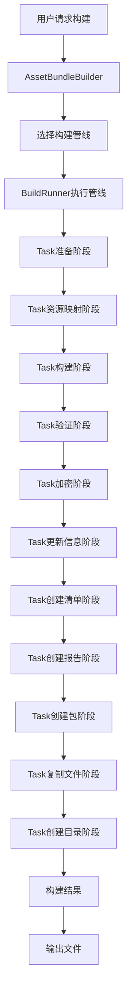
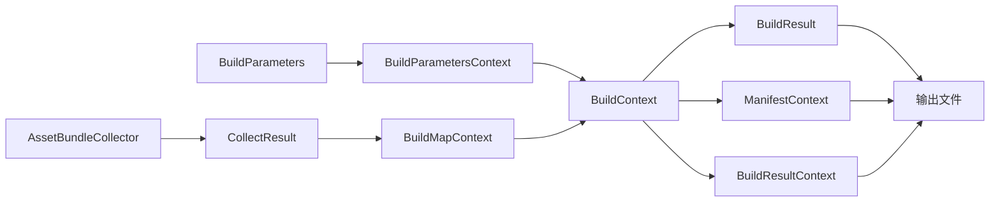

# YooAsset打包系统完整解析

通过深入分析YooAsset源码，详细解析其打包系统的整体架构、构建流程和具体实现。

---

## 📚 目录
1. [整体架构设计](#整体架构设计)
2. [构建管线核心流程](#构建管线核心流程)
3. [多构建管线对比](#多构建管线对比)
4. [关键任务详细解析](#关键任务详细解析)
5. [数据流转机制](#数据流转机制)
6. [错误处理和日志系统](#错误处理和日志系统)
7. [性能优化策略](#性能优化策略)
8. [实际使用示例](#实际使用示例)

---

## 🏗️ 整体架构设计

### 核心架构图


### 三层架构设计
```csharp
// 1. 用户接口层
AssetBundleBuilder // 统一构建入口
AssetBundleBuilderWindow // 编辑器UI界面

// 2. 业务逻辑层
BuildRunner // 构建流程执行器
BuildPipeline[] // 多种构建管线
Task[] // 具体任务实现

// 3. 数据管理层
BuildContext // 构建上下文
BuildParameters // 构建参数
BuildMapContext // 资源映射上下文
```

---

## 🔄 构建管线核心流程

### 1. **构建入口** (AssetBundleBuilder.cs)
```csharp
public BuildResult Run(BuildParameters buildParameters, List<IBuildTask> buildPipeline, bool enableLog)
{
    // 1. 参数验证
    if (buildParameters == null) throw new Exception("buildParameters is null");
    if (buildPipeline.Count == 0) throw new Exception("Build pipeline is empty");

    // 2. 初始化上下文
    _buildContext.ClearAllContext();
    var buildParametersContext = new BuildParametersContext(buildParameters);
    _buildContext.SetContextObject(buildParametersContext);

    // 3. 初始化日志
    string logFilePath = $"{buildParametersContext.GetPipelineOutputDirectory()}/buildInfo.log";
    BuildLogger.InitLogger(enableLog, logFilePath);

    // 4. 执行构建管线
    BuildLogger.Log($"Begin to build package : {buildParameters.PackageName} by {buildParameters.BuildPipeline}");
    var buildResult = BuildRunner.Run(buildPipeline, _buildContext);

    // 5. 结果处理
    if (buildResult.Success)
    {
        buildResult.OutputPackageDirectory = buildParametersContext.GetPackageOutputDirectory();
        BuildLogger.Log("Resource pipeline build success");
    }
    else
    {
        BuildLogger.Error($"{buildParameters.BuildPipeline} build failed !");
        BuildLogger.Error($"An error occurred in build task {buildResult.FailedTask}");
    }

    return buildResult;
}
```

### 2. **管线执行器** (BuildRunner.cs)
```csharp
public static BuildResult Run(List<IBuildTask> pipeline, BuildContext context)
{
    BuildResult buildResult = new BuildResult();
    buildResult.Success = true;
    TotalSeconds = 0;

    // 顺序执行所有任务
    for (int i = 0; i < pipeline.Count; i++)
    {
        IBuildTask task = pipeline[i];
        try
        {
            _buildWatch = Stopwatch.StartNew();
            string taskName = task.GetType().Name.Split('_')[0];
            BuildLogger.Log($"--------------------------------------------->{taskName}<--------------------------------------------");

            // 执行任务
            task.Run(context);

            _buildWatch.Stop();

            // 统计耗时
            int seconds = GetBuildSeconds();
            TotalSeconds += seconds;
            BuildLogger.Log($"{taskName} It takes {seconds} seconds in total");
        }
        catch (Exception e)
        {
            buildResult.Success = false;
            buildResult.FailedTask = task.GetType().Name;
            BuildLogger.Error($"{task.GetType().Name} throw exception : {e.Message}");
            return buildResult;
        }
    }

    return buildResult;
}
```

---

## 🔧 多构建管线对比

### 1. **Scriptable Build Pipeline (SBP)** - 推荐
```csharp
// ScriptableBuildPipeline.cs
public class ScriptableBuildPipeline : IBuildPipeline
{
    public BuildResult Run(BuildParameters buildParameters, bool enableLog)
    {
        AssetBundleBuilder builder = new AssetBundleBuilder();
        return builder.Run(buildParameters, GetDefaultBuildPipeline(), enableLog);
    }

    private List<IBuildTask> GetDefaultBuildPipeline()
    {
        return new List<IBuildTask>
        {
            new TaskPrepare_SBP(),           // 准备阶段
            new TaskGetBuildMap_SBP(),       // 资源映射
            new TaskBuilding_SBP(),          // Unity SBP构建
            new TaskVerifyBuildResult_SBP(),  // 验证构建结果
            new TaskEncryption_SBP(),         // 加密处理
            new TaskUpdateBundleInfo_SBP(),   // 更新Bundle信息
            new TaskCreateManifest_SBP(),     // 创建清单
            new TaskCreateReport_SBP(),       // 创建报告
            new TaskCreatePackage_SBP(),      // 创建包
            new TaskCopyBuildinFiles_SBP(),   // 复制内置文件
            new TaskCreateCatalog_SBP()       // 创建目录
        };
    }
}
```

### 2. **Builtin Build Pipeline (BBP)** - 传统方式
```csharp
// BuiltinBuildPipeline.cs
public class BuiltinBuildPipeline : IBuildPipeline
{
    private List<IBuildTask> GetDefaultBuildPipeline()
    {
        return new List<IBuildTask>
        {
            new TaskPrepare_BBP(),           // 准备阶段
            new TaskGetBuildMap_BBP(),       // 资源映射
            new TaskBuilding_BBP(),          // Unity传统构建
            new TaskVerifyBuildResult_BBP(),  // 验证构建结果
            new TaskEncryption_BBP(),         // 加密处理
            new TaskUpdateBundleInfo_BBP(),   // 更新Bundle信息
            new TaskCreateManifest_BBP(),     // 创建清单
            new TaskCreateReport_BBP(),       // 创建报告
            new TaskCreatePackage_BBP(),      // 创建包
            new TaskCopyBuildinFiles_BBP(),   // 复制内置文件
            new TaskCreateCatalog_BBP()       // 创建目录
        };
    }
}
```

### 3. **Raw File Build Pipeline (RFBP)** - 原始文件
```csharp
// RawFileBuildPipeline.cs
public class RawFileBuildPipeline : IBuildPipeline
{
    private List<IBuildTask> GetDefaultBuildPipeline()
    {
        return new List<IBuildTask>
        {
            new TaskPrepare_RFBP(),          // 准备阶段
            new TaskGetBuildMap_RFBP(),      // 资源映射
            new TaskBuilding_RFBP(),         // 原始文件构建
            new TaskEncryption_RFBP(),        // 加密处理
            new TaskUpdateBundleInfo_RFBP(),  // 更新Bundle信息
            new TaskCreateManifest_RFBP(),    // 创建清单
            new TaskCreateReport_RFBP(),      // 创建报告
            new TaskCreatePackage_RFBP(),     // 创建包
            new TaskCopyBuildinFiles_RFBP(),  // 复制内置文件
            new TaskCreateCatalog_RFBP()      // 创建目录
        };
    }
}
```

### 管线对比表
| 特性 | Scriptable Pipeline | Builtin Pipeline | Raw File Pipeline |
|------|------------------|-----------------|-------------------|
| **构建速度** | ⭐⭐⭐⭐⭐ 最快 | ⭐⭐⭐ 中等 | ⭐⭐ 较慢 |
| **增量构建** | ✅ 支持 | ✅ 支持 | ❌ 不支持 |
| **依赖分析** | ✅ 精确 | ⚠️ 基础 | ❌ 无 |
| **资源优化** | ✅ 最佳 | ⚠️ 一般 | ❌ 无 |
| **适用场景** | 商业项目 | 简单项目 | 原始文件备份 |
| **Unity版本** | 2018.4+ | 所有版本 | 所有版本 |

---

## 📋 关键任务详细解析

### 1. **TaskPrepare** - 准备阶段
```csharp
// TaskPrepare_SBP.cs
void IBuildTask.Run(BuildContext context)
{
    var buildParametersContext = context.GetContextObject<BuildParametersContext>();
    var buildParameters = buildParametersContext.Parameters as ScriptableBuildParameters;

    // 1. 清理输出目录
    string pipelineOutputDirectory = buildParameters.GetPipelineOutputDirectory();
    if (Directory.Exists(pipelineOutputDirectory))
        Directory.Delete(pipelineOutputDirectory, true);
    Directory.CreateDirectory(pipelineOutputDirectory);

    // 2. 创建参数文件
    buildParametersContext.CreateBuildParametersFile();

    BuildLogger.Log($"Pipeline output directory : {pipelineOutputDirectory}");
}
```

### 2. **TaskGetBuildMap** - 资源映射阶段
```csharp
// TaskGetBuildMap.cs - 核心任务
public BuildMapContext CreateBuildMap(bool simulateBuild, BuildParameters buildParameters)
{
    BuildMapContext context = new BuildMapContext();
    Dictionary<string, BuildAssetInfo> allBuildAssetInfos = new Dictionary<string, BuildAssetInfo>(1000);

    // 1. 获取所有收集器收集的资源
    var collectResult = AssetBundleCollectorSettingData.Setting.BeginCollect(
        buildParameters.PackageName, simulateBuild, buildParameters.UseAssetDependencyDB);
    List<CollectAssetInfo> allCollectAssets = collectResult.CollectAssets;

    // 2. 剔除未被引用的依赖项资源
    RemoveZeroReferenceAssets(context, allCollectAssets);

    // 3. 录入所有收集器主动收集的资源
    foreach (var collectAssetInfo in allCollectAssets)
    {
        // 处理资源标签（非MainAssetCollector清除标签）
        if (collectAssetInfo.CollectorType != ECollectorType.MainAssetCollector)
        {
            if (collectAssetInfo.AssetTags.Count > 0)
            {
                collectAssetInfo.AssetTags.Clear();
                BuildLogger.Warning($"Remove asset tags for {collectAssetInfo.AssetInfo.AssetPath}");
            }
        }

        // 创建构建资源信息
        var buildAssetInfo = new BuildAssetInfo(
            collectAssetInfo.CollectorType,
            collectAssetInfo.BundleName,
            collectAssetInfo.Address,
            collectAssetInfo.AssetInfo);
        buildAssetInfo.AddAssetTags(collectAssetInfo.AssetTags);
        allBuildAssetInfos.Add(collectAssetInfo.AssetInfo.AssetPath, buildAssetInfo);
    }

    // 4. 录入所有收集资源依赖的其它资源
    foreach (var collectAssetInfo in allCollectAssets)
    {
        foreach (var dependAsset in collectAssetInfo.DependAssets)
        {
            if (allBuildAssetInfos.ContainsKey(dependAsset.AssetPath) == false)
            {
                var buildAssetInfo = new BuildAssetInfo(
                    ECollectorType.DependAssetCollector, // 标记为依赖资源
                    string.Empty,
                    string.Empty,
                    dependAsset);
                allBuildAssetInfos.Add(dependAsset.AssetPath, buildAssetInfo);
            }
        }
    }

    // 5. 创建资源包信息
    CreateBundleInfos(context, buildParameters, allBuildAssetInfos);

    return context;
}
```

### 3. **TaskBuilding** - 构建阶段
```csharp
// TaskBuilding_SBP.cs - Scriptable构建
void IBuildTask.Run(BuildContext context)
{
    var buildParametersContext = context.GetContextObject<BuildParametersContext>();
    var buildMapContext = context.GetContextObject<BuildMapContext>();
    var scriptableBuildParameters = buildParametersContext.Parameters as ScriptableBuildParameters;

    // 1. 构建内容
    var buildContent = new BundleBuildContent(buildMapContext.GetPipelineBuilds());

    // 2. 构建参数
    var buildParameters = scriptableBuildParameters.GetBundleBuildParameters();
    string builtinShadersBundleName = scriptableBuildParameters.BuiltinShadersBundleName;
    string monoScriptsBundleName = scriptableBuildParameters.MonoScriptsBundleName;

    // 3. 创建任务列表
    var taskList = SBPBuildTasks.Create(builtinShadersBundleName, monoScriptsBundleName);

    // 4. 执行Unity构建
    IBundleBuildResults buildResults;
    ReturnCode exitCode = ContentPipeline.BuildAssetBundles(
        buildParameters, buildContent, out buildResults, taskList);

    if (exitCode < 0)
    {
        throw new Exception($"UnityEngine build failed ! ReturnCode : {exitCode}");
    }

    // 5. 处理特殊资源包
    HandleSpecialBundles(buildMapContext, builtinShadersBundleName, monoScriptsBundleName);

    // 6. 保存构建结果
    var buildResultContext = new BuildResultContext();
    buildResultContext.Results = buildResults;
    context.SetContextObject(buildResultContext);
}
```

### 4. **TaskCreateManifest** - 清单创建阶段
```csharp
// TaskCreateManifest.cs
protected void CreateManifestFile(bool processBundleDepends, bool processBundleTags, BuildContext context)
{
    var buildParametersContext = context.GetContextObject<BuildParametersContext>();
    var buildMapContext = context.GetContextObject<BuildMapContext>();
    var buildParameters = buildParametersContext.Parameters;
    var packageOutputDirectory = buildParametersContext.GetPackageOutputDirectory();

    // 1. 创建资源清单对象
    PackageManifest manifest = new PackageManifest();
    manifest.FileVersion = ManifestDefine.FileVersion;
    manifest.PackageName = buildParameters.PackageName;
    manifest.PackageVersion = buildParameters.PackageVersion;
    manifest.EnableAddressable = buildMapContext.Command.EnableAddressable;
    manifest.LocationToLower = buildMapContext.Command.LocationToLower;
    manifest.OutputNameStyle = buildMapContext.Command.OutputNameStyle;
    manifest.BuildPipeline = buildParameters.BuildPipeline;
    manifest.BundleEncryption = buildParameters.EncryptionServices != null;

    // 2. 创建资源包列表
    manifest.BundleList = CreatePackageBundleList(buildMapContext);

    // 3. 创建资源对象列表（🎯 关键：只包含MainAssetCollector）
    manifest.AssetList = CreatePackageAssetList(buildMapContext);

    // 4. 处理资源包的依赖列表
    if (processBundleDepends)
        ProcessBundleDepends(context, manifest);

    // 5. 处理资源包的标签集合
    if (processBundleTags)
        ProcessBundleTags(manifest);

    // 6. 处理内置资源包
    if (processBundleDepends)
        ProcessBuiltinBundleDependency(context, manifest);

    // 7. 创建资源清单文件
    // JSON格式
    {
        string fileName = YooAssetSettingsData.GetManifestJsonFileName(buildParameters.PackageName, buildParameters.PackageVersion);
        string filePath = $"{packageOutputDirectory}/{fileName}";
        ManifestTools.SerializeToJson(filePath, manifest);
    }

    // 8. 创建资源清单二进制文件
    {
        string fileName = YooAssetSettingsData.GetManifestBinaryFileName(buildParameters.PackageName, buildParameters.PackageVersion);
        string packagePath = $"{packageOutputDirectory}/{fileName}";
        ManifestTools.SerializeToBinary(packagePath, manifest, buildParameters.ManifestProcessServices);
        BuildLogger.Log($"Create package manifest file : {packagePath}");
    }
}
```

---

## 📊 数据流转机制

### 上下文系统设计
```csharp
// BuildContext.cs - 构建上下文容器
public class BuildContext
{
    private readonly Dictionary<Type, IContextObject> _contexts = new Dictionary<Type, IContextObject>();

    public void SetContextObject<T>(T contextObject) where T : IContextObject
    {
        Type type = typeof(T);
        if (_contexts.ContainsKey(type))
            _contexts[type] = contextObject;
        else
            _contexts.Add(type, contextObject);
    }

    public T GetContextObject<T>() where T : IContextObject
    {
        Type type = typeof(T);
        if (_contexts.TryGetValue(type, out IContextObject contextObject))
            return (T)contextObject;
        else
            throw new Exception($"Context object type not found : {type}");
    }
}
```

### 数据流转图


---

## 🔍 错误处理和日志系统

### 构建错误分类
```csharp
// ErrorCode.cs
public enum ErrorCode
{
    // 参数错误
    InvalidParameters = 1001,
    InvalidBuildPipeline = 1002,
    InvalidCollectorType = 1003,

    // 资源错误
    ResourceNotFound = 2001,
    ResourceReferenceError = 2002,
    ResourceDuplicateError = 2003,

    // 构建错误
    UnityEngineBuildFailed = 3001,
    UnityEditorBuildFailed = 3002,
    BuildTaskFailed = 3003,

    // 文件错误
    FileNotFound = 4001,
    FileWriteError = 4002,
    FileReadError = 4003
}
```

### 日志系统设计
```csharp
// BuildLogger.cs
public static class BuildLogger
{
    public static void InitLogger(bool enableLog, string logFilePath)
    {
        // 初始化文件日志和控制台日志
    }

    public static void Log(string message)
    {
        // 记录信息日志
        Debug.Log($"[YooAsset Build] {message}");
    }

    public static void Warning(string message)
    {
        // 记录警告日志
        Debug.LogWarning($"[YooAsset Build] {message}");
    }

    public static void Error(string message)
    {
        // 记录错误日志
        Debug.LogError($"[YooAsset Build] {message}");
    }
}
```

---

## ⚡ 性能优化策略

### 1. **资源依赖缓存**
```csharp
// AssetDependencyDatabase.cs
public class AssetDependencyDatabase
{
    private static Dictionary<string, List<string>> _dependencyCache = new Dictionary<string, List<string>>();

    public static List<string> GetDependencies(string assetPath)
    {
        if (_dependencyCache.TryGetValue(assetPath, out List<string> dependencies))
            return dependencies;

        // 计算依赖关系
        dependencies = CalculateDependencies(assetPath);
        _dependencyCache[assetPath] = dependencies;
        return dependencies;
    }
}
```

### 2. **并行处理**
```csharp
// TaskCreateReport.cs - 并行创建报告
private void ParallelProcessBundleInfos(List<PackageBundle> bundleInfos)
{
    Parallel.ForEach(bundleInfos, bundleInfo =>
    {
        // 并行处理每个Bundle信息
        ProcessBundleInfo(bundleInfo);
    });
}
```

### 3. **增量构建支持**
```csharp
// Scriptable Build Pipeline支持增量构建
// 只有修改的资源会被重新构建，大幅提升构建速度
```

---

## 🎯 实际使用示例

### 1. **创建构建参数**
```csharp
// Scriptable构建参数
var buildParameters = new ScriptableBuildParameters
{
    PackageName = "DefaultPackage",
    PackageVersion = "1.0.0",
    BuildTarget = BuildTarget.StandaloneWindows64,
    BuildPipeline = EBuildPipeline.ScriptableBuildPipeline,
    BuildMode = EBuildMode.ForceRebuild,
    CompressionOption = ECompressOption.LZ4,
    OutputNameStyle = EOutputNameStyle.HashName,
    EncryptionServices = new MyEncryptionService(),
    ManifestProcessServices = new MyManifestProcessService()
};
```

### 2. **执行构建**
```csharp
// 通过Builder窗口构建
[MenuItem("YooAsset/Build AssetBundles")]
public static void BuildAssetBundles()
{
    var buildParameters = CreateBuildParameters();
    var buildPipeline = new ScriptableBuildPipeline();

    BuildResult result = buildPipeline.Run(buildParameters, true);

    if (result.Success)
    {
        Debug.Log($"构建成功！输出目录：{result.OutputPackageDirectory}");
        EditorUtility.RevealInFinder(result.OutputPackageDirectory);
    }
    else
    {
        Debug.LogError($"构建失败：{result.FailedTask}");
    }
}
```

### 3. **自定义构建任务**
```csharp
// 创建自定义构建任务
public class CustomBuildTask : IBuildTask
{
    void IBuildTask.Run(BuildContext context)
    {
        BuildLogger.Log("执行自定义构建任务");

        // 获取构建上下文
        var buildParametersContext = context.GetContextObject<BuildParametersContext>();
        var buildMapContext = context.GetContextObject<BuildMapContext>();

        // 执行自定义逻辑
        ProcessCustomAssets(buildMapContext);

        BuildLogger.Log("自定义构建任务完成");
    }
}
```

---

## 📈 性能监控和分析

### 构建时间统计
```csharp
// BuildRunner.cs - 自动统计每个任务的执行时间
_buildWatch = Stopwatch.StartNew();
task.Run(context);
_buildWatch.Stop();

int seconds = GetBuildSeconds();
TotalSeconds += seconds;
BuildLogger.Log($"{taskName} It takes {seconds} seconds in total");
```

### 构建报告示例
```json
{
  "Summary": {
    "PackageName": "DefaultPackage",
    "PackageVersion": "1.0.0",
    "BuildPipeline": "ScriptableBuildPipeline",
    "TotalBuildTime": 120,
    "TotalBundleCount": 45,
    "TotalBundleSize": 256000000,
    "MainAssetCount": 30,
    "EncryptedBundleCount": 20
  },
  "BundleDetails": [
    {
      "BundleName": "ui_mainpanel_abc123",
      "FilePath": "ui_mainpanel_abc123.bundle",
      "FileSize": 1024000,
      "Hash": "abc123...",
      "MainAssets": [
        {
          "Address": "UI/MainPanel",
          "AssetPath": "Assets/GameRes/UI/MainPanel.prefab",
          "AssetType": "GameObject"
        }
      ],
      "Dependencies": ["shared_materials_def456"],
      "Tags": ["UI", "Panel"]
    }
  ]
}
```

---

## 🎉 总结

YooAsset的打包系统设计具有以下特点：

### 🏗️ 架构优势
1. **模块化设计**：Task-based架构，易于扩展和维护
2. **多管线支持**：适应不同项目需求和Unity版本
3. **上下文管理**：统一的数据流转和状态管理
4. **错误处理**：完善的错误分类和日志系统

### 🔧 技术特色
1. **依赖分析**：智能的资源依赖关系分析
2. **增量构建**：基于SBP的高效增量构建
3. **资源优化**：自动的零引用清理和打包优化
4. **加密支持**：灵活的资源加密和解密机制

### 💡 使用建议
1. **推荐使用Scriptable Build Pipeline**：性能最佳，功能完整
2. **合理规划Collector配置**：平衡性能和功能需求
3. **定期清理构建缓存**：避免缓存导致的构建问题
4. **关注构建报告**：及时发现和解决构建问题

这套打包系统为YooAsset提供了强大而灵活的资源构建能力，是整个框架的核心基础设施！

---

## 📚 扩展阅读

1. **[YooAsset三种Collector类型对比](YooAsset三种Collector类型对比.md)**
2. **[YooAsset MainAssets寻找机制详解](YooAsset MainAssets寻找机制详解.md)**
3. **[DependAssetCollector机制深度解析](DependAssetCollector机制深度解析.md)**
4. **[YooAsset学习路线图](YooAsset学习路线图.md)**